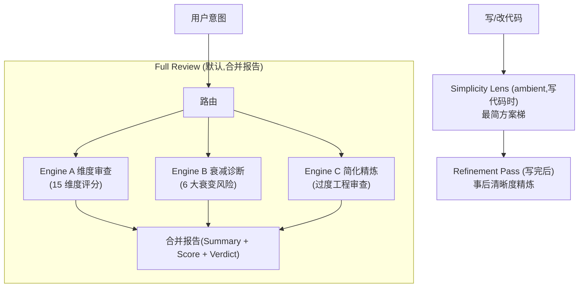

# Diting (谛听) —— 代码质量审查套件

[English](README_EN.md)

[](https://github.com/Kirky-X/diting/releases) [](LICENSE)

Diting 是一个面向 AI agent 的统一代码质量审查 skill,融合三个独立引擎,各自保留独立的分析方法(因为它们解决不同问题,强行统一格式会丢失信息),但共享一个入口、一个模式表,以及默认 Full Review 情况下的合并报告。

三个引擎构成完整审查能力:**Engine A 维度审查**(15 维度,置信度 + 严重度评分)→ **Engine B 衰减诊断**(6 大衰变风险,Symptom→Source→Consequence→Remedy)→ **Engine C 简化精炼**(过度工程审查 / 最简方案梯 / 精炼 pass)。各模式完整路由表与流程文档见 [SKILL.md](SKILL.md)。

| 引擎 | 回答的问题 | 输出风格 |
| ---- | ---------- | -------- |
| **A. 维度审查** | "这段代码正确、安全、快速、设计良好吗?" | 严重度 + 置信度评分问题列表,100 分总分,Approved/Changes/Rejected 结论 |
| **B. 衰减诊断** | "为什么这段代码维护起来会痛苦?哪本书里的原则能解释它?" | Symptom → Source → Consequence → Remedy 诊断,Health Score,模块依赖图 |
| **C. 简化精炼** | "这段代码比问题本身需要的更多吗?它是否足够清晰?" | 最简方案梯(写代码前)· 删除清单(只报告,不改)· 精炼 pass(事后清晰度编辑,保留行为) |

## 安装

### 方式一:通过 `skills` 包安装(推荐)

需 [Node.js](https://nodejs.org/) 18+ 和 `skills` npm 包(v1.5.12+)。`skills` 是 open agent skills 生态的 CLI,支持 68+ agents(Claude Code / Trae / Cursor / Codex / OpenCode 等)。

```bash
# 安装到 Claude Code
npx skills add https://github.com/Kirky-X/diting.git --agent claude-code -y

# 等价简写(owner/repo)
npx skills add Kirky-X/diting --agent claude-code -y

# 安装到 Trae
npx skills add Kirky-X/diting --agent trae -y

# 列出仓库中可被发现的所有 skills(不安装)
npx skills add https://github.com/Kirky-X/diting.git --list
```

安装后 skill 文件位于对应 agent 的 skills 目录(如 `.claude/skills/diting/`)。

### 方式二:传统 git clone

```bash
git clone https://github.com/Kirky-X/diting.git
# 将 SKILL.md + references/ + scripts/ 链接或复制到 agent skills 目录
# 各 runtime 的 skills 目录路径示例(任选其一):
#   Claude Code:  ~/.claude/skills/diting/
#   Trae:         ~/.trae-cn/skills/diting/
#   Cursor:       ~/.cursor/skills/diting/
#   Codex:        ~/.codex/skills/diting/
```

## 使用示例

Diting 作为 skill 被 agent 加载后,通过自然语言意图触发,无需显式命令。完整路由表与用户意图映射见 [SKILL.md 路由表](./SKILL.md)。

### Engine A —— 维度审查(15 维度)

| 模式 | 一句话功能 |
| ---- | ---------- |
| `review` (无参数) | Full Review 三引擎合并报告(默认) |
| `review security` | 安全维度(OWASP/CWE) |
| `review performance` | 性能维度 |
| `review quality` | 代码质量维度 |
| `review architecture` | 架构维度(单 PR 范围) |
| `review simplification` | 简化维度 |
| `review api` | API 设计维度 |
| `review database` | 数据库维度 |
| `review testing` | 测试维度 |
| `review documentation` | 文档维度 |
| `review i18n` | 国际化维度 |
| `review accessibility` | 可访问性维度 |
| `review correctness` | 正确性维度 |
| `review diff` | Diff 审查 |
| `review pre-commit` | Pre-commit 审查 |
| `review batch` | 批量审查 |

### Engine B —— 衰减诊断(代码库级)

| 模式 | 一句话功能 |
| ---- | ---------- |
| Architecture Audit | 整库架构审计 + 模块依赖图 |
| Tech Debt Assessment | 技术债评估 + 重构路线图 |
| Test Quality Review | 测试套件质量审查 |
| Health Dashboard | 代码库健康度仪表盘 |
| Full Sweep & Auto-Fix | 全库扫描 + 自动修复(⚠️ 写文件) |

### Engine C —— 简化精炼

| 模式 | 一句话功能 |
| ---- | ---------- |
| Over-engineering Review | Diff 范围过度工程审查(只报告,不改) |
| Over-engineering Audit | 整库过度工程审计 |
| Debt Ledger | `lazy:` 注释债务台账 |
| Refinement Pass | 事后清晰度精炼(保留行为) |
| Simplicity Lens (ambient) | 写代码时的最简方案梯(YAGNI → reuse → stdlib → native → existing dep → one line → minimum) |

## 能力概览

### `references/` —— 三引擎共享参考文档

| 目录 / 文件 | 内容 |
| ----------- | ---- |
| `review-workflow.md`、`anti-patterns.md` | Engine A 共享工作流 |
| `commands/*.md` | Engine A 15 个维度指南 |
| `security/`、`performance/`、`quality/`、`correctness/`、`architecture/`、`simplification/` | Engine A 深度材料 |
| `security/security-design-patterns.md` | 安全模式目录(架构/设计/实现三层,STRIDE→pattern) |
| `templates/report.md`、`feedback-examples.md` | Engine A + 合并报告外壳 |
| `workflow/three-pass-review.md` | Engine A 三遍审查方法论 |
| `decay/common.md` | Engine B 核心:Iron Law、配置、报告模板、Health Score、历史追踪、分级 |
| `decay/decay-risks.md`、`test-decay-risks.md`、`source-coverage.md`、`custom-risks-guide.md`、`remedy-guide.md` | Engine B 风险定义 |
| `decay/{architecture,debt,pr-review,sweep,health,test,onboarding}-guide.md` | Engine B 各模式流程 |
| `simplicity/ladder.md` | Engine C:最简方案梯 |
| `simplicity/overengineering-review.md` | Engine C:Diff 范围删除清单 |
| `simplicity/overengineering-audit.md` | Engine C:整库删除清单 |
| `simplicity/refinement-pass.md` | Engine C:事后清晰度编辑 |
| `simplicity/debt-ledger.md` | Engine C:`lazy:` 注释台账 |

### `scripts/` —— 辅助脚本

- [`analyzer.py`](scripts/analyzer.py) — 静态分析辅助(Engine A)
- [`security_check.py`](scripts/security_check.py) — 基于模式的安全扫描(Engine A)
- [`parallel_review.py`](scripts/parallel_review.py) — 多维度并行审查 fan-out(Engine A);它加载的每维度参考路径在合并后仍然有效

## 完整审查流程



1. **Engine A** —— 扫描 security / performance / quality / architecture / simplification 五个默认维度,产出带置信度(0–100,仅报告 ≥80)和严重度(Critical/High/Medium/Low)的具体问题
2. **Engine B** —— 对同一范围运行 PR-Review 衰减扫描:6 大衰变风险(R1–R6),每个写成 Symptom → Source → Consequence → Remedy,遵循 Iron Law(没有诊断后果就不写修复)
3. **Engine C** —— 仅做过度工程一次 pass,使用 `delete:` / `stdlib:` / `native:` / `yagni:` / `shrink:` 标签(范围限定,正确性/安全/性能留给 Engine A,不重复)
4. **合并** —— 使用 `templates/report.md` 作为外壳(Summary 表 + Overall Score + Verdict),Engine B 发现单独占 `### 🧬 Decay Risks` 小节,Engine C 发现单独占 `### ✂️ Simplification Opportunities` 小节
5. **评分** —— Engine A 的 Overall Score(100 − 扣分)作为头条分数;Engine B 的 Health Score 作为第二个数(两者加权方式不同,不取平均);Engine C 没有自己的分数,只看 net-lines
6. **结论** —— 仅由 Engine A 的 Critical/High 发现驱动;衰变风险和简化机会进入 Summary 但绝不单独阻塞结论

## FAQ

### `skills` 包版本要求?

需 `skills` npm 包 **v1.5.12+**。`skills` 是 [vercel-labs/agent-skills](https://github.com/vercel-labs/agent-skills) 生态的 CLI,支持 68+ agents。用 `npx skills@latest` 自动获取最新版。

### 哪些源格式被支持?

实跑验证四种 `npx skills add` 源格式兼容性:

| 命令格式                                           | 兼容性 | 说明                                          |
| -------------------------------------------------- | :----: | --------------------------------------------- |
| `npx skills add https://github.com/Kirky-X/diting.git` |   ✓    | Full GitHub URL + .git 后缀,推荐             |
| `npx skills add https://github.com/Kirky-X/diting`     |   ✓    | Full GitHub URL(无 .git),自动补全后缀      |
| `npx skills add Kirky-X/diting`                   |   ✓    | owner/repo 简写,自动展开为 Full URL,推荐   |
| `npx skills add Kirky-X/diting.git`               |   ✗    | **不支持** — skills 包 bug:生成 `diting.git.git` 双后缀,clone 失败。改用 `Kirky-X/diting`(不带 .git)或 Full URL |

**结论**:推荐使用前三种格式。避免 `owner/repo.git` 简写(skills 包有双后缀 bug)。

### 远程安装提示"No skills found"?

确认 GitHub 仓库 `Kirky-X/diting` 已 push 含 `SKILL.md`(根目录,YAML frontmatter 含 `name` + `description`)的最新代码。`skills` 包通过 `git clone` 获取仓库后扫描 `SKILL.md`,仓库为空或缺少 `SKILL.md` 会报该错。

### `skills add` 提示"Installation complete"但 `.claude/skills/diting/` 不存在?

这是 `skills` 包的已知问题:命令报告成功但未实际复制文件。**Workaround**:手动复制 skill 文件到 agent skills 目录(以下为各 runtime 路径示例,Claude Code / Trae / Cursor / Codex 任选其一):

```bash
# Claude Code
mkdir -p ~/.claude/skills/diting
cp -r SKILL.md skill.json references scripts ~/.claude/skills/diting/

# Trae
mkdir -p ~/.trae-cn/skills/diting
cp -r SKILL.md skill.json references scripts ~/.trae-cn/skills/diting/

# Cursor
mkdir -p ~/.cursor/skills/diting
cp -r SKILL.md skill.json references scripts ~/.cursor/skills/diting/

# Codex
mkdir -p ~/.codex/skills/diting
cp -r SKILL.md skill.json references scripts ~/.codex/skills/diting/
```

### Full Sweep 会自动改代码吗?

是。Full Sweep 是 Diting 唯一一个会在整个代码库范围内未经提示就写文件的模式。运行前会显示 `decay/sweep-guide.md` Step 0 的预飞行确认通知,等待一次性批准,然后 hands-free 执行。其他所有模式(包括 Full Review、单维度审查、Ladder、Refinement Pass)只触碰用户本次主动询问的代码,不会做代码库范围的未提示编辑。

## 许可证

MIT
