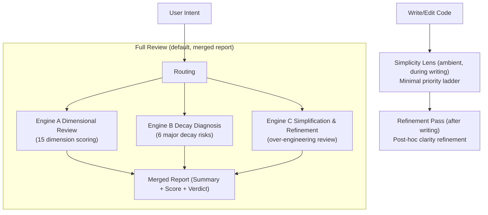

# Diting (谛听) — Code Quality Review Suite

[English](README_EN.md)

[](https://github.com/Kirky-X/diting/releases) [](LICENSE)

Diting is a unified code quality review skill for AI agents, merging three independent engines that each retain their own analysis methods (because they solve different problems, forcing uniform format loses information), but sharing one entry point, one mode table, and a merged report for the default Full Review scenario.

The three engines form a complete review capability: **Engine A Dimensional Review** (15 dimensions, Confidence + Severity scoring) → **Engine B Decay Diagnosis** (6 major decay risks, Symptom→Source→Consequence→Remedy) → **Engine C Simplification & Refinement** (over-engineering review / minimal priority ladder / refinement pass). See [SKILL.md](SKILL.md) for the complete mode routing table and workflow documentation.

| Engine | Question Answered | Output Style |
| ------ | ----------------- | ------------ |
| **A. Dimensional Review** | "Is this code correct, secure, fast, well-designed?" | Severity + Confidence scored issue list, 100-point total, Approved/Changes/Rejected verdict |
| **B. Decay Diagnosis** | "Why is this code painful to maintain? Which book principle explains it?" | Symptom → Source → Consequence → Remedy diagnosis, Health Score, module dependency graph |
| **C. Simplification & Refinement** | "Does this code exceed what the problem needs? Is it clear enough?" | Minimal priority ladder (before writing code) · Deletion checklist (report only, no changes) · Refinement pass (post-hoc clarity edit, preserving behavior) |

## Installation

### Method 1: Install via `skills` package (recommended)

Requires [Node.js](https://nodejs.org/) 18+ and the `skills` npm package (v1.5.12+). `skills` is a CLI for the open agent skills ecosystem, supporting 68+ agents (Claude Code / Trae / Cursor / Codex / OpenCode etc.).

```bash
# Install to Claude Code
npx skills add https://github.com/Kirky-X/diting.git --agent claude-code -y

# Equivalent shorthand (owner/repo)
npx skills add Kirky-X/diting --agent claude-code -y

# Install to Trae
npx skills add Kirky-X/diting --agent trae -y

# List discoverable skills in repo (without installing)
npx skills add https://github.com/Kirky-X/diting.git --list
```

After installation, skill files are located in the corresponding agent's skills directory (e.g., `.claude/skills/diting/`).

### Method 2: Traditional git clone

```bash
git clone https://github.com/Kirky-X/diting.git
# Link or copy SKILL.md + references/ + scripts/ to agent skills directory
# Example paths for each runtime (pick one):
#   Claude Code:  ~/.claude/skills/diting/
#   Trae:         ~/.trae-cn/skills/diting/
#   Cursor:       ~/.cursor/skills/diting/
#   Codex:        ~/.codex/skills/diting/
```

## Usage Examples

Diting is loaded as a skill by agents and triggered via natural language intent, no explicit commands needed. See [SKILL.md routing table](./SKILL.md) for the complete mode routing and user intent mapping.

### Engine A — Dimensional Review (15 dimensions)

| Mode | One-line description |
| ---- | -------------------- |
| `review` (no args) | Full Review three-engine merged report (default) |
| `review security` | Security dimension (OWASP/CWE) |
| `review performance` | Performance dimension |
| `review quality` | Code quality dimension |
| `review architecture` | Architecture dimension (single PR scope) |
| `review simplification` | Simplification dimension |
| `review api` | API design dimension |
| `review database` | Database dimension |
| `review testing` | Testing dimension |
| `review documentation` | Documentation dimension |
| `review i18n` | Internationalization dimension |
| `review accessibility` | Accessibility dimension |
| `review correctness` | Correctness dimension |
| `review diff` | Diff review |
| `review pre-commit` | Pre-commit review |
| `review batch` | Batch review |

### Engine B — Decay Diagnosis (codebase-level)

| Mode | One-line description |
| ---- | -------------------- |
| Architecture Audit | Full codebase architecture audit + module dependency graph |
| Tech Debt Assessment | Tech debt assessment + refactoring roadmap |
| Test Quality Review | Test suite quality review |
| Health Dashboard | Codebase health dashboard |
| Full Sweep & Auto-Fix | Full codebase scan + auto-fix (⚠️ writes files) |

### Engine C — Simplification & Refinement

| Mode | One-line description |
| ---- | -------------------- |
| Over-engineering Review | Diff-scope over-engineering review (report only, no changes) |
| Over-engineering Audit | Full codebase over-engineering audit |
| Debt Ledger | `lazy:` comment debt ledger |
| Refinement Pass | Post-hoc clarity refinement (preserving behavior) |
| Simplicity Lens (ambient) | Minimal priority ladder during code writing (YAGNI → reuse → stdlib → native → existing dep → one line → minimum) |

## Capability Overview

### `references/` — Shared reference documents for three engines

| Directory / File | Content |
| ---------------- | ------- |
| `review-workflow.md`, `anti-patterns.md` | Engine A shared workflow |
| `commands/*.md` | Engine A 15 dimension guides |
| `security/`, `performance/`, `quality/`, `correctness/`, `architecture/`, `simplification/` | Engine A deep materials |
| `security/security-design-patterns.md` | Security pattern catalog (arch/design/impl layers, STRIDE→pattern) |
| `templates/report.md`, `feedback-examples.md` | Engine A + merged report shell |
| `workflow/three-pass-review.md` | Engine A three-pass review methodology |
| `decay/common.md` | Engine B core: Iron Law, config, report template, Health Score, history tracking, triage |
| `decay/decay-risks.md`, `test-decay-risks.md`, `source-coverage.md`, `custom-risks-guide.md`, `remedy-guide.md` | Engine B risk definitions |
| `decay/{architecture,debt,pr-review,sweep,health,test,onboarding}-guide.md` | Engine B mode workflows |
| `simplicity/ladder.md` | Engine C: minimal priority ladder |
| `simplicity/overengineering-review.md` | Engine C: diff-scope deletion checklist |
| `simplicity/overengineering-audit.md` | Engine C: repo-scope deletion checklist |
| `simplicity/refinement-pass.md` | Engine C: post-hoc clarity edit |
| `simplicity/debt-ledger.md` | Engine C: `lazy:` comment ledger |

### `scripts/` — Helper scripts

- [`analyzer.py`](scripts/analyzer.py) — Static analysis helper (Engine A)
- [`security_check.py`](scripts/security_check.py) — Pattern-based security scan (Engine A)
- [`parallel_review.py`](scripts/parallel_review.py) — Multi-dimension parallel review fan-out (Engine A); its per-dimension reference paths remain valid after this merge

## Full Review Workflow



1. **Engine A** — scans security / performance / quality / architecture / simplification (five default dimensions), produces concrete issues with Confidence (0–100, only report ≥80) and Severity (Critical/High/Medium/Low)
2. **Engine B** — runs PR-Review decay scan on same scope: 6 major decay risks (R1–R6), each written as Symptom → Source → Consequence → Remedy, following Iron Law (no remedy without diagnosed consequence)
3. **Engine C** — does a single over-engineering pass using `delete:` / `stdlib:` / `native:` / `yagni:` / `shrink:` tags (scope-limited, correctness/security/performance stay in Engine A, no duplication)
4. **Merge** — uses `templates/report.md` as shell (Summary table + Overall Score + Verdict), Engine B findings get their own `### 🧬 Decay Risks` subsection, Engine C findings get their own `### ✂️ Simplification Opportunities` subsection
5. **Scoring** — Engine A's Overall Score (100 − deductions) as headline score; Engine B's Health Score as second number (different weighting, don't average); Engine C has no independent score, only net-lines
6. **Verdict** — driven only by Engine A's Critical/High findings; decay risks and simplification opportunities go into Summary but never independently block verdict

## FAQ

### `skills` package version requirement?

Requires `skills` npm package **v1.5.12+**. `skills` is a CLI for the [vercel-labs/agent-skills](https://github.com/vercel-labs/agent-skills) ecosystem, supporting 68+ agents. Use `npx skills@latest` to automatically get the latest version.

### Which source formats are supported?

Tested four `npx skills add` source format compatibility:

| Command Format | Compatibility | Notes |
| -------------- | :-----------: | ----- |
| `npx skills add https://github.com/Kirky-X/diting.git` | ✓ | Full GitHub URL + .git suffix, recommended |
| `npx skills add https://github.com/Kirky-X/diting` | ✓ | Full GitHub URL (without .git), auto-appends suffix |
| `npx skills add Kirky-X/diting` | ✓ | owner/repo shorthand, auto-expands to full URL, recommended |
| `npx skills add Kirky-X/diting.git` | ✗ | **Not supported** — skills package bug: generates `diting.git.git` double suffix, clone fails. Use `Kirky-X/diting` (without .git) or full URL instead |

**Conclusion**: Use the first three formats. Avoid `owner/repo.git` shorthand (skills package has double suffix bug).

### Remote install shows "No skills found"?

Confirm the GitHub repo `Kirky-X/diting` has pushed latest code containing `SKILL.md` (root directory, YAML frontmatter with `name` + `description`). The `skills` package scans `SKILL.md` after `git clone` — empty repo or missing `SKILL.md` causes this error.

### `skills add` shows "Installation complete" but `.claude/skills/diting/` doesn't exist?

This is a known issue with the `skills` package: command reports success but doesn't actually copy files. **Workaround**: manually copy skill files to agent skills directory (example paths for each runtime, pick one for Claude Code / Trae / Cursor / Codex):

```bash
# Claude Code
mkdir -p ~/.claude/skills/diting
cp -r SKILL.md skill.json references scripts ~/.claude/skills/diting/

# Trae
mkdir -p ~/.trae-cn/skills/diting
cp -r SKILL.md skill.json references scripts ~/.trae-cn/skills/diting/

# Cursor
mkdir -p ~/.cursor/skills/diting
cp -r SKILL.md skill.json references scripts ~/.cursor/skills/diting/

# Codex
mkdir -p ~/.codex/skills/diting
cp -r SKILL.md skill.json references scripts ~/.codex/skills/diting/
```

### Does Full Sweep automatically modify code?

Yes. Full Sweep is the only Diting mode that writes files across the entire codebase without prompting. Before running, it displays the pre-flight confirmation notification from `decay/sweep-guide.md` Step 0, waits for one-time approval, then runs hands-free. All other modes (including Full Review, single-dimension review, Ladder, Refinement Pass) only touch the code the user actively asks about this turn, no codebase-wide unprompted edits.

## License

MIT
