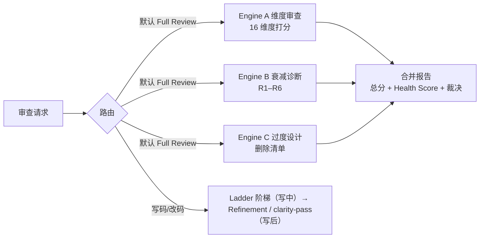

# Diting（谛听）— 代码质量审查套件

> 三引擎统一的代码质量审查 skill：**A 维度审查 × B 衰减诊断 × C 简化与精炼**。一个入口、一张模式路由表，默认场景输出一份合并报告。

[](https://github.com/Kirky-X/diting/tags) [](LICENSE) [](scripts/)

中文 | [English](README_EN.md)

## ✨ 功能特性

| 引擎 | 回答的问题 | 产出 |
| ---- | ---------- | ---- |
| **A. 维度审查** | 这段代码正确、安全、快、设计好吗？ | Confidence（0–100，仅报 ≥80）+ Severity（Critical/High/Medium/Low）双打分问题清单，100 分制总分，Approved/Changes/Rejected 裁决 |
| **B. 衰减诊断** | 这段代码为什么难维护？哪条原则能解释？ | Symptom→Source→Consequence→Remedy 推理链发现，Health Score，模块依赖图 |
| **C. 简化与精炼** | 这段代码超出问题所需了吗？足够清晰吗？ | 最小实现阶梯（写码时）· 删除清单（只报告不改码）· 精炼/清晰化（写码后，保持行为） |

- **16 个审查维度**（Engine A）：security / performance / quality / architecture / simplification / api / database / testing / documentation / i18n / accessibility / correctness / agent（12-factor 审计，支持单因子子命令）/ diff / pre-commit / batch，指南位于 `references/commands/`
- **`review pr <number>`**：GitHub PR 审查编排——资格检查、置信度过滤、`gh pr comment`、证据深链，安全部分联动 tiangang
- **6 大衰减风险**（Engine B，R1–R6）：含 Iron Law（无诊断后果不出补救）、`.decay-review.yaml` 项目配置、历史追踪与分诊
- **clarity-pass**（Engine C）：写后简化协议，含安全前提（脏树检查、定点回滚）与优先级队列、验证门
- **确定性脚本层**：`parallel_review.py` 多维并行扫描（markdown/json/text/sarif 四种输出）、`sarif_report.py` 聚合为 SARIF 2.1.0（带结构校验）、`security_check.py` 模式安全扫描——纯 Python 标准库，无第三方依赖
- **CodeNexus 可选集成**：存在 `codenexus.lbug` 索引时自动产出 `impact`/`query` 命令清单做爆炸半径预检（无索引则跳过，不虚构）
- **注入隔离**：被审查代码中的注释、字符串、docstring 一律视为数据，绝不作为指令执行

## 📦 安装

```bash
# 方式 1：从本仓库根一键部署（同步到 ~/.zcode/skills/ 与 ~/.claude/skills/，LF 强制归一）
bash scripts/sync-skills.sh diting

# 方式 2：手动拷贝到 agent 技能目录
cp -r diting/ ~/.zcode/skills/diting/
# 方式三：远程安装（GitHub 仓库）
npx skills add Kirky-X/diting --agent claude-code -y
```

首跑依赖：仅需 Python 3.8+（脚本层全部使用标准库），无 requirements.txt。

## 🚀 快速开始

前置：skill 已部署到 agent 技能目录，在支持 skills 的 agent 会话中用自然语言触发（完整路由表见 [SKILL.md](SKILL.md)）。

```text
review src/auth/                  # 不带维度 → Full Review（三引擎合并报告）
review security src/api/          # 单维度审查
review pr 123                     # GitHub PR 审查编排
这个代码库哪里腐化最严重？          # Engine B → Health Dashboard
```

脚本层可直接独立运行（确定性、可复现）：

```bash
python3 ~/.zcode/skills/diting/scripts/parallel_review.py src/ --format markdown   # 多维并行扫描
python3 ~/.zcode/skills/diting/scripts/parallel_review.py src/ --format json --output report.json
python3 ~/.zcode/skills/diting/scripts/sarif_report.py report.json --validate      # CI 用 SARIF
python3 ~/.zcode/skills/diting/scripts/security_check.py src/                      # 模式安全扫描
```

> 目标超过 20 个文件时，Full Review 的 Step 0 会优先调用 `parallel_review.py` 生成确定性骨架，再由模型侧验证扩展；脚本不可用时降级为纯人工扫描并在报告中注明。

### 全景流程（mermaid）



## ✅ 测试与验证

本 skill 无独立 pytest 套件，采用脚本冒烟 + 结构校验（2026-09-13 实测）：

| 验证项 | 命令 | 实测结果 |
| ------ | ---- | -------- |
| 安全模式扫描 | `python3 scripts/security_check.py <样本目录>` | 在含 `eval()` / SQL 字符串拼接的样本上检出 `eval_usage`（HIGH）并输出统计 |
| 并行审查 + SARIF | `python3 scripts/parallel_review.py <样本> --format sarif` | 输出合法 SARIF 2.1.0（`"version": "2.1.0"`），7 个内置 agent 可选 |
| SARIF 结构校验 | `python3 scripts/sarif_report.py <json> --validate` | 校验通过 |
| frontmatter | 大修终验 | YAML 有效 |

## 📁 目录结构

```text
diting/
├── SKILL.md                 # 入口：三引擎路由表 + Full Review 工作流
├── skill.json               # 元数据（v0.1.2，MIT）
├── references/
│   ├── commands/            # Engine A：16 维度审查指南 + pr-review 编排
│   ├── security|performance|quality|correctness|architecture|simplification/
│   │                        # Engine A 各维度深度材料
│   ├── decay/               # Engine B：风险定义 + 7 个模式 guide + common.md（Iron Law/配置）
│   ├── simplicity/          # Engine C：ladder / overengineering / debt-ledger / refinement / clarity-pass
│   ├── agent-factors/       # 12-factor agent 因子规范与流程
│   ├── templates/           # 合并报告骨架与反馈示例
│   └── codenexus.md         # CodeNexus CLI 参考（Step 1.5）
├── scripts/                 # parallel_review / security_check / analyzer / sarif_report / codenexus_helpers / install-skill.sh
└── test-prompts.json        # 触发验收用例
```

## 🔮 边界

- **安全扫描归 [tiangang](../tiangang/)**：SAST、漏洞扫描、发布前安全检查不触发本 skill；`review pr` 会编排 tiangang 完成其中的安全部分
- **纯功能开发不触发**：没有 review / audit / simplify 诉求的普通写码、重构、修 bug 不进入本 skill
- **纯重写/清晰化**：属于 Engine C 的 clarity-pass 协议（`references/simplicity/clarity-pass.md`），且仅在本 skill 已加载后适用
- **架构双口径**：当前 diff/PR 的设计问题走 Engine A（`review architecture`）；整库模块结构审计走 Engine B（`decay/architecture-guide.md`），范围不明时默认 Engine A

## 📄 License 与归属

MIT License（© 2026 Kirky-X）。已退役的自研 skill **code-review**（PR 审查编排）与 **code-simplifier**（风险分级简化队列）分别并入本 skill 的 `review pr` 模式与 clarity-pass 协议。
