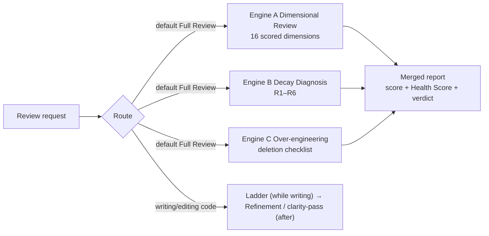

# Diting — Code Quality Review Suite

> A unified code quality review skill with **three engines: A Dimensional Review × B Decay Diagnosis × C Simplification & Refinement**. One entry point, one mode routing table, and a single merged report for the default scenario.

[](https://github.com/Kirky-X/diting/tags) [](LICENSE) [](scripts/)

English | [中文](README.md)

## ✨ Features

| Engine | Question Answered | Output |
| ------ | ----------------- | ------ |
| **A. Dimensional Review** | Is this code correct, secure, fast, well-designed? | Issue list scored by Confidence (0–100, ≥80 confirmed / 55–79 needs-verification per three-state adjudication) + Severity (Critical/High/Medium/Low), 100-point total, Approved/Changes/Rejected verdict |
| **B. Decay Diagnosis** | Why is this code painful to maintain? Which principle explains it? | Symptom→Source→Consequence→Remedy findings, Health Score, module dependency graph |
| **C. Simplification & Refinement** | Does this code exceed what the problem needs? Is it clear enough? | Minimal-solution ladder (while writing) · Deletion checklist (report only, no edits) · Refinement/clarity pass (after writing, behavior-preserving) |

- **16 review dimensions** (Engine A): security / performance / quality / architecture / simplification / api / database / testing / documentation / i18n / accessibility / correctness / agent (12-factor audit, with single-factor sub-commands) / diff / pre-commit / batch — guides in `references/commands/`
- **`review pr <number>`**: GitHub PR review orchestration — eligibility check, confidence filtering, `gh pr comment`, evidence deep links; the security portion delegates to tiangang
- **6 decay risks** (Engine B, R1–R6): with the Iron Law (no remedy without diagnosed consequence), `.decay-review.yaml` project config, history tracking and triage
- **clarity-pass** (Engine C): post-writing simplification protocol with safety preconditions (dirty-tree check, targeted rollback), priority queue, and verification gates
- **Deterministic script layer**: `parallel_review.py` multi-dimension parallel scan (markdown/json/text/sarif output), `sarif_report.py` SARIF 2.1.0 aggregation (with structural validation), `security_check.py` pattern-based security scan — pure Python standard library, no third-party dependencies
- **Optional CodeNexus integration**: when a `codenexus.lbug` index exists, produces `impact`/`query` command lists for blast-radius pre-checks (skipped when absent, never fabricated)
- **Untrusted-content isolation**: comments, strings, and docstrings in reviewed code are treated as data, never as instructions

## 📦 Installation

```bash
# Option 1: one-command deploy from the multi-skill workspace root
# (the script lives in the workspace's scripts/, not inside this repo;
#  syncs to ~/.zcode/skills/ and ~/.claude/skills/, LF-normalized)
bash scripts/sync-skills.sh diting      # run from the workspace root (this repo's parent directory)

# Option 2: manual copy into an agent skills directory
cp -r diting/ ~/.zcode/skills/diting/
# Option 3: Remote install (GitHub repo)
npx skills add Kirky-X/diting --agent claude-code -y
```

First-run requirements: Python 3.8+ only (the script layer uses the standard library exclusively); no requirements.txt.

## 🚀 Quick Start

Prerequisite: the skill is deployed to an agent skills directory; trigger it with natural language in a skills-aware agent session (full routing table in [SKILL.md](SKILL.md)).

```text
review src/auth/                  # no dimension → Full Review (merged three-engine report)
review security src/api/          # single-dimension review
review pr 123                     # GitHub PR review orchestration
Where does this codebase decay the most?   # Engine B → Health Dashboard
```

The script layer also runs standalone (deterministic, reproducible):

```bash
python3 ~/.zcode/skills/diting/scripts/parallel_review.py src/ --format markdown   # parallel multi-dimension scan
python3 ~/.zcode/skills/diting/scripts/parallel_review.py src/ --format json --output report.json
python3 ~/.zcode/skills/diting/scripts/sarif_report.py report.json --validate      # SARIF for CI
python3 ~/.zcode/skills/diting/scripts/security_check.py src/                      # pattern security scan
```

> When the target spans more than 20 files, Full Review's Step 0 calls `parallel_review.py` first to build a deterministic skeleton, then verifies and extends it by reading the code; if the script is unavailable it degrades to a manual scan and notes that in the report.

### Full Flow (mermaid)



## ✅ Tests & Verification

The skill ships an offline test suite (`tests/`, 6 test files, `python3 -m pytest tests/ -q` → 136 passed, measured 2026-10-04; no network, no third-party dependencies), complemented by script smoke-testing plus structural checks (measured 2026-09-13):

| Check | Command | Measured result |
| ----- | ------- | --------------- |
| Security pattern scan | `python3 scripts/security_check.py <sample dir>` | Detects `eval_usage` (HIGH) with statistics on samples containing `eval()` / SQL string concatenation |
| Parallel review + SARIF | `python3 scripts/parallel_review.py <sample> --format sarif` | Emits valid SARIF 2.1.0 (`"version": "2.1.0"`); 7 built-in agents selectable |
| SARIF structural validation | `python3 scripts/sarif_report.py <json> --validate` | Validation passes |
| Frontmatter | final overhaul verification | YAML valid |

## 📁 Directory Structure

```text
diting/
├── SKILL.md                 # Entry: three-engine routing table + Full Review workflow
├── skill.json               # Metadata (v0.1.4, MIT)
├── references/
│   ├── commands/            # Engine A: 16 dimension guides + pr-review orchestration
│   ├── security|performance|quality|correctness|architecture|simplification/
│   │                        # Engine A deep materials per dimension
│   ├── decay/               # Engine B: risk definitions + 9 guides + common.md (Iron Law/config)
│   ├── simplicity/          # Engine C: ladder / overengineering / debt-ledger / refinement / clarity-pass
│   ├── agent-factors/       # 12-factor agent factor specs and processes
│   ├── templates/           # Merged report skeleton and feedback examples
│   └── codenexus.md         # CodeNexus CLI reference (Step 1.5)
├── scripts/                 # parallel_review / security_check / analyzer / sarif_report / codenexus_helpers / skill_lint / install-skill.sh
├── tests/                   # Offline smoke test suite (6 test files + SKIPPED.md not-tested list)
├── evals/                   # evals.json: 4 evals (2 with assertions)
└── triggers/                # trigger-queries.json: 23 trigger-adjudication queries (13 trigger / 10 no)
```

## 🔮 Boundaries

- **Security scanning belongs to [tiangang](../tiangang/)**: SAST, vulnerability scanning, and pre-release security checks do not trigger this skill; `review pr` orchestrates tiangang for its security portion
- **Plain feature development does not trigger it**: writing code, refactoring, or bug fixing with no review/audit/simplify request stays out
- **Pure rewrite/clarity work**: handled by Engine C's clarity-pass protocol (`references/simplicity/clarity-pass.md`), applicable only after this skill is already loaded
- **Two architecture scopes**: current diff/PR design questions go to Engine A (`review architecture`); whole-codebase module audits go to Engine B (`decay/architecture-guide.md`) — when scope is unclear, default to Engine A

## 📄 License & Attribution

MIT License (© 2026 Kirky-X). The retired in-house skills **code-review** (PR review orchestration) and **code-simplifier** (risk-ranked simplification queue) were merged into this skill as the `review pr` mode and the clarity-pass protocol respectively.
