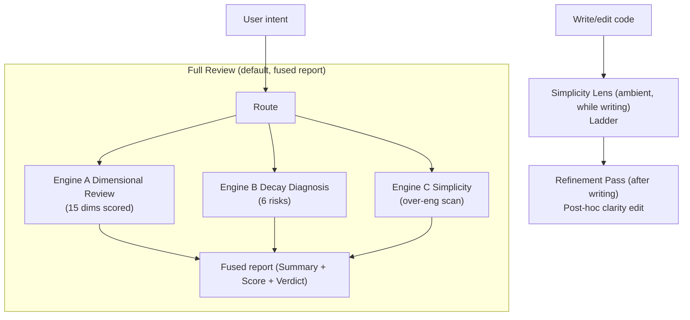

# Diting (谛听) — Code Quality Review Suite

[Chinese](README.md)

[](https://github.com/Kirky-X/diting/releases) [](LICENSE)

Diting is a unified code-quality review skill for AI agents. It fuses three independent engines, each keeping its own analytical method (they solve different problems, and forcing one format on all of them would lose information), but sharing one entry point, one mode table, and — for the default Full Review case — one combined report.

Three engines form the complete review capability: **Engine A Dimensional Review** (15 dimensions, confidence + severity scoring) → **Engine B Decay Diagnosis** (6 decay risks, Symptom→Source→Consequence→Remedy) → **Engine C Simplicity & Refinement** (over-engineering review / laziest-solution ladder / refinement pass). See [SKILL.md](SKILL.md) for the full route table and process documentation.

| Engine | Question it answers | Output style |
| ------ | ------------------- | ------------ |
| **A. Dimensional Review** | "Is this code correct, secure, fast, well-designed?" | Severity+confidence scored issue list, 100-pt score, Approved/Changes/Rejected verdict |
| **B. Decay Diagnosis** | "Why will this be painful to maintain, and what book-grounded principle explains it?" | Symptom → Source → Consequence → Remedy findings, Health Score, module dependency graph |
| **C. Simplicity & Refinement** | "Is this more code than the problem needs, and is it as clear as it should be?" | Ladder (minimal-first, before writing) · deletion list (report-only) · refinement pass (post-hoc clarity edit, preserves behavior) |

## Installation

### Method 1: Via `skills` package (recommended)

Requires [Node.js](https://nodejs.org/) 18+ and the `skills` npm package (v1.5.12+). `skills` is the CLI for the open agent skills ecosystem, supporting 68+ agents (Claude Code / Trae / Cursor / Codex / OpenCode, etc.).

```bash
# Install to Claude Code
npx skills add https://github.com/Kirky-X/diting.git --agent claude-code -y

# Equivalent shorthand (owner/repo)
npx skills add Kirky-X/diting --agent claude-code -y

# Install to Trae
npx skills add Kirky-X/diting --agent trae -y

# List all discoverable skills in this repo (no install)
npx skills add https://github.com/Kirky-X/diting.git --list
```

After installation, skill files are located in the corresponding agent's skills directory (e.g. `.claude/skills/diting/`).

### Method 2: Traditional git clone

```bash
git clone https://github.com/Kirky-X/diting.git
# Link or copy SKILL.md + references/ + scripts/ to the agent skills directory
# Skills directory paths for each runtime (choose one):
#   Claude Code:  ~/.claude/skills/diting/
#   Trae:         ~/.trae-cn/skills/diting/
#   Cursor:       ~/.cursor/skills/diting/
#   Codex:        ~/.codex/skills/diting/
```

## Usage

Once loaded as a skill by an agent, Diting is triggered by natural language intent — no explicit commands needed. See [SKILL.md route table](./SKILL.md) for the full routing table and intent mapping.

### Engine A — Dimensional Review (15 dimensions)

| Mode | One-liner |
| ---- | --------- |
| `review` (no args) | Full Review, fused three-engine report (default) |
| `review security` | Security dimension (OWASP/CWE) |
| `review performance` | Performance dimension |
| `review quality` | Code quality dimension |
| `review architecture` | Architecture dimension (single PR scope) |
| `review simplification` | Simplification dimension |
| `review api` | API design dimension |
| `review database` | Database dimension |
| `review testing` | Testing dimension |
| `review documentation` | Documentation dimension |
| `review i18n` | Internationalization dimension |
| `review accessibility` | Accessibility dimension |
| `review correctness` | Correctness dimension |
| `review diff` | Diff review |
| `review pre-commit` | Pre-commit review |
| `review batch` | Batch review |

### Engine B — Decay Diagnosis (codebase-wide)

| Mode | One-liner |
| ---- | --------- |
| Architecture Audit | Whole-codebase architecture audit + module dependency graph |
| Tech Debt Assessment | Tech debt assessment + refactoring roadmap |
| Test Quality Review | Test suite quality review |
| Health Dashboard | Codebase health dashboard |
| Full Sweep & Auto-Fix | Full-codebase sweep + auto-fix (⚠️ writes files) |

### Engine C — Simplicity & Refinement

| Mode | One-liner |
| ---- | --------- |
| Over-engineering Review | Diff-scoped over-engineering review (report-only, no edits) |
| Over-engineering Audit | Repo-wide over-engineering audit |
| Debt Ledger | `lazy:` comment debt ledger |
| Refinement Pass | Post-hoc clarity refinement (preserves behavior) |
| Simplicity Lens (ambient) | Ladder while writing code (YAGNI → reuse → stdlib → native → existing dep → one line → minimum) |

## Capabilities

### `references/` — Shared reference docs for all three engines

| Directory / File | Content |
| ---------------- | ------- |
| `review-workflow.md`, `anti-patterns.md` | Engine A shared workflow |
| `commands/*.md` | Engine A 15 dimension guides |
| `security/`, `performance/`, `quality/`, `correctness/`, `architecture/`, `simplification/` | Engine A deep-dive material |
| `security/security-design-patterns.md` | Security pattern catalog (arch/design/impl tiers, STRIDE→pattern) |
| `templates/report.md`, `feedback-examples.md` | Engine A + fused report shell |
| `workflow/three-pass-review.md` | Engine A three-pass review methodology |
| `decay/common.md` | Engine B core: Iron Law, config, report template, Health Score, history tracking, triage |
| `decay/decay-risks.md`, `test-decay-risks.md`, `source-coverage.md`, `custom-risks-guide.md`, `remedy-guide.md` | Engine B risk definitions |
| `decay/{architecture,debt,pr-review,sweep,health,test,onboarding}-guide.md` | Engine B per-mode process |
| `simplicity/ladder.md` | Engine C: minimal-first ladder |
| `simplicity/overengineering-review.md` | Engine C: diff-scoped deletion list |
| `simplicity/overengineering-audit.md` | Engine C: repo-wide deletion list |
| `simplicity/refinement-pass.md` | Engine C: post-hoc clarity edit |
| `simplicity/debt-ledger.md` | Engine C: `lazy:` comment ledger |

### `scripts/` — Helper scripts

- [`analyzer.py`](scripts/analyzer.py) — Static analysis helpers (Engine A)
- [`security_check.py`](scripts/security_check.py) — Pattern-based security scan (Engine A)
- [`parallel_review.py`](scripts/parallel_review.py) — Fan-out multi-dimension review (Engine A); the reference paths it loads per dimension stay valid after this merge

## Full Review Pipeline



1. **Engine A** — scans security / performance / quality / architecture / simplification (the five default dimensions) for concrete, located issues, each scored with Confidence (0–100, report only ≥80) and Severity (Critical/High/Medium/Low)
2. **Engine B** — for the same scope, runs the PR-Review decay scan: the Six Decay Risks (R1–R6), each written as Symptom → Source → Consequence → Remedy, following the Iron Law (never state a fix without a diagnosed consequence)
3. **Engine C** — one pass for over-engineering only, using the `delete:` / `stdlib:` / `native:` / `yagni:` / `shrink:` tags (scope-limited — correctness/security/performance stay in Engine A, not duplicated here)
4. **Merge** — uses `templates/report.md` as the outer shell (Summary table + Overall Score + Verdict); Engine B findings get their own `### 🧬 Decay Risks` subsection, Engine C findings get their own `### ✂️ Simplification Opportunities` subsection
5. **Score** — Engine A's Overall Score (100 − deductions) is the headline; Engine B's Health Score is reported alongside it as a second number (they weight differently — do not average them); Engine C has no score of its own, only its net-lines figure
6. **Verdict** — driven by Engine A's Critical/High findings only; decay risks and simplification opportunities inform the Summary but never block a verdict by themselves

## FAQ

### What version of the `skills` package is required?

Requires `skills` npm package **v1.5.12+**. `skills` is the CLI for the [vercel-labs/agent-skills](https://github.com/vercel-labs/agent-skills) ecosystem, supporting 68+ agents. Use `npx skills@latest` to get the latest version automatically.

### Which URL formats are supported?

Tested compatibility for four `npx skills add` URL formats:

| Command format | Compatible | Notes |
| -------------- | :--------: | ----- |
| `npx skills add https://github.com/Kirky-X/diting.git` | ✓ | Full GitHub URL + .git suffix, recommended |
| `npx skills add https://github.com/Kirky-X/diting` | ✓ | Full GitHub URL (no .git), auto-appends suffix |
| `npx skills add Kirky-X/diting` | ✓ | owner/repo shorthand, auto-expands to full URL, recommended |
| `npx skills add Kirky-X/diting.git` | ✗ | **Not supported** — skills package bug: generates `diting.git.git` double suffix, clone fails. Use `Kirky-X/diting` (no .git) or full URL |

**Conclusion**: Use the first three formats. Avoid the `owner/repo.git` shorthand (skills package has a double-suffix bug).

### Remote install says "No skills found"?

Make sure the GitHub repo `Kirky-X/diting` has been pushed with the latest code containing `SKILL.md` (in the root directory with YAML frontmatter including `name` + `description`). The `skills` package clones the repo and scans for `SKILL.md` — an empty repo or missing `SKILL.md` will trigger this error.

### `skills add` says "Installation complete" but `.claude/skills/diting/` doesn't exist?

This is a known issue with the `skills` package: the command reports success but doesn't actually copy the files. **Workaround**: manually copy the skill files to the agent skills directory (choose one for your runtime):

```bash
# Claude Code
mkdir -p ~/.claude/skills/diting
cp -r SKILL.md skill.json references scripts ~/.claude/skills/diting/

# Trae
mkdir -p ~/.trae-cn/skills/diting
cp -r SKILL.md skill.json references scripts ~/.trae-cn/skills/diting/

# Cursor
mkdir -p ~/.cursor/skills/diting
cp -r SKILL.md skill.json references scripts ~/.cursor/skills/diting/

# Codex
mkdir -p ~/.codex/skills/diting
cp -r SKILL.md skill.json references scripts ~/.codex/skills/diting/
```

### Does Full Sweep auto-edit code?

Yes. Full Sweep is the only Diting mode that writes to files unprompted across a whole codebase. Before running, it shows the pre-flight consent notice from `decay/sweep-guide.md` Step 0, waits for one-time approval, then runs hands-free. Every other mode (including Full Review, single-dimension review, the Ladder, Refinement Pass) only touches code the user is actively asking about in this turn — no unprompted codebase-wide edits outside Full Sweep.

## License

MIT
