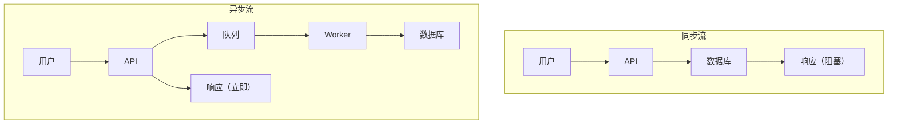
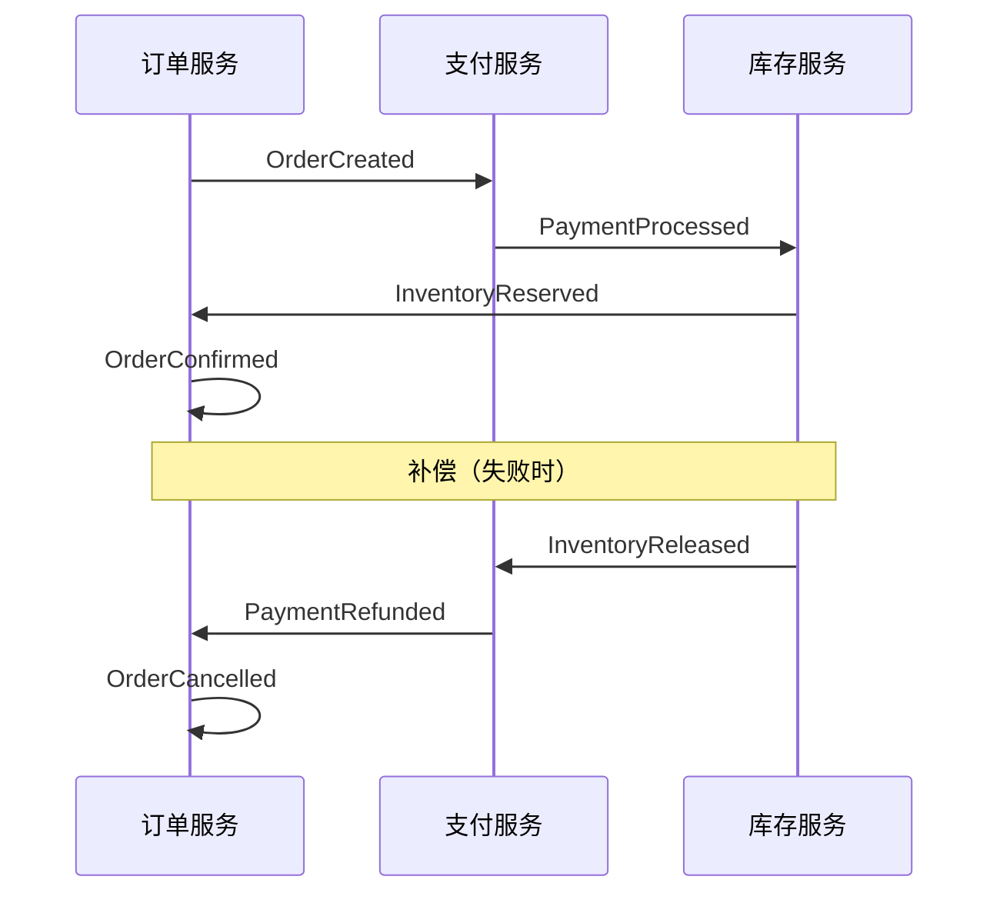
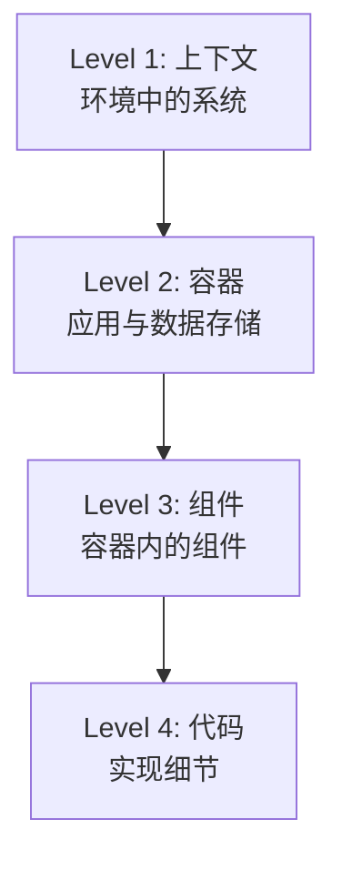

# 架构反模式与深度技术

> 架构深度技术：高可用、高并发、分布式、文档、安全架构。主流程详见 [architect-guide.md](architect-guide.md)。

## 高可用设计

### 容错模式

```
┌─────────────────────────────────────────────────────────┐
│                  容错                         │
├─────────────────────────────────────────────────────────┤
│ 断路器                                          │
│   └── 防止级联失败                           │
│                                                          │
│ 退避重试                                       │
│   └── 处理瞬时失败                          │
│                                                          │
│ 舱壁隔离                                       │
│   └── 隔离故障域                            │
│                                                          │
│ 超时                                                  │
│   └── 防止资源耗尽                        │
│                                                          │
│ 降级                                                 │
│   └── 优雅降级                               │
└─────────────────────────────────────────────────────────┘
```

### 可用性目标

| 9 的数量 | 可用性 | 年停机时间 |
|-------|--------------|---------------|
| 99% | 两个 9 | 3.65 天 |
| 99.9% | 三个 9 | 8.77 小时 |
| 99.99% | 四个 9 | 52.6 分钟 |
| 99.999% | 五个 9 | 5.26 分钟 |

## 高并发架构

### 缓存策略

```
┌─────────────────────────────────────────────────────────┐
│                 缓存层                           │
├─────────────────────────────────────────────────────────┤
│ CDN 缓存                                                │
│   └── 静态资源、边缘缓存                        │
│                                                          │
│ 应用缓存                                        │
│   └── 内存（本地）、Redis（分布式）             │
│                                                          │
│ 数据库缓存                                           │
│   └── 查询缓存、缓冲池                           │
│                                                          │
│ 缓存模式                                           │
│   ├── Cache-aside：应用管理缓存             │
│   ├── Read-through：缓存读源              │
│   └── Write-through：缓存写源              │
└─────────────────────────────────────────────────────────┘
```

### 数据库优化

```
┌─────────────────────────────────────────────────────────┐
│              数据库扩展                            │
├─────────────────────────────────────────────────────────┤
│ 垂直扩展                                         │
│   └── 更多 CPU、RAM、SSD                                 │
│                                                          │
│ 读副本                                            │
│   └── 分散读流量                            │
│                                                          │
│ 分片                                                 │
│   └── 水平分区                            │
│                                                          │
│ 分区                                             │
│   └── 范围、哈希、列表分区                     │
└─────────────────────────────────────────────────────────┘
```

### 异步处理



## 分布式系统设计

### CAP 定理

| 属性 | 描述 | 权衡 |
|----------|-------------|-----------|
| **一致性（Consistency）** | 所有节点看到相同数据 | 延迟 |
| **可用性（Availability）** | 每个请求都得到响应 | 旧数据 |
| **分区容错（Partition Tolerance）** | 网络故障时系统仍工作 | 必须有 |

**选择**：CP（一致性 + 分区）或 AP（可用性 + 分区）

### 分布式事务

| 模式 | 适用场景 | 权衡 |
|---------|----------|-----------|
| **2PC** | 强一致性 | 阻塞、单点故障 |
| **Saga** | 长事务 | 补偿逻辑复杂度 |
| **TCC** | 高性能 | 实现复杂度 |

### Saga 模式



## 架构文档

### C4 模型



### 架构决策记录（ADR）

```markdown
# ADR-001: 使用事件驱动架构

## 状态
Accepted

## 上下文
系统需处理大量异步操作，且服务间需松耦合。

## 决策
使用消息队列实现事件驱动架构。

## 后果
- 优点：解耦、可扩展、弹性
- 缺点：复杂度、最终一致、调试挑战

## 考虑的替代方案
1. 同步 REST —— 因紧耦合否决
2. gRPC 流 —— 因复杂度否决
```

## 安全架构

### 认证架构

```
┌─────────────────────────────────────────────────────────┐
│              认证流                         │
├─────────────────────────────────────────────────────────┤
│ 客户端 → API 网关 → 认证服务                     │
│                          │                               │
│                          ├── 验证凭据        │
│                          ├── 生成 JWT                │
│                          └── 返回 token                │
│                                                          │
│ 后续请求：                                     │
│ 客户端 → API 网关 → 验证 JWT → 后端服务   │
└─────────────────────────────────────────────────────────┘
```

### 授权模式

| 模式 | 适用场景 | 复杂度 |
|---------|----------|------------|
| **RBAC** | 基于角色访问 | 低 |
| **ABAC** | 基于属性访问 | 中 |
| **PBAC** | 基于策略访问 | 高 |
