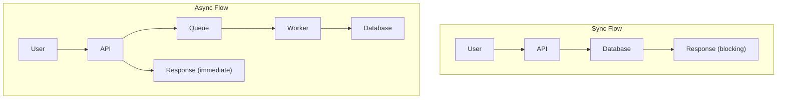
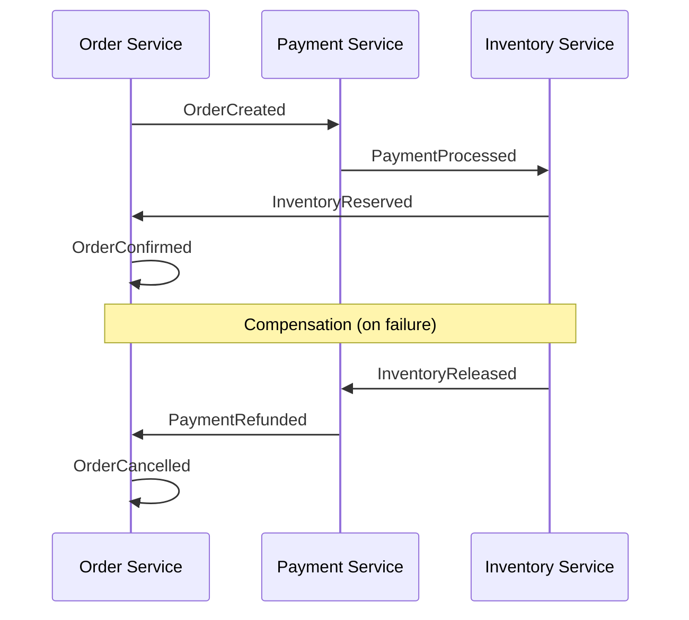
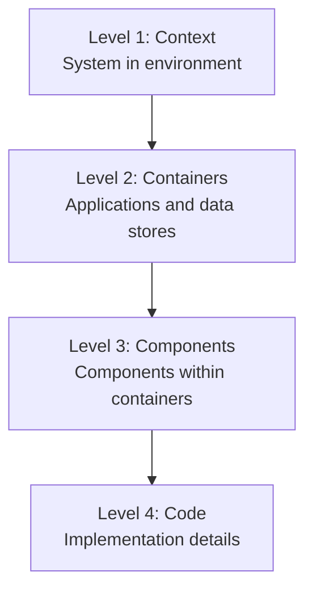

# Architecture Anti-Patterns & Deep Techniques

> Architecture deep techniques: high availability, high concurrency, distributed systems, documentation, security architecture. For the main workflow, see [architect-guide.md](architect-guide.md).

## High Availability Design

### Fault Tolerance Patterns

```
┌─────────────────────────────────────────────────────────┐
│                  Fault Tolerance                         │
├─────────────────────────────────────────────────────────┤
│ Circuit Breaker                                         │
│   └── Prevents cascading failures                       │
│                                                          │
│ Exponential Backoff Retry                               │
│   └── Handles transient failures                        │
│                                                          │
│ Bulkhead Isolation                                      │
│   └── Isolates failure domains                          │
│                                                          │
│ Timeout                                                 │
│   └── Prevents resource exhaustion                      │
│                                                          │
│ Degradation                                             │
│   └── Graceful degradation                              │
└─────────────────────────────────────────────────────────┘
```

### Availability Targets

| Number of 9s | Availability | Annual Downtime |
|-------|--------------|---------------|
| 99% | Two 9s | 3.65 days |
| 99.9% | Three 9s | 8.77 hours |
| 99.99% | Four 9s | 52.6 minutes |
| 99.999% | Five 9s | 5.26 minutes |

## High Concurrency Architecture

### Caching Strategies

```
┌─────────────────────────────────────────────────────────┐
│                 Caching Layer                            │
├─────────────────────────────────────────────────────────┤
│ CDN Cache                                               │
│   └── Static resources, edge caching                    │
│                                                          │
│ Application Cache                                       │
│   └── In-memory (local), Redis (distributed)            │
│                                                          │
│ Database Cache                                          │
│   └── Query cache, buffer pool                          │
│                                                          │
│ Cache Patterns                                          │
│   ├── Cache-aside: Application manages cache            │
│   ├── Read-through: Cache reads source                  │
│   └── Write-through: Cache writes source                │
└─────────────────────────────────────────────────────────┘
```

### Database Optimization

```
┌─────────────────────────────────────────────────────────┐
│              Database Scaling                            │
├─────────────────────────────────────────────────────────┤
│ Vertical Scaling                                        │
│   └── More CPU, RAM, SSD                                │
│                                                          │
│ Read Replicas                                           │
│   └── Distribute read traffic                           │
│                                                          │
│ Sharding                                                │
│   └── Horizontal partitioning                           │
│                                                          │
│ Partitioning                                            │
│   └── Range, hash, list partitioning                    │
└─────────────────────────────────────────────────────────┘
```

### Asynchronous Processing



## Distributed System Design

### CAP Theorem

| Property | Description | Trade-off |
|----------|-------------|-----------|
| **Consistency** | All nodes see the same data | Latency |
| **Availability** | Every request gets a response | Stale data |
| **Partition Tolerance** | System works during network failures | Must have |

**Choice**: CP (Consistency + Partition) or AP (Availability + Partition)

### Distributed Transactions

| Pattern | Use Cases | Trade-offs |
|---------|----------|-----------|
| **2PC** | Strong consistency | Blocking, single point of failure |
| **Saga** | Long-running transactions | Compensation logic complexity |
| **TCC** | High performance | Implementation complexity |

### Saga Pattern



## Architecture Documentation

### C4 Model



### Architecture Decision Records (ADR)

```markdown
# ADR-001: Use Event-Driven Architecture

## Status
Accepted

## Context
The system needs to handle a large number of asynchronous operations and requires loose coupling between services.

## Decision
Use message queues to implement event-driven architecture.

## Consequences
- Pros: Decoupling, scalability, resilience
- Cons: Complexity, eventual consistency, debugging challenges

## Alternatives Considered
1. Synchronous REST — Rejected due to tight coupling
2. gRPC streaming — Rejected due to complexity
```

## Security Architecture

### Authentication Architecture

```
┌─────────────────────────────────────────────────────────┐
│              Authentication Flow                         │
├─────────────────────────────────────────────────────────┤
│ Client -> API Gateway -> Auth Service                    │
│                          │                               │
│                          ├── Verify credentials          │
│                          ├── Generate JWT                │
│                          └── Return token                │
│                                                          │
│ Subsequent requests:                                    │
│ Client -> API Gateway -> Verify JWT -> Backend Service  │
└─────────────────────────────────────────────────────────┘
```

### Authorization Patterns

| Pattern | Use Cases | Complexity |
|---------|----------|------------|
| **RBAC** | Role-based access | Low |
| **ABAC** | Attribute-based access | Medium |
| **PBAC** | Policy-based access | High |
