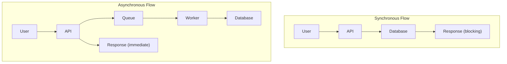
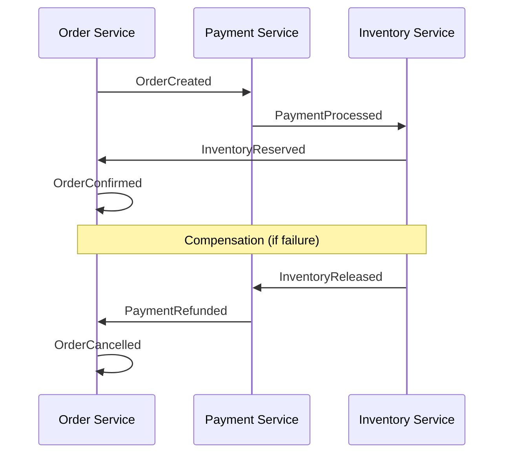
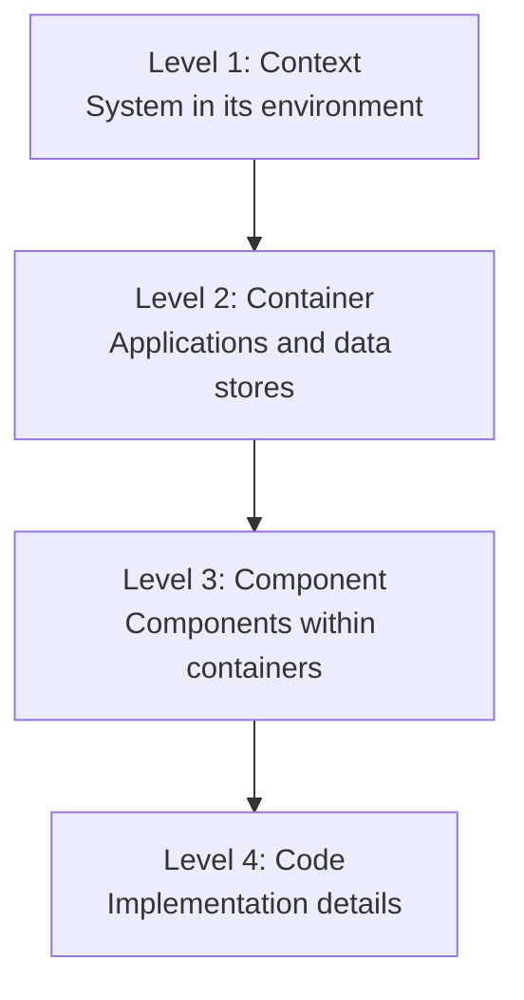

# Architecture Anti-Patterns & Deep Dive

> 架构深度技术：高可用、高并发、分布式、文档、安全架构。主流程详见 [architect-guide.md](architect-guide.md)。

## High-Availability Design

### Fault Tolerance Patterns

```
┌─────────────────────────────────────────────────────────┐
│                  Fault Tolerance                         │
├─────────────────────────────────────────────────────────┤
│ Circuit Breaker                                          │
│   └── Prevent cascade failures                           │
│                                                          │
│ Retry with Backoff                                       │
│   └── Handle transient failures                          │
│                                                          │
│ Bulkhead Isolation                                       │
│   └── Isolate failure domains                            │
│                                                          │
│ Timeout                                                  │
│   └── Prevent resource exhaustion                        │
│                                                          │
│ Fallback                                                 │
│   └── Graceful degradation                               │
└─────────────────────────────────────────────────────────┘
```

### Availability Targets

| Nines | Availability | Downtime/Year |
|-------|--------------|---------------|
| 99% | Two nines | 3.65 days |
| 99.9% | Three nines | 8.77 hours |
| 99.99% | Four nines | 52.6 minutes |
| 99.999% | Five nines | 5.26 minutes |

## High-Concurrency Architecture

### Caching Strategies

```
┌─────────────────────────────────────────────────────────┐
│                 Caching Layers                           │
├─────────────────────────────────────────────────────────┤
│ CDN Cache                                                │
│   └── Static assets, edge caching                        │
│                                                          │
│ Application Cache                                        │
│   └── In-memory (local), Redis (distributed)             │
│                                                          │
│ Database Cache                                           │
│   └── Query cache, buffer pool                           │
│                                                          │
│ Cache Patterns                                           │
│   ├── Cache-aside: Application manages cache             │
│   ├── Read-through: Cache reads from source              │
│   └── Write-through: Cache writes to source              │
└─────────────────────────────────────────────────────────┘
```

### Database Optimization

```
┌─────────────────────────────────────────────────────────┐
│              Database Scaling                            │
├─────────────────────────────────────────────────────────┤
│ Vertical Scaling                                         │
│   └── More CPU, RAM, SSD                                 │
│                                                          │
│ Read Replicas                                            │
│   └── Distribute read traffic                            │
│                                                          │
│ Sharding                                                 │
│   └── Horizontal partitioning                            │
│                                                          │
│ Partitioning                                             │
│   └── Range, Hash, List partitioning                     │
└─────────────────────────────────────────────────────────┘
```

### Async Processing



## Distributed System Design

### CAP Theorem

| Property | Description | Trade-off |
|----------|-------------|-----------|
| **Consistency** | All nodes see same data | Latency |
| **Availability** | Every request gets response | Stale data |
| **Partition Tolerance** | System works despite network failures | Must have |

**Choose**: CP (Consistency + Partition) or AP (Availability + Partition)

### Distributed Transactions

| Pattern | Use Case | Trade-off |
|---------|----------|-----------|
| **2PC** | Strong consistency | Blocking, single point of failure |
| **Saga** | Long-running transactions | Compensation logic complexity |
| **TCC** | High performance | Implementation complexity |

### Saga Pattern



## Architecture Documentation

### C4 Model



### Architecture Decision Records (ADR)

```markdown
# ADR-001: Use Event-Driven Architecture

## Status
Accepted

## Context
System needs to handle high volume of async operations
with loose coupling between services.

## Decision
Implement event-driven architecture using message queues.

## Consequences
- Pros: Decoupling, scalability, resilience
- Cons: Complexity, eventual consistency, debugging challenges

## Alternatives Considered
1. Synchronous REST - Rejected due to tight coupling
2. gRPC streaming - Rejected due to complexity
```

## Security Architecture

### Authentication Architecture

```
┌─────────────────────────────────────────────────────────┐
│              Authentication Flow                         │
├─────────────────────────────────────────────────────────┤
│ Client → API Gateway → Auth Service                     │
│                          │                               │
│                          ├── Validate credentials        │
│                          ├── Generate JWT                │
│                          └── Return token                │
│                                                          │
│ Subsequent Requests:                                     │
│ Client → API Gateway → Validate JWT → Backend Service   │
└─────────────────────────────────────────────────────────┘
```

### Authorization Patterns

| Pattern | Use Case | Complexity |
|---------|----------|------------|
| **RBAC** | Role-based access | Low |
| **ABAC** | Attribute-based access | Medium |
| **PBAC** | Policy-based access | High |
