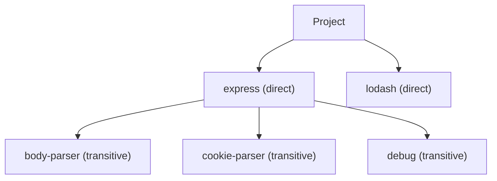
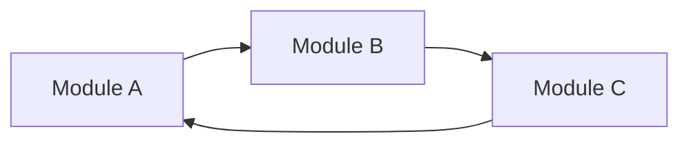
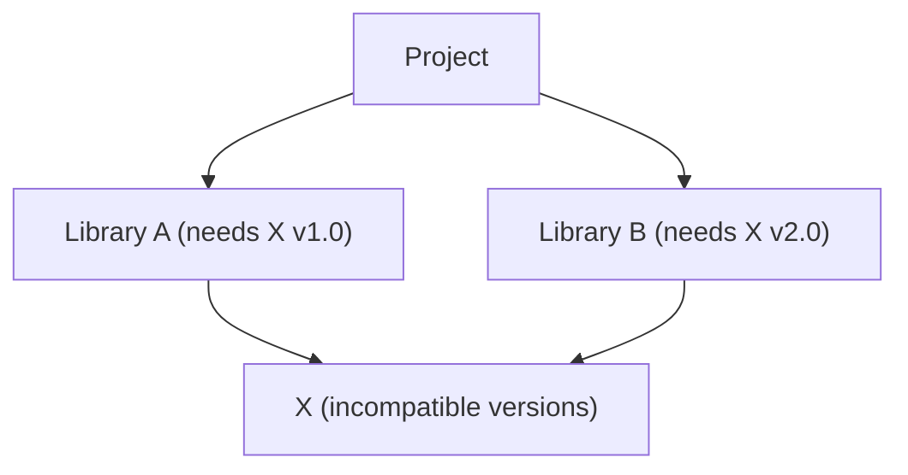
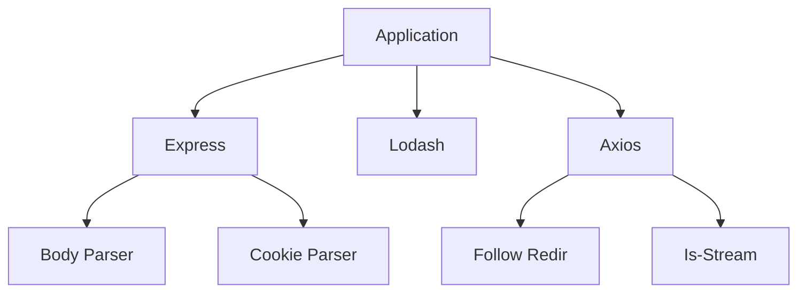

# Dependency Analysis Guide

## Dependency Types

### Direct Dependencies

Declared in project config: `package.json` (`{"express": "^4.18.0"}`), `requirements.txt` (`flask==2.0.0`), `Cargo.toml`, etc.

### Transitive Dependencies

Dependencies pulled in by direct dependencies:



### Development Dependencies

Dependencies only needed during development:

```json
{
  "devDependencies": {
    "jest": "^29.0.0",
    "eslint": "^8.0.0"
  }
}
```

## Dependency Metrics

### Coupling Analysis

| Metric | Formula | Target |
|--------|---------|--------|
| Afferent Coupling (Ca) | Incoming dependencies | Lower is better |
| Efferent Coupling (Ce) | Outgoing dependencies | Lower is better |
| Instability (I) | Ce / (Ca + Ce) | 0.0 - 1.0 |
| Abstractness (A) | Abstract classes / Total | Balance with I |

### Dependency Distance

```
Direct dependency: Distance = 1
Transitive (1 level): Distance = 2
Transitive (2 levels): Distance = 3
```

**Risk**: Higher distance = less visibility = more risk

## Dependency Issues

### 1. Circular Dependencies

**Detection**


**Problems**
- Unclear ownership
- Initialization issues
- Testing difficulties
- Deployment complexity

**Solutions**
- **Dependency Injection**: pass instances as parameters instead of importing
- **Extract shared dependency**: move the common logic to a third module
- **Invert dependency**: define an interface in a lower-level module

```python
# Before: A imports B, B imports A (circular)
# After: A receives B via DI — no import cycle
class A:
    def use_b(self, b_instance):  # injected, not imported
        return b_instance
```

### 2. Dependency Hell

**Symptoms**
- Conflicting version requirements
- Diamond dependency problem
- Version lock

**Example Diamond Problem**


**Solutions**
- Use dependency resolution tools
- Lock files (package-lock.json, Pipfile.lock)
- Version ranges carefully managed

### 3. Bloated Dependencies

**Detection**
```
[ ] Unused dependencies in project
[ ] Development dependencies in production
[ ] Duplicate functionality across dependencies
[ ] Overly large dependencies
```

**Analysis Commands**
```bash
# npm
npm ls --depth=0
npm prune

# pip
pip list --outdated
pip-autoremove

# cargo
cargo tree
cargo tree --duplicates
```

### 4. Outdated Dependencies

**Security Risks**
- Known vulnerabilities in old versions
- Missing security patches
- Deprecated dependencies

**Analysis**
```bash
# npm audit
npm audit
npm audit fix

# pip safety check
safety check
pip-audit

# cargo audit
cargo audit
```

## Dependency Health Metrics

### Version Health

| Status | Description | Action |
|--------|-------------|--------|
| Latest | Current version | None |
| Outdated | Behind latest | Plan update |
| Deprecated | No longer maintained | Migrate |
| Vulnerable | Security issues | Update immediately |

### Dependency Freshness

```
Freshness Score = (Dependencies at latest) / (Total dependencies) * 100

Target: > 80%
```

### License Compliance

**License Categories**
| Category | Risk Level | Examples |
|----------|------------|----------|
| Permissive | Low | MIT, Apache 2.0, BSD |
| Weak Copyleft | Medium | LGPL, MPL |
| Strong Copyleft | High | GPL, AGPL |
| Proprietary | Variable | Custom licenses |

**Compliance Check**
```
[ ] All licenses identified
[ ] License compatibility verified
[ ] Attribution requirements met
[ ] No prohibited licenses
```

## Dependency Visualization

### Dependency Graph



### Dependency Matrix

| From \ To | App | Auth | DB | API | Utils |
|-----------|-----|------|----|-----|-------|
| App       | -   | 1    | 1  | 1   | 1     |
| Auth      | 0   | -    | 1  | 0   | 1     |
| DB        | 0   | 0    | -  | 0   | 1     |
| API       | 0   | 1    | 1  | -   | 1     |
| Utils     | 0   | 0    | 0  | 0   | -     |

## Dependency Management Best Practices

### 1. Version Pinning

- **Exact** (`4.18.2`): pin critical deps to a known-good version
- **Patch** (`~4.17.21`): allow patch updates only
- **Minor** (`^1.4.0`): allow minor updates within same major
- **Lock files** (`package-lock.json`, `Pipfile.lock`, `Cargo.lock`): commit to VCS, update deliberately

### 2. Dependency Groups

Group by purpose: `dependencies/{web,database,auth,utils}` (core) vs `dev-dependencies/{testing,linting,building}` (dev only). Keeps blast radius of a dep change bounded to one concern.

### 3. Regular Maintenance

**Schedule**
| Task | Frequency |
|------|-----------|
| Security audit | Weekly |
| Update check | Monthly |
| Major version review | Quarterly |
| Dependency cleanup | Quarterly |

### 4. Dependency Decisions

**Before Adding Dependency**
```
[ ] Is it actively maintained?
[ ] Is it well-documented?
[ ] Is the bundle size acceptable?
[ ] Are there security issues?
[ ] Is the license compatible?
[ ] Can it be implemented simply in-house?
```

## Dependency Analysis Tools

| Ecosystem | Tree / Duplicates | Security | License | Outdated |
|-----------|-------------------|----------|---------|----------|
| JS/TS | `npx depcheck`, `npx bundle-analyzer` | `npm audit` | `npx license-checker` | `npm outdated` |
| Python | `pipdeptree` | `safety check`, `pip-audit` | `pip-licenses` | `pip list --outdated` |
| Rust | `cargo tree`, `cargo tree --duplicates` | `cargo audit` | (cargo metadata) | `cargo outdated` |

## Dependency Review Checklist

### Security
- [ ] No known vulnerabilities
- [ ] Security audit passed
- [ ] Dependencies from trusted sources
- [ ] No unnecessary dependencies

### Maintenance
- [ ] Dependencies actively maintained
- [ ] Compatible with project versions
- [ ] Update path clear
- [ ] Migration plan for deprecated

### Performance
- [ ] Bundle size acceptable
- [ ] No duplicate dependencies
- [ ] Tree-shaking supported
- [ ] Lazy loading possible

### Legal
- [ ] All licenses identified
- [ ] License compatibility verified
- [ ] Attribution requirements met
- [ ] No prohibited licenses

### Architecture
- [ ] No circular dependencies
- [ ] Clear dependency direction
- [ ] Appropriate abstraction level
- [ ] Testability not compromised
