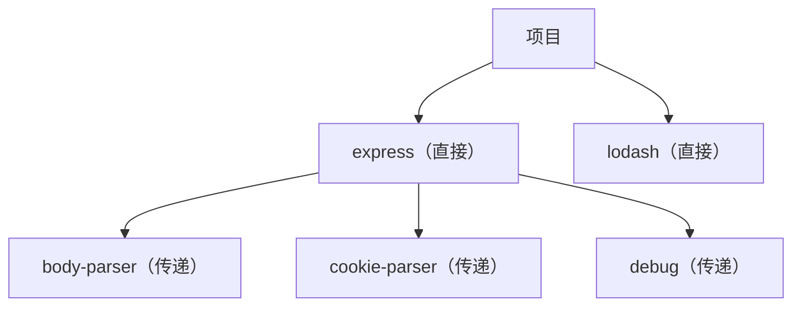
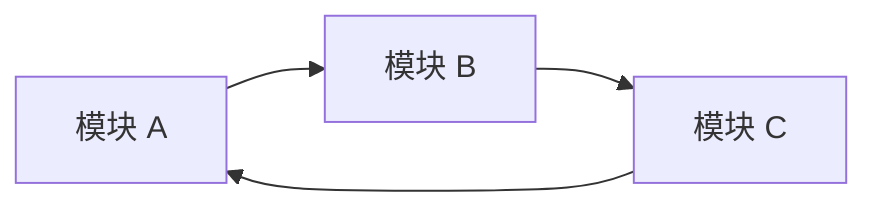
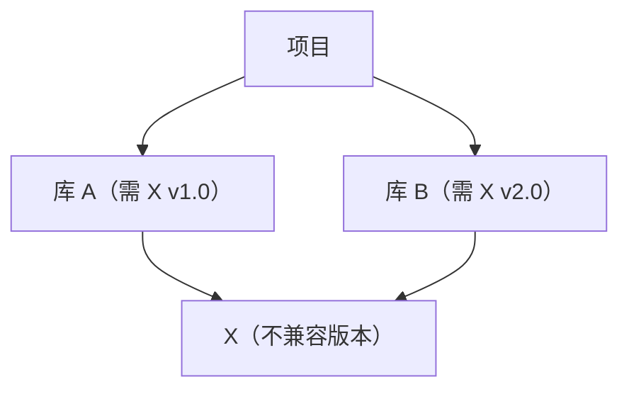
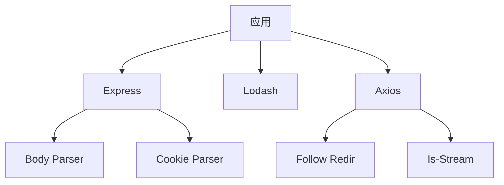

# 依赖分析指南

## 依赖类型

### 直接依赖

在项目配置中声明：`package.json`（`{"express": "^4.18.0"}`）、`requirements.txt`（`flask==2.0.0`）、`Cargo.toml` 等。

### 传递依赖

由直接依赖引入的依赖：



### 开发依赖

仅开发期间需要的依赖：

```json
{
  "devDependencies": {
    "jest": "^29.0.0",
    "eslint": "^8.0.0"
  }
}
```

## 依赖指标

### 耦合分析

| 指标 | 公式 | 目标 |
|--------|---------|--------|
| 入向耦合（Ca） | 入向依赖 | 越低越好 |
| 出向耦合（Ce） | 出向依赖 | 越低越好 |
| 不稳定度（I） | Ce / (Ca + Ce) | 0.0 - 1.0 |
| 抽象度（A） | 抽象类 / 总数 | 与 I 平衡 |

### 依赖距离

```
直接依赖：距离 = 1
传递（1 层）：距离 = 2
传递（2 层）：距离 = 3
```

**风险**：距离越远 = 可见性越低 = 风险越高

## 依赖问题

### 1. 循环依赖

**检测**


**问题**
- 所有权不清
- 初始化问题
- 测试困难
- 部署复杂度

**解决方案**
- **依赖注入**：以参数形式传入实例，而非导入
- **提取共享依赖**：将公共逻辑移至第三个模块
- **反转依赖**：在低层模块定义接口

```python
# 之前：A 导入 B，B 导入 A（循环）
# 之后：A 通过 DI 接收 B —— 无导入环
class A:
    def use_b(self, b_instance):  # 注入，而非导入
        return b_instance
```

### 2. 依赖地狱

**症状**
- 版本需求冲突
| 菱形依赖问题
- 版本锁定

**菱形问题示例**


**解决方案**
- 使用依赖解析工具
- 锁文件（package-lock.json、Pipfile.lock）
- 谨慎管理版本范围

### 3. 依赖膨胀

**检测**
```
[ ] 项目中存在未使用的依赖
[ ] 生产环境包含开发依赖
[ ] 跨依赖功能重复
[ ] 依赖过大
```

**分析命令**
```bash
# npm
npm ls --depth=0
npm prune

# pip
pip list --outdated
pip-autoremove

# cargo
cargo tree
cargo tree --duplicates
```

### 4. 过期依赖

**安全风险**
- 旧版本的已知漏洞
- 缺失安全补丁
- 已弃用依赖

**分析**
```bash
# npm audit
npm audit
npm audit fix

# pip 安全检查
safety check
pip-audit

# cargo audit
cargo audit
```

## 依赖健康指标

### 版本健康

| 状态 | 描述 | 行动 |
|--------|-------------|--------|
| 最新 | 当前版本 | 无 |
| 过期 | 落后于最新 | 计划更新 |
| 已弃用 | 不再维护 | 迁移 |
| 有漏洞 | 安全问题 | 立即更新 |

### 依赖新鲜度

```
新鲜度分数 = （最新依赖数）/（总依赖数）* 100

目标：> 80%
```

### 许可证合规

**许可证类别**
| 类别 | 风险等级 | 示例 |
|----------|------------|----------|
| 宽松 | 低 | MIT、Apache 2.0、BSD |
| 弱 Copyleft | 中 | LGPL、MPL |
| 强 Copyleft | 高 | GPL、AGPL |
| 专有 | 可变 | 自定义许可证 |

**合规检查**
```
[ ] 所有许可证已识别
[ ] 许可证兼容性已验证
[ ] 署名要求已满足
[ ] 无禁止的许可证
```

## 依赖可视化

### 依赖图



### 依赖矩阵

| 从 \ 到 | App | Auth | DB | API | Utils |
|-----------|-----|------|----|-----|-------|
| App       | -   | 1    | 1  | 1   | 1     |
| Auth      | 0   | -    | 1  | 0   | 1     |
| DB        | 0   | 0    | -  | 0   | 1     |
| API       | 0   | 1    | 1  | -   | 1     |
| Utils     | 0   | 0    | 0  | 0   | -     |

## 依赖管理最佳实践

### 1. 版本锁定

- **精确**（`4.18.2`）：将关键依赖锁定到已知良好版本
- **补丁**（`~4.17.21`）：仅允许补丁更新
- **次版本**（`^1.4.0`）：允许同主版本内的次版本更新
- **锁文件**（`package-lock.json`、`Pipfile.lock`、`Cargo.lock`）：提交到 VCS，有意识地更新

### 2. 依赖分组

按用途分组：`dependencies/{web,database,auth,utils}`（核心）vs `dev-dependencies/{testing,linting,building}`（仅开发）。使依赖变更的影响范围限定在一个关注点内。

### 3. 定期维护

**计划**
| 任务 | 频率 |
|------|-----------|
| 安全审计 | 每周 |
| 更新检查 | 每月 |
| 主版本审查 | 每季度 |
| 依赖清理 | 每季度 |

### 4. 依赖决策

**添加依赖前**
```
[ ] 是否积极维护？
[ ] 文档是否良好？
[ ] 包大小是否可接受？
[ ] 是否有安全问题？
[ ] 许可证是否兼容？
[ ] 是否可在内部简单实现？
```

## 依赖分析工具

| 生态 | 树 / 重复 | 安全 | 许可证 | 过期 |
|-----------|-------------------|----------|---------|----------|
| JS/TS | `npx depcheck`、`npx bundle-analyzer` | `npm audit` | `npx license-checker` | `npm outdated` |
| Python | `pipdeptree` | `safety check`、`pip-audit` | `pip-licenses` | `pip list --outdated` |
| Rust | `cargo tree`、`cargo tree --duplicates` | `cargo audit` | （cargo metadata） | `cargo outdated` |

## 依赖审查清单

### 安全
- [ ] 无已知漏洞
- [ ] 安全审计通过
- [ ] 依赖来自可信来源
- [ ] 无不必要的依赖

### 维护
- [ ] 依赖积极维护
- [ ] 与项目版本兼容
- [ ] 更新路径清晰
- [ ] 已弃用有迁移计划

### 性能
- [ ] 包大小可接受
- [ ] 无重复依赖
- [ ] 支持 tree-shaking
- [ ] 可懒加载

### 法律
- [ ] 所有许可证已识别
- [ ] 许可证兼容性已验证
- [ ] 署名要求已满足
- [ ] 无禁止的许可证

### 架构
- [ ] 无循环依赖
- [ ] 依赖方向清晰
- [ ] 抽象层级适当
- [ ] 可测试性未受损
