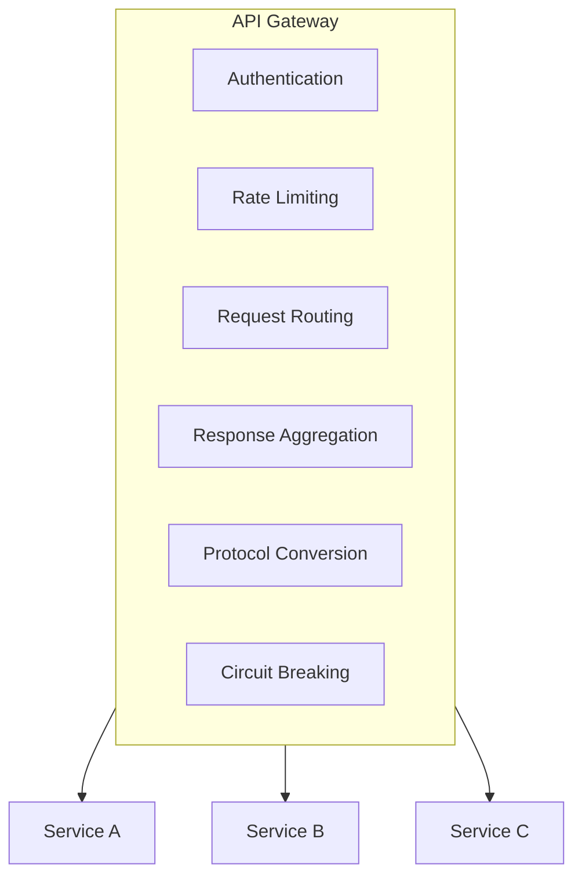
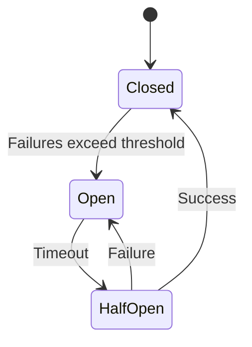
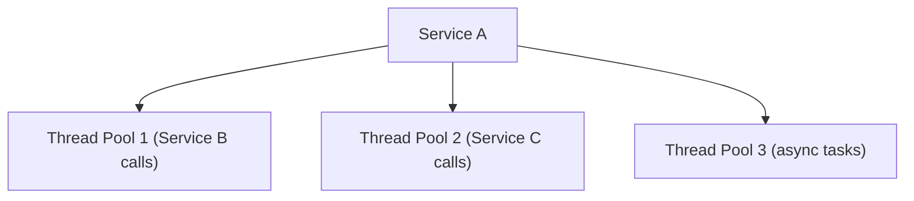

# Microservices Architecture Compliance

> **Scope**: Microservices deployment-specific rules.
> General quality attributes (coupling metrics, reliability patterns) are covered in [system-architecture.md](system-architecture.md) and also apply here — this document focuses on what is unique to microservices.

## Core Principles

### 1. Single Responsibility per Service

**Guidelines**
- Each service owns one business capability
- Service boundaries align with business domains
- Services are independently deployable

**Compliance Check**
```
[ ] Service has a clear business purpose
[ ] Service can be independently developed
[ ] Service can be independently deployed
[ ] Service can be independently scaled
```

### 2. Loose Coupling

**Metrics**
| Metric | Target | Description |
|--------|--------|-------------|
| Service dependency count | < 5 | Direct dependencies per service |
| API stability | > 95% | Interface change frequency |
| Deployment independence | Yes | Can deploy without coordination |

**Anti-Patterns**
- Distributed monolith (services tightly coupled)
- Chatty services (excessive inter-service calls)
- Shared database (database-level coupling)

### 3. High Cohesion

**Guidelines**
- Related functionality grouped within a service
- Clear service boundaries
- Minimize cross-service transactions

**Cohesion Metrics**
```
Good cohesion:
- User service handles all user-related operations
- Order service owns the complete order lifecycle

Poor cohesion:
- User service handles both users and notifications
- Order service basic operations depend on multiple other services
```

## Service Communication

| Style | Mechanism | Pros | Cons |
|-------|-----------|------|------|
| Synchronous | REST/HTTP | Simple, debuggable, public API friendly | Tight coupling, failure propagation, no retry |
| Synchronous | gRPC | High performance, strongly typed, bidirectional streaming | Complex config, poor readability, requires protobuf |
| Asynchronous | Message queue | Loose coupling, built-in retry, load balancing | Eventual consistency, hard to debug, ordering issues |
| Asynchronous | Event stream | Event sourcing, replay, real-time | Infrastructure complexity, event versioning |

### Communication Patterns

| Pattern | Use Cases | Example |
|---------|----------|---------|
| Request-Response | Simple queries | GET /users/123 |
| Fire-and-Forget | Notifications | Send email |
| Publish-Subscribe | Event propagation | OrderCreated |
| Saga | Distributed transactions | Order + Payment + Inventory |

## Data Management

### Database per Service

**Principle**
- Each service owns its own data
- Services do not directly access each other's databases
- Data consistency guaranteed through events

**Compliance Check**
```
[ ] No shared database between services
[ ] Other services do not directly access tables
[ ] Data replicated through events
[ ] Each service manages its own schema
```

### Data Consistency Patterns

**Saga Pattern**
```
Order Service -> OrderCreated
  -> Payment Service -> PaymentProcessed
    -> Inventory Service -> InventoryReserved
      -> Order Service -> OrderConfirmed
```

**Compensation**
```
When any step fails:
  -> Trigger compensation transaction
  -> Rollback previous operations
```

### CQRS (Command Query Responsibility Segregation)

**When to Use**
- Different read and write models
- Cross-data complex queries
- Performance optimization needed

**Structure**
```
Write side: Commands -> Events -> Write database
Read side: Events -> Projections -> Read database
```

## Service Discovery

### Patterns

**Client-Side Discovery**
```
Client -> Service Registry -> Available instance
Client -> Call instance directly
```

**Server-Side Discovery**
```
Client -> Load Balancer -> Service instance
```

### Health Checks

**Requirements**
```
[ ] Expose health endpoint (/health)
[ ] Implement liveness probe
[ ] Implement readiness probe
[ ] Support graceful shutdown
```

## API Gateway Pattern

### Responsibilities



### Gateway Checklist
- [ ] Single entry point for clients
- [ ] Cross-cutting concerns handled
- [ ] Service routing configured
- [ ] Rate limiting implemented
- [ ] Authentication/authorization enforced

## Resilience Patterns

### Circuit Breaker

**States**


**Configuration**
| Parameter | Typical Value |
|-----------|---------------|
| Failure threshold | 5 failures |
| Open timeout | 30 seconds |
| Half-Open request count | 3 |

### Exponential Backoff Retry

`delay = base * 2^attempt`; limit retries (e.g., 3); rethrow on last attempt. Combine with jitter to avoid thundering herd.

### Bulkhead Isolation

**Pattern**


**Benefit**: Failure in one pool does not affect others

## Observability

### Three Pillars

| Pillar | Key Practices |
|--------|---------------|
| Logging | Structured (JSON), correlation ID, appropriate level, PII redaction |
| Metrics | Request/error rates, latency percentiles, resource utilization |
| Tracing | Distributed tracing, service boundary spans, context propagation, sampling |

### Health Metrics

| Metric | Description | Threshold |
|-----------|-------------|-----------|
| Error rate | Failed requests / Total requests | < 1% |
| Latency P99 | 99th percentile response time | < 1s |
| Saturation | Resource utilization | < 80% |
| Availability | Uptime percentage | > 99.9% |

## Deployment

### Containerization

**Dockerfile Best Practices**
```dockerfile
# Multi-stage build
FROM builder AS build
COPY . .
RUN build

FROM runtime
COPY --from=build /app/dist /app
CMD ["./start"]
```

**Checklist**
- [ ] Use multi-stage builds
- [ ] Minimal base image
- [ ] No secrets in image
- [ ] Health check defined

### Kubernetes Deployment

**Requirements**
```
[ ] Define resource limits
[ ] Configure liveness probe
[ ] Configure readiness probe
[ ] ConfigMap for configuration management
[ ] Secret for sensitive data management
[ ] Horizontal Pod Autoscaler
```

## Compliance Checklist

### Architecture
- [ ] Services independently deployable
- [ ] Clear service boundaries defined
- [ ] No distributed monolith pattern
- [ ] API gateway implemented

### Communication
- [ ] Appropriate communication patterns used
- [ ] Circuit breaker implemented
- [ ] Retry logic with backoff
- [ ] Timeout configuration appropriate

### Data
- [ ] Database per service
- [ ] No shared databases
- [ ] Event-driven consistency
- [ ] CQRS used where appropriate

### Resilience
- [ ] Circuit breaker configured
- [ ] Bulkhead isolation implemented
- [ ] Graceful degradation supported
- [ ] Health checks exposed

### Observability
- [ ] Structured logging
- [ ] Metrics collection
- [ ] Distributed tracing
- [ ] Alerting configured

### Security
- [ ] Inter-service authentication
- [ ] API gateway security
- [ ] Secrets management
- [ ] Network policies
