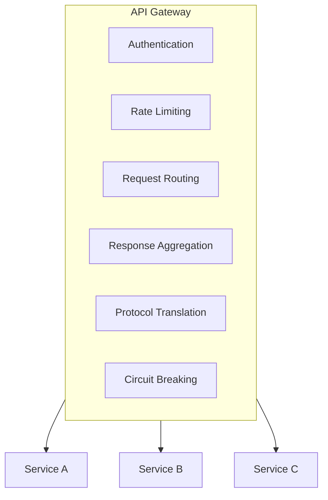
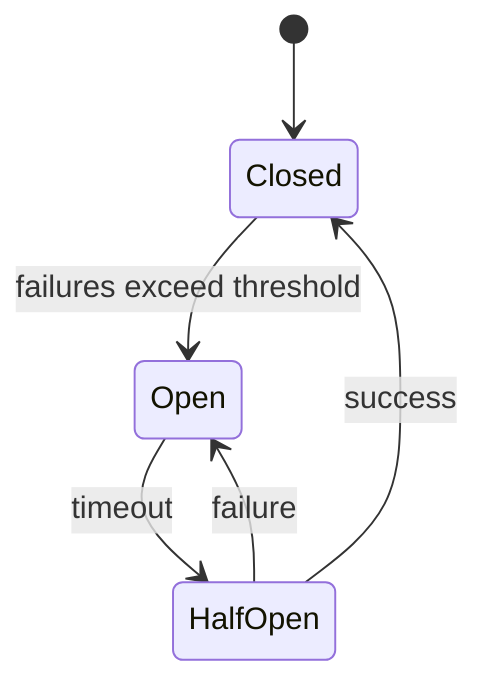
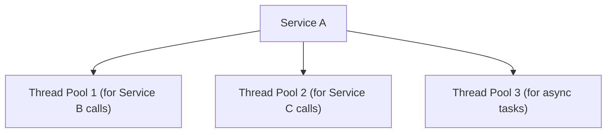

# Microservices Architecture Compliance

> **Scope**: Rules specific to microservices deployments.  
> General quality attributes (coupling metrics, reliability patterns) are in [system-architecture.md](system-architecture.md) and apply here too — this document focuses on what's *unique* to microservices.

## Core Principles

### 1. Single Responsibility per Service

**Guidelines**
- Each service owns one business capability
- Service boundaries align with business domains
- Services are independently deployable

**Compliance Check**
```
[ ] Service has clear business purpose
[ ] Service can be developed independently
[ ] Service can be deployed independently
[ ] Service can scale independently
```

### 2. Loose Coupling

**Metrics**
| Metric | Target | Description |
|--------|--------|-------------|
| Service Dependencies | < 5 | Direct dependencies per service |
| API Stability | > 95% | Interface change frequency |
| Deployment Independence | Yes | Can deploy without coordination |

**Anti-Patterns**
- Distributed Monolith (services tightly coupled)
- Chatty Services (excessive inter-service calls)
- Shared Database (database-level coupling)

### 3. High Cohesion

**Guidelines**
- Related functionality grouped within service
- Clear service boundaries
- Minimal cross-service transactions

**Cohesion Indicators**
```
Good Cohesion:
- User service handles all user-related operations
- Order service owns complete order lifecycle

Poor Cohesion:
- User service handles users AND notifications
- Order service depends on multiple other services for basic operations
```

## Service Communication

| Style | Mechanism | Pros | Cons |
|-------|-----------|------|------|
| Sync | REST/HTTP | Simple, debuggable, public-API friendly | Tight coupling, failure propagation, no retry |
| Sync | gRPC | High perf, strong typing, bidirectional streaming | Complex setup, less readable, needs protobuf |
| Async | Message Queue | Loose coupling, built-in retry, load leveling | Eventual consistency, harder debugging, ordering |
| Async | Event Streaming | Event sourcing, replay, real-time | Infra complexity, event versioning |

### Communication Patterns

| Pattern | Use Case | Example |
|---------|----------|---------|
| Request-Response | Simple queries | GET /users/123 |
| Fire-and-Forget | Notifications | Send email |
| Publish-Subscribe | Event propagation | Order created |
| Saga | Distributed transactions | Order + Payment + Inventory |

## Data Management

### Database per Service

**Principles**
- Each service owns its data
- No direct database access across services
- Data consistency through events

**Compliance Check**
```
[ ] No shared database between services
[ ] No direct table access from other services
[ ] Data replication through events
[ ] Each service manages its schema
```

### Data Consistency Patterns

**Saga Pattern**
```
Order Service -> OrderCreated
  -> Payment Service -> PaymentProcessed
    -> Inventory Service -> InventoryReserved
      -> Order Service -> OrderConfirmed
```

**Compensation**
```
If any step fails:
  -> Trigger compensating transactions
  -> Roll back previous operations
```

### CQRS (Command Query Responsibility Segregation)

**When to Use**
- Different read/write models
- Complex queries across data
- Performance optimization needed

**Structure**
```
Write Side: Commands -> Events -> Write DB
Read Side: Events -> Projections -> Read DB
```

## Service Discovery

### Patterns

**Client-Side Discovery**
```
Client -> Service Registry -> Available Instances
Client -> Direct call to instance
```

**Server-Side Discovery**
```
Client -> Load Balancer -> Service Instance
```

### Health Checks

**Requirements**
```
[ ] Health endpoint exposed (/health)
[ ] Liveness probe implemented
[ ] Readiness probe implemented
[ ] Graceful shutdown supported
```

## API Gateway Pattern

### Responsibilities



### Gateway Checklist
- [ ] Single entry point for clients
- [ ] Cross-cutting concerns handled
- [ ] Service routing configured
- [ ] Rate limiting implemented
- [ ] Authentication/Authorization enforced

## Resilience Patterns

### Circuit Breaker

**States**


**Configuration**
| Parameter | Typical Value |
|-----------|---------------|
| Failure Threshold | 5 failures |
| Open Timeout | 30 seconds |
| Half-Open Requests | 3 |

### Retry with Exponential Backoff

`delay = base * 2^attempt`; cap retries (e.g., 3); re-raise on final attempt. Combine with jitter to avoid thundering herd.

### Bulkhead Isolation

**Pattern**


**Benefit**: Failure in one pool doesn't affect others

## Observability

### Three Pillars

| Pillar | Key practices |
|--------|---------------|
| Logs | Structured (JSON), correlation IDs, appropriate levels, PII masked |
| Metrics | Request/error rate, latency percentiles, resource utilization |
| Traces | Distributed tracing, spans at service boundaries, context propagation, sampling |

### Health Indicators

| Indicator | Description | Threshold |
|-----------|-------------|-----------|
| Error Rate | Failed requests / Total | < 1% |
| Latency P99 | 99th percentile response time | < 1s |
| Saturation | Resource usage | < 80% |
| Availability | Uptime percentage | > 99.9% |

## Deployment

### Containerization

**Dockerfile Best Practices**
```dockerfile
# Multi-stage build
FROM builder AS build
COPY . .
RUN build

FROM runtime
COPY --from=build /app/dist /app
CMD ["./start"]
```

**Checklist**
- [ ] Multi-stage builds used
- [ ] Minimal base image
- [ ] No secrets in image
- [ ] Health check defined

### Kubernetes Deployment

**Requirements**
```
[ ] Resource limits defined
[ ] Liveness probe configured
[ ] Readiness probe configured
[ ] ConfigMap for configuration
[ ] Secret for sensitive data
[ ] Horizontal Pod Autoscaler
```

## Compliance Checklist

### Architecture
- [ ] Services are independently deployable
- [ ] Clear service boundaries defined
- [ ] No distributed monolith patterns
- [ ] API Gateway implemented

### Communication
- [ ] Appropriate communication patterns used
- [ ] Circuit breakers implemented
- [ ] Retry logic with backoff
- [ ] Timeout configurations appropriate

### Data
- [ ] Database per service
- [ ] No shared database
- [ ] Event-driven consistency
- [ ] CQRS where appropriate

### Resilience
- [ ] Circuit breakers configured
- [ ] Bulkhead isolation implemented
- [ ] Graceful degradation supported
- [ ] Health checks exposed

### Observability
- [ ] Structured logging
- [ ] Metrics collection
- [ ] Distributed tracing
- [ ] Alerting configured

### Security
- [ ] Service-to-service authentication
- [ ] API Gateway security
- [ ] Secret management
- [ ] Network policies
