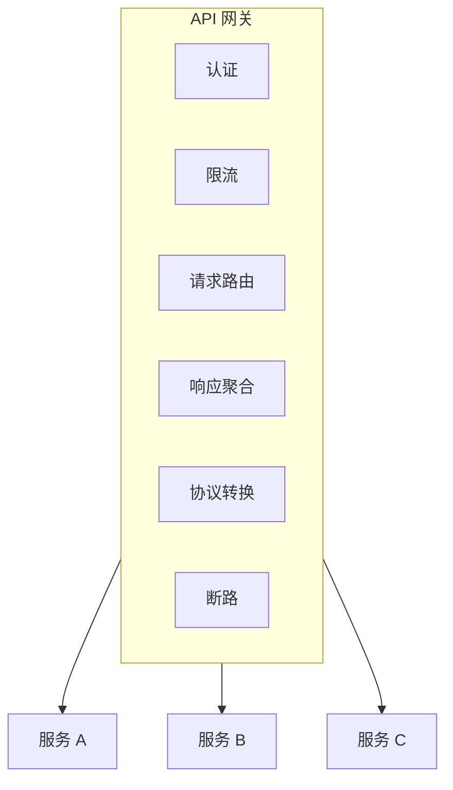
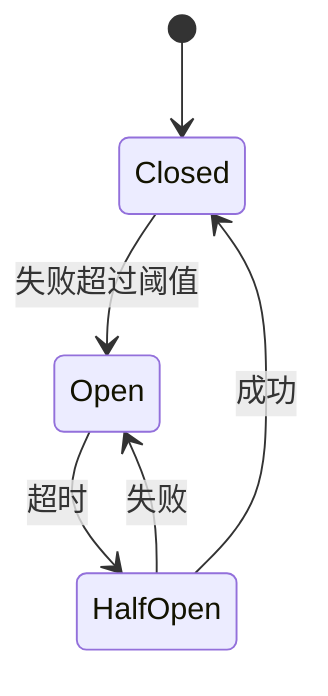
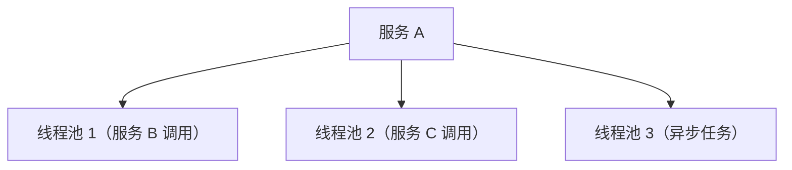

# 微服务架构合规

> **范围**：微服务部署专属规则。  
> 通用质量属性（耦合指标、可靠性模式）见 [system-architecture.md](system-architecture.md)，此处同样适用 —— 本文档聚焦微服务*独有*的内容。

## 核心原则

### 1. 每服务单一职责

**指南**
- 每个服务拥有一个业务能力
- 服务边界与业务领域对齐
- 服务可独立部署

**合规检查**
```
[ ] 服务有清晰业务目的
[ ] 服务可独立开发
[ ] 服务可独立部署
[ ] 服务可独立扩展
```

### 2. 松耦合

**指标**
| 指标 | 目标 | 描述 |
|--------|--------|-------------|
| 服务依赖数 | < 5 | 每服务直接依赖 |
| API 稳定性 | > 95% | 接口变更频率 |
| 部署独立性 | 是 | 可无需协调即部署 |

**反模式**
- 分布式单体（服务紧耦合）
- 唠叨服务（过多服务间调用）
- 共享数据库（数据库级耦合）

### 3. 高内聚

**指南**
- 相关功能聚合在服务内
- 清晰的服务边界
- 最小化跨服务事务

**内聚指标**
```
良好内聚：
- 用户服务处理所有用户相关操作
- 订单服务拥有完整订单生命周期

不良内聚：
- 用户服务既处理用户又处理通知
- 订单服务基础操作依赖多个其他服务
```

## 服务通信

| 风格 | 机制 | 优点 | 缺点 |
|-------|-----------|------|------|
| 同步 | REST/HTTP | 简单、可调试、对公开 API 友好 | 紧耦合、失败传播、无重试 |
| 同步 | gRPC | 高性能、强类型、双向流 | 配置复杂、可读性差、需 protobuf |
| 异步 | 消息队列 | 松耦合、内置重试、负载均衡 | 最终一致、调试难、顺序问题 |
| 异步 | 事件流 | 事件溯源、重放、实时 | 基础设施复杂、事件版本化 |

### 通信模式

| 模式 | 适用场景 | 示例 |
|---------|----------|---------|
| 请求-响应 | 简单查询 | GET /users/123 |
| 即发即忘 | 通知 | 发送邮件 |
| 发布-订阅 | 事件传播 | 订单已创建 |
| Saga | 分布式事务 | 订单 + 支付 + 库存 |

## 数据管理

### 每服务一库

**原则**
- 每个服务拥有自己的数据
- 服务间不直接访问数据库
- 通过事件保证数据一致性

**合规检查**
```
[ ] 服务间无共享数据库
[ ] 其他服务不直接访问表
[ ] 通过事件复制数据
[ ] 每个服务管理自己的 schema
```

### 数据一致性模式

**Saga 模式**
```
订单服务 -> OrderCreated
  -> 支付服务 -> PaymentProcessed
    -> 库存服务 -> InventoryReserved
      -> 订单服务 -> OrderConfirmed
```

**补偿**
```
任何步骤失败时：
  -> 触发补偿事务
  -> 回滚之前的操作
```

### CQRS（命令查询职责分离）

**何时使用**
- 不同的读写模型
- 跨数据复杂查询
- 需要性能优化

**结构**
```
写侧：命令 -> 事件 -> 写库
读侧：事件 -> 投影 -> 读库
```

## 服务发现

### 模式

**客户端发现**
```
客户端 -> 服务注册表 -> 可用实例
客户端 -> 直接调用实例
```

**服务端发现**
```
客户端 -> 负载均衡器 -> 服务实例
```

### 健康检查

**要求**
```
[ ] 暴露健康端点（/health）
[ ] 实现 liveness 探针
[ ] 实现 readiness 探针
[ ] 支持优雅关闭
```

## API 网关模式

### 职责



### 网关清单
- [ ] 客户端单一入口
- [ ] 横切关注点已处理
- [ ] 服务路由已配置
- [ ] 实现限流
- [ ] 强制认证/授权

## 弹性模式

### 断路器

**状态**


**配置**
| 参数 | 典型值 |
|-----------|---------------|
| 失败阈值 | 5 次失败 |
| Open 超时 | 30 秒 |
| Half-Open 请求数 | 3 |

### 指数退避重试

`delay = base * 2^attempt`；限制重试次数（如 3 次）；最后一次重新抛出。结合 jitter 避免惊群。

### 舱壁隔离

**模式**


**收益**：一个池的失败不影响其他池

## 可观测性

### 三大支柱

| 支柱 | 关键实践 |
|--------|---------------|
| 日志 | 结构化（JSON）、关联 ID、适当级别、PII 脱敏 |
| 指标 | 请求/错误率、延迟百分位、资源利用率 |
| 追踪 | 分布式追踪、服务边界 span、上下文传播、采样 |

### 健康指标

| 指标 | 描述 | 阈值 |
|-----------|-------------|-----------|
| 错误率 | 失败请求 / 总请求 | < 1% |
| 延迟 P99 | 第 99 百分位响应时间 | < 1s |
| 饱和度 | 资源使用率 | < 80% |
| 可用性 | 正常运行时间百分比 | > 99.9% |

## 部署

### 容器化

**Dockerfile 最佳实践**
```dockerfile
# 多阶段构建
FROM builder AS build
COPY . .
RUN build

FROM runtime
COPY --from=build /app/dist /app
CMD ["./start"]
```

**清单**
- [ ] 使用多阶段构建
- [ ] 最小基础镜像
- [ ] 镜像中无密钥
- [ ] 定义健康检查

### Kubernetes 部署

**要求**
```
[ ] 定义资源限制
[ ] 配置 liveness 探针
[ ] 配置 readiness 探针
[ ] ConfigMap 管理配置
[ ] Secret 管理敏感数据
[ ] 水平 Pod 自动伸缩
```

## 合规清单

### 架构
- [ ] 服务可独立部署
- [ ] 定义清晰的服务边界
- [ ] 无分布式单体模式
- [ ] 实现 API 网关

### 通信
- [ ] 使用适当的通信模式
- [ ] 实现断路器
- [ ] 带退避的重试逻辑
- [ ] 超时配置适当

### 数据
- [ ] 每服务一库
- [ ] 无共享数据库
- [ ] 事件驱动一致性
- [ ] 适当处使用 CQRS

### 弹性
- [ ] 配置断路器
- [ ] 实现舱壁隔离
- [ ] 支持优雅降级
- [ ] 暴露健康检查

### 可观测性
- [ ] 结构化日志
- [ ] 指标采集
- [ ] 分布式追踪
- [ ] 配置告警

### 安全
- [ ] 服务间认证
- [ ] API 网关安全
- [ ] 密钥管理
- [ ] 网络策略
