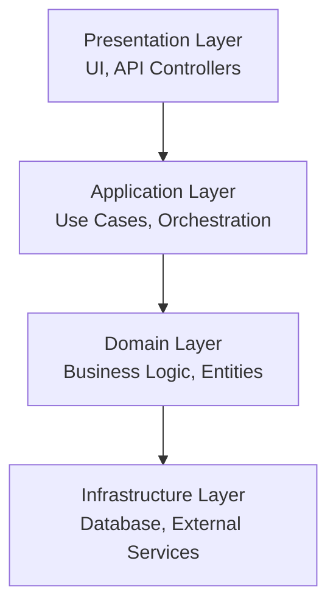
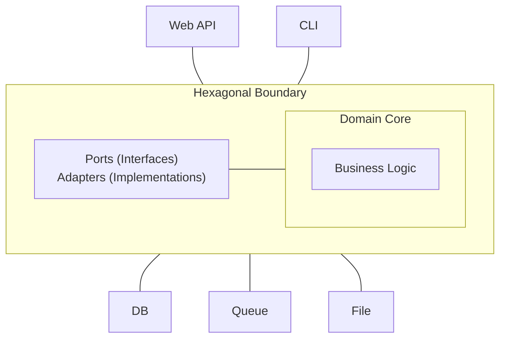
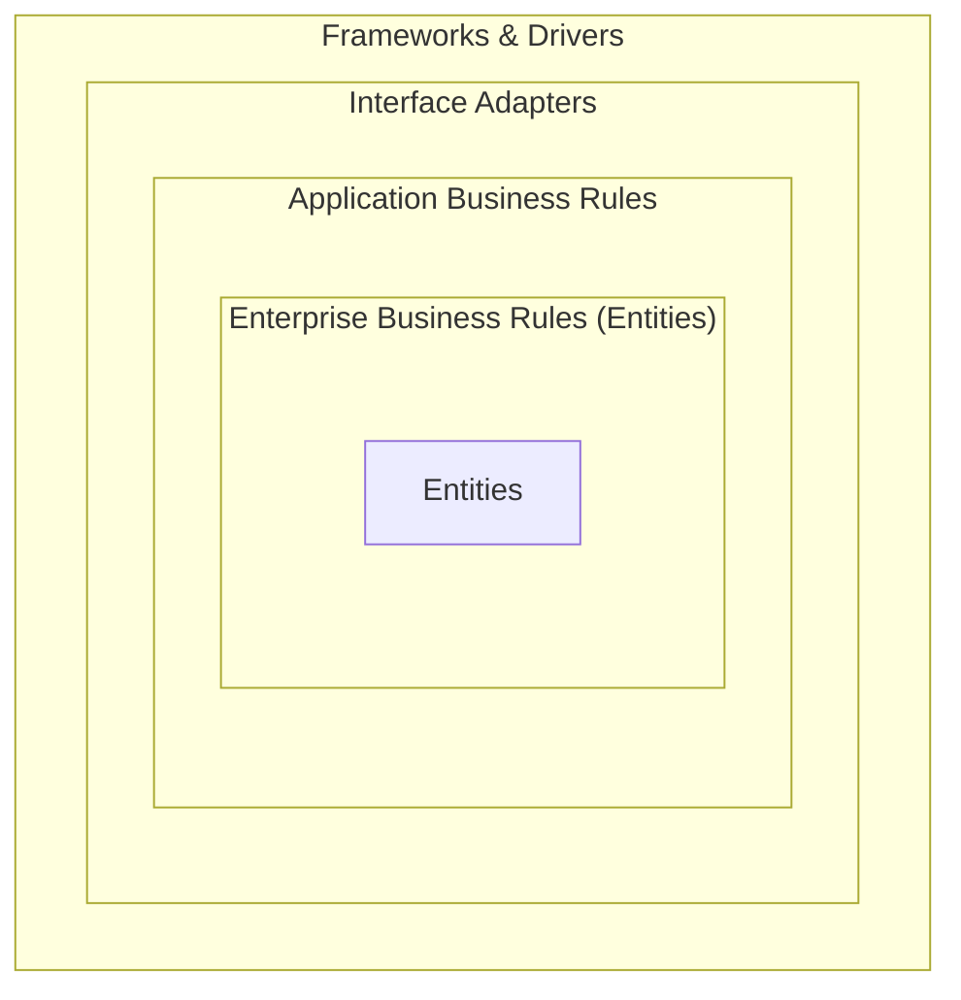

# System Architecture Review Guide

> **Scope**: General architecture quality attributes — applicable to any system (monolith, modular monolith, microservices).
> Microservices-specific compliance rules are in [microservices-compliance.md](microservices-compliance.md).

## Architecture Quality Attributes

### 1. Modifiability

**Principles**

- Low coupling between modules
- High cohesion within modules
- Clear separation of concerns
- Well-defined interfaces

**Metrics**
| Metric | Target | Description |
|--------|--------|-------------|
| Coupling factor | < 0.3 | Inter-module dependencies |
| Cohesion degree | > 0.7 | Related functionality grouping |
| Interface stability | > 0.9 | API change frequency |

**Anti-Patterns**

- God Object (one class does everything)
- Spaghetti Code (no clear structure)
- Copy-Paste Programming
- Hardcoded dependencies

### 2. Scalability

**Horizontal Scaling Pattern**

```
Load Balancer -> [Server 1, Server 2, Server 3] -> Shared State
```

**Vertical Scaling Considerations**

- CPU optimization
- Memory management
- I/O efficiency

**Scaling Metrics**
| Metric | Description |
|--------|-------------|
| Throughput | Requests per second |
| Latency | Response time percentiles |
| Resource utilization | CPU, memory, I/O |

### 3. Reliability

**Patterns**

- Circuit breaker
- Exponential backoff retry
- Bulkhead isolation
- Timeout pattern

**Metrics**
| Metric | Target |
|--------|--------|
| Availability | > 99.9% |
| MTTR | < 1 hour |
| MTBF | > 1000 hours |

### 4. Security

**Architecture Principles**

- Defense in depth
- Least privilege
- Secure by default
- Fail secure

**Security Layers**

```
Network -> Application -> Service -> Data
```

## Layered Architecture

### Standard Layers



### Layer Dependencies

**Rules**

- Upper layers depend on lower layers
- Lower layers should not depend on upper layers
- Domain layer should be independent

**Violation Detection**

```python
def check_layer_violation(source_layer, target_layer):
    layer_order = {'presentation': 4, 'application': 3, 'domain': 2, 'infrastructure': 1}
    return layer_order.get(source_layer, 0) < layer_order.get(target_layer, 0)
```

## Hexagonal Architecture (Ports and Adapters)

### Structure



### Ports (Interfaces)

- Inbound: Define how external actors interact with the application
- Outbound: Define how the application interacts with external systems

### Adapters (Implementations)

- Primary adapters: REST controllers, CLI handlers, message consumers
- Secondary adapters: Database repositories, API clients, file systems

## Clean Architecture

### Dependency Rule

> Source code dependencies can only point inward toward higher-level policies.

### Layers



## Event-Driven Architecture

### Patterns

**Event Sourcing**

```
Command -> Validate -> Create Event -> Store Event -> Update State
```

**CQRS (Command Query Responsibility Segregation)**

```
Write Model: Commands -> Events -> Write Database
Read Model: Events -> Projections -> Read Database
```

**Messaging Patterns**

- Point-to-point
- Publish-subscribe
- Request-reply

### Event Types

| Type              | Purpose                      | Example      |
| ----------------- | ---------------------------- | ------------ |
| Domain Events     | What happened in the domain  | OrderCreated |
| Integration Events | Cross bounded context        | OrderShipped |
| Commands          | Request to do something      | CreateOrder  |

## Architecture Decision Records (ADR)

### Template

```
# ADR-001: [Title]
## Status: [Proposed | Accepted | Deprecated | Superseded]
## Context: What is the problem we are trying to solve?
## Decision: What is the change we are proposing?
## Consequences: Positive and negative impacts?
## Alternatives Considered: What other options were evaluated?
```

## Architecture Review Checklist

### Structure

- [ ] Clear layer separation
- [ ] Well-defined module boundaries
- [ ] Consistent naming conventions
- [ ] Appropriate abstraction level

### Dependencies

- [ ] No circular dependencies
- [ ] Dependency injection used
- [ ] Interface-based dependencies
- [ ] External dependency isolation

### Scalability

- [ ] Stateless design where possible
- [ ] Supports horizontal scaling
- [ ] Caching strategy defined
- [ ] Database sharding considered

### Reliability

- [ ] Error handling at boundaries
- [ ] Graceful degradation
- [ ] Circuit breaker for external calls
- [ ] Retry mechanism implemented

### Security

- [ ] Authentication at boundaries
- [ ] Authorization checks in place
- [ ] Sensitive data encrypted
- [ ] Security logging enabled

### Performance

- [ ] Critical path identified
- [ ] Performance budget defined
- [ ] Resource pooling implemented
- [ ] Async processing where appropriate

## Architecture Style vs Architecture Pattern

Reviews often confuse the two — need to distinguish:

- **Style** — System-level organizational constraints (layered, microservices, event-driven). Answers _"How is the entire system organized?"_
- **Pattern** — Structured solution to a specific sub-problem (CQRS, Saga, Sidecar, BFF). Answers _"How do we solve this one specific problem within the style?"_

A system chooses **one style**, then layers **multiple patterns** on top.

## Architecture Selection Decision Matrix

| Signal / Constraint                                             | Starting Choice                                         | Evolve To When                                             |
| --------------------------------------------------------------- | -------------------------------------------------- | ---------------------------------------------------------- |
| 1–3 developers, single domain, CRUD                            | **Layered** (Presentation/Business/Data)           | Modular monolith when modules bleed into each other        |
| Multiple teams, clear bounded contexts                         | **Modular Monolith + DDD Aggregates**              | Microservices only after independent deploy/scale validated |
| Need to independently scale one capability                      | **Microservices** (extract only that capability)   | — Do not reflexively extract everything else               |
| Read-heavy write-light, or very different read/write models    | **CQRS** + read model                             | Add event sourcing when audit/replay needed               |
| Many state transitions, complex business rules                 | **DDD** (aggregates, value objects, domain events) | Add event sourcing when temporal audit is important        |
| Multiple incompatible inbound channels (web/mobile/CLI/job)    | **Hexagonal** (Ports and Adapters)                 | —                                                          |
| Pursue pure dependency direction (policy at center)            | **Clean Architecture**                             | —                                                          |
| Async, reactive, streaming workloads                           | **Event-Driven** (Pub/Sub + queues)                | Saga for long-running transactions                         |
| Cross-cutting infra (auth/proxy/telemetry) detached from app  | **Sidecar / Service Mesh**                         | —                                                          |
| Multiple frontends needing customized APIs                     | **BFF** (Backend for Frontend)                     | —                                                          |

## Anti-Signals (When You Chose Wrong)

| Wrong Choice                              | Typical Code Smell                              |
| ----------------------------------------- | -------------------------------------------- |
| 2-person team using microservices         | Distributed monolith; ops overhead ≫ benefit |
| Event sourcing without replay/audit needs | Complexity tax with no payoff                |
| CQRS without read/write asymmetry         | Two models to keep consistent, zero benefit  |
| Anemic CRUD with Clean Architecture       | Ceremony over empty domain logic             |
| Domain scattered everywhere with layered  | "Smart UI, dumb everywhere else" rot         |
| Hexagonal with only one adapter           | One-trick-abstraction-layer — YAGNI          |

## Decision Order (Apply Top-Down)

1. **Domain complexity?** No → Layered. Yes → DDD / Hexagonal core.
2. **Team topology and deployment independence?** Multiple teams, independent releases →
   Microservices — and only for bounded contexts that need it. Otherwise
   modular monolith.
3. **Read/write asymmetry?** Yes → CQRS.
4. **Async workflows?** Yes → Event-driven + Saga for multi-step transactions.
5. **Frontend diversity?** Yes → BFF per frontend.

> A concise single-page version for PR scope review is in [commands/architecture.md](../commands/architecture.md).
