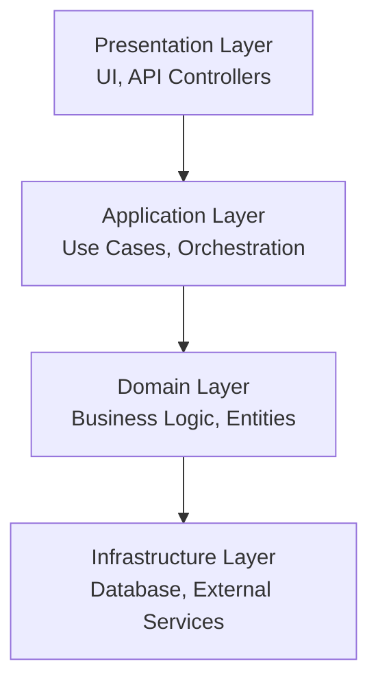
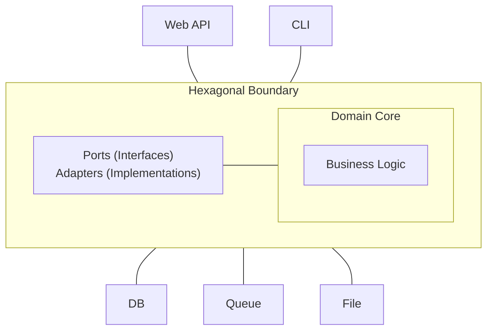
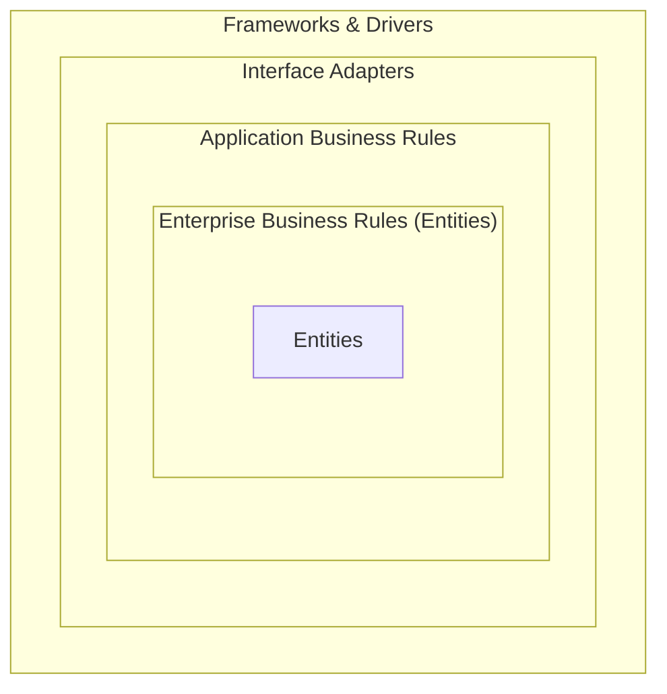

# System Architecture Review Guide

> **Scope**: General architecture quality attributes — applies to any system (monolith, modular monolith, microservices).  
> For microservices-specific compliance rules see [microservices-compliance.md](microservices-compliance.md).

## Architecture Quality Attributes

### 1. Modifiability

**Principles**

- Low coupling between modules
- High cohesion within modules
- Clear separation of concerns
- Well-defined interfaces

**Metrics**
| Metric | Target | Description |
|--------|--------|-------------|
| Coupling Factor | < 0.3 | Dependencies between modules |
| Cohesion | > 0.7 | Related functionality grouped |
| Interface Stability | > 0.9 | API change frequency |

**Anti-Patterns**

- God Object (one class does everything)
- Spaghetti Code (no clear structure)
- Copy-Paste Programming
- Hard-coded Dependencies

### 2. Scalability

**Horizontal Scaling Patterns**

```
Load Balancer -> [Server 1, Server 2, Server 3] -> Shared State
```

**Vertical Scaling Considerations**

- CPU optimization
- Memory management
- I/O efficiency

**Scaling Metrics**
| Metric | Description |
|--------|-------------|
| Throughput | Requests per second |
| Latency | Response time percentiles |
| Resource Utilization | CPU, Memory, I/O |

### 3. Reliability

**Patterns**

- Circuit Breaker
- Retry with Exponential Backoff
- Bulkhead Isolation
- Timeout Patterns

**Metrics**
| Metric | Target |
|--------|--------|
| Availability | > 99.9% |
| MTTR | < 1 hour |
| MTBF | > 1000 hours |

### 4. Security

**Architecture Principles**

- Defense in Depth
- Least Privilege
- Secure by Default
- Fail Secure

**Security Layers**

```
Network -> Application -> Service -> Data
```

## Layered Architecture

### Standard Layers



### Layer Dependencies

**Rules**

- Upper layers depend on lower layers
- Lower layers should not depend on upper layers
- Domain layer should be independent

**Violation Detection**

```python
def check_layer_violation(source_layer, target_layer):
    layer_order = {'presentation': 4, 'application': 3, 'domain': 2, 'infrastructure': 1}
    return layer_order.get(source_layer, 0) < layer_order.get(target_layer, 0)
```

## Hexagonal Architecture (Ports & Adapters)

### Structure



### Ports (Interfaces)

- Inbound: Define how external actors interact with the application
- Outbound: Define how the application interacts with external systems

### Adapters (Implementations)

- Primary: REST controllers, CLI handlers, Message consumers
- Secondary: Database repositories, API clients, File systems

## Clean Architecture

### Dependency Rule

> Source code dependencies must point only inward, toward higher-level policies.

### Layers



## Event-Driven Architecture

### Patterns

**Event Sourcing**

```
Command -> Validate -> Create Event -> Store Event -> Update State
```

**CQRS (Command Query Responsibility Segregation)**

```
Write Model: Commands -> Events -> Write Database
Read Model: Events -> Projections -> Read Database
```

**Message Patterns**

- Point-to-Point
- Publish-Subscribe
- Request-Reply

### Event Types

| Type              | Purpose                      | Example      |
| ----------------- | ---------------------------- | ------------ |
| Domain Event      | Something happened in domain | OrderCreated |
| Integration Event | Cross-bounded context        | OrderShipped |
| Command           | Request to do something      | CreateOrder  |

## Architecture Decision Records (ADR)

### Template

```
# ADR-001: [Title]
## Status: [Proposed | Accepted | Deprecated | Superseded]
## Context: What is the issue we're addressing?
## Decision: What is the change we're proposing?
## Consequences: Positive and negative outcomes?
## Alternatives Considered: What other options were evaluated?
```

## Architecture Review Checklist

### Structure

- [ ] Clear layer separation
- [ ] Well-defined module boundaries
- [ ] Consistent naming conventions
- [ ] Appropriate abstraction levels

### Dependencies

- [ ] No circular dependencies
- [ ] Dependency injection used
- [ ] Interface-based dependencies
- [ ] External dependencies isolated

### Scalability

- [ ] Stateless design where possible
- [ ] Horizontal scaling supported
- [ ] Caching strategy defined
- [ ] Database sharding considered

### Reliability

- [ ] Error handling at boundaries
- [ ] Graceful degradation
- [ ] Circuit breakers for external calls
- [ ] Retry mechanisms implemented

### Security

- [ ] Authentication at boundaries
- [ ] Authorization checks in place
- [ ] Sensitive data encrypted
- [ ] Security logging enabled

### Performance

- [ ] Critical paths identified
- [ ] Performance budgets defined
- [ ] Resource pooling implemented
- [ ] Async processing where appropriate

## Architecture Style vs Architecture Pattern

The two are routinely conflated in review — distinguish them:

- **Style** — system-level organizational constraint (Layered, Microservices,
  Event-Driven). Answers _"how is the whole system organized?"_
- **Pattern** — a structural solution to a specific sub-problem (CQRS, Saga,
  Sidecar, BFF). Answers _"how do we solve this one problem inside the style?"_

One system picks **one style**, then layers **several patterns** on top.

## Architecture Selection Decision Matrix

| Signal / constraint                                             | Start with                                         | Evolve to when                                             |
| --------------------------------------------------------------- | -------------------------------------------------- | ---------------------------------------------------------- |
| 1–3 devs, single domain, CRUD                                   | **Layered** (Presentation/Business/Data)           | Modular Monolith once modules bleed into each other        |
| Multiple teams, clear bounded contexts                          | **Modular Monolith + DDD aggregates**              | Microservices only when independent deploy/scale is proven |
| Need to scale one capability independently                      | **Microservices** (extract that capability only)   | — do not extract everything else by reflex                 |
| Heavy read / light write, or very different read & write models | **CQRS** + read models                             | + Event Sourcing when audit/replay is required             |
| Many state transitions, complex business rules                  | **DDD** (Aggregates, Value Objects, Domain Events) | + Event Sourcing when temporal audit matters               |
| Many incompatible inbound channels (web/mobile/CLI/job)         | **Hexagonal** (Ports & Adapters)                   | —                                                          |
| Want dependency-direction purity (policy at center)             | **Clean Architecture**                             | —                                                          |
| Async, reactive, streaming workload                             | **Event-Driven** (Pub/Sub + queues)                | + Saga for long-running transactions                       |
| Cross-cutting infra (auth/proxy/telemetry) off the app          | **Sidecar / Service Mesh**                         | —                                                          |
| Several frontends needing tailored APIs                         | **BFF** (Backend for Frontend)                     | —                                                          |

## Anti-Signals (when the choice is wrong)

| Wrong choice                              | Tell-tale smell                              |
| ----------------------------------------- | -------------------------------------------- |
| Microservices for a 2-dev team            | Distributed Monolith; ops overhead ≫ benefit |
| Event Sourcing without replay/audit need  | Complexity tax with no payoff                |
| CQRS without read/write asymmetry         | Two models to keep consistent, zero upside   |
| Clean Architecture around anemic CRUD     | ceremony over no domain logic                |
| Layered when domains cross-cut everywhere | "smart UI, dumb everywhere else" rot         |
| Hexagonal with one adapter                | abstraction layer with one crossing — YAGNI  |

## Decision Order (apply top-down)

1. **Domain complexity?** No → Layered. Yes → DDD / Hexagonal core.
2. **Team topology & deploy independence?** Multi-team, independent release →
   Microservices — and only for the bounded contexts that need it. Otherwise
   Modular Monolith.
3. **Read/write asymmetry?** Yes → CQRS.
4. **Async workflow?** Yes → Event-Driven + Saga for multi-step transactions.
5. **Frontend variety?** Yes → BFF per frontend.

> See [commands/architecture.md](../commands/architecture.md) for the compact
> one-page version used during PR-scoped review.
