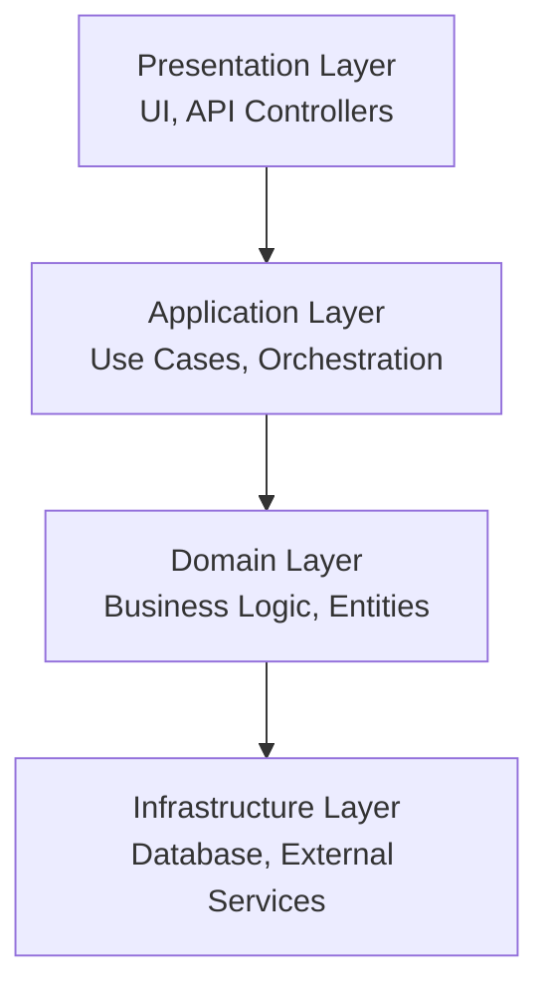
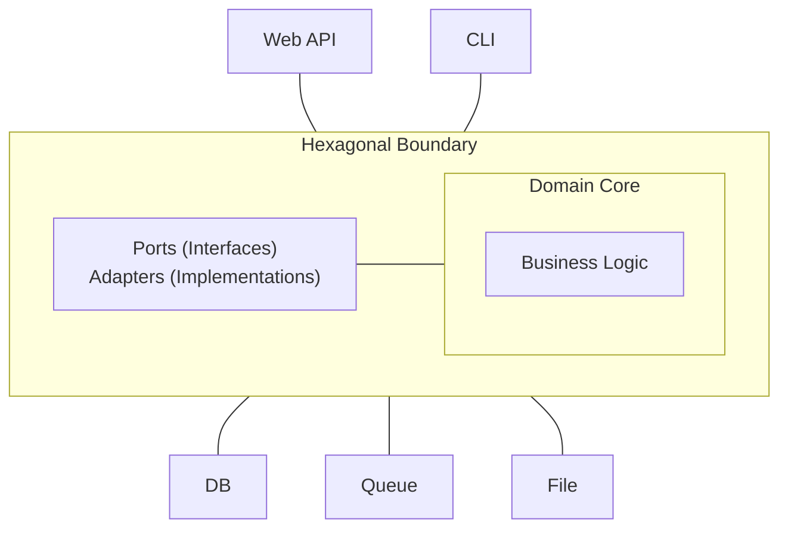
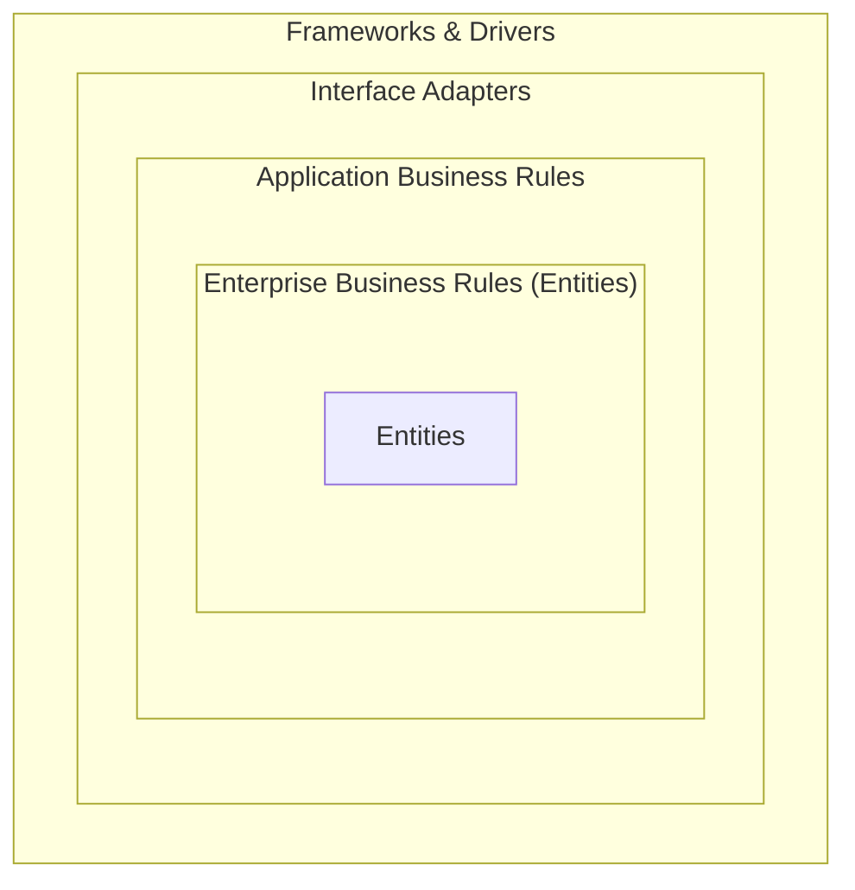

# 系统架构审查指南

> **范围**：通用架构质量属性 —— 适用于任何系统（单体、模块化单体、微服务）。  
> 微服务专属合规规则见 [microservices-compliance.md](microservices-compliance.md)。

## 架构质量属性

### 1. 可修改性

**原则**

- 模块间低耦合
- 模块内高内聚
- 清晰的关注点分离
- 定义良好的接口

**指标**
| 指标 | 目标 | 描述 |
|--------|--------|-------------|
| 耦合因子 | < 0.3 | 模块间依赖 |
| 内聚度 | > 0.7 | 相关功能分组 |
| 接口稳定性 | > 0.9 | API 变更频率 |

**反模式**

- God Object（一个类包揽一切）
- Spaghetti Code（无清晰结构）
- Copy-Paste 编程
- 硬编码依赖

### 2. 可扩展性

**水平扩展模式**

```
Load Balancer -> [Server 1, Server 2, Server 3] -> Shared State
```

**垂直扩展考量**

- CPU 优化
- 内存管理
- I/O 效率

**扩展指标**
| 指标 | 描述 |
|--------|-------------|
| 吞吐量 | 每秒请求数 |
| 延迟 | 响应时间百分位 |
| 资源利用率 | CPU、内存、I/O |

### 3. 可靠性

**模式**

- 断路器
- 指数退避重试
- 舱壁隔离
- 超时模式

**指标**
| 指标 | 目标 |
|--------|--------|
| 可用性 | > 99.9% |
| MTTR | < 1 小时 |
| MTBF | > 1000 小时 |

### 4. 安全

**架构原则**

- 纵深防御
- 最小权限
- 默认安全
- 失败安全

**安全层级**

```
Network -> Application -> Service -> Data
```

## 分层架构

### 标准层



### 层依赖

**规则**

- 上层依赖下层
- 下层不应依赖上层
- 领域层应独立

**违反检测**

```python
def check_layer_violation(source_layer, target_layer):
    layer_order = {'presentation': 4, 'application': 3, 'domain': 2, 'infrastructure': 1}
    return layer_order.get(source_layer, 0) < layer_order.get(target_layer, 0)
```

## 六边形架构（端口与适配器）

### 结构



### 端口（接口）

- 入站：定义外部参与者如何与应用交互
- 出站：定义应用如何与外部系统交互

### 适配器（实现）

- 主适配器：REST 控制器、CLI 处理器、消息消费者
- 次适配器：数据库仓储、API 客户端、文件系统

## Clean Architecture

### 依赖规则

> 源代码依赖只能向内指向更高层策略。

### 层



## 事件驱动架构

### 模式

**事件溯源**

```
Command -> Validate -> Create Event -> Store Event -> Update State
```

**CQRS（命令查询职责分离）**

```
Write Model: Commands -> Events -> Write Database
Read Model: Events -> Projections -> Read Database
```

**消息模式**

- 点对点
- 发布-订阅
- 请求-应答

### 事件类型

| 类型              | 用途                      | 示例      |
| ----------------- | ---------------------------- | ------------ |
| 领域事件      | 领域中发生的事情 | OrderCreated |
| 集成事件 | 跨限界上下文        | OrderShipped |
| 命令           | 请求做某事      | CreateOrder  |

## 架构决策记录（ADR）

### 模板

```
# ADR-001: [标题]
## 状态: [Proposed | Accepted | Deprecated | Superseded]
## 上下文: 我们要解决的问题是什么？
## 决策: 我们提议的变更是什么？
## 后果: 正面和负面影响？
## 考虑的替代方案: 评估过哪些其他选项？
```

## 架构审查清单

### 结构

- [ ] 清晰的层分离
- [ ] 定义良好的模块边界
- [ ] 一致的命名约定
- [ ] 适当的抽象层级

### 依赖

- [ ] 无循环依赖
- [ ] 使用依赖注入
- [ ] 基于接口的依赖
- [ ] 外部依赖隔离

### 可扩展性

- [ ] 尽可能无状态设计
- [ ] 支持水平扩展
- [ ] 定义缓存策略
- [ ] 考虑数据库分片

### 可靠性

- [ ] 边界处错误处理
- [ ] 优雅降级
- [ ] 外部调用使用断路器
- [ ] 实现重试机制

### 安全

- [ ] 边界处认证
- [ ] 授权检查到位
- [ ] 敏感数据加密
- [ ] 启用安全日志

### 性能

- [ ] 识别关键路径
- [ ] 定义性能预算
- [ ] 实现资源池化
- [ ] 适当处异步处理

## 架构风格 vs 架构模式

审查中常混淆两者 —— 需区分：

- **风格** —— 系统级组织约束（分层、微服务、事件驱动）。回答_"整个系统如何组织？"_
- **模式** —— 针对特定子问题的结构化解决方案（CQRS、Saga、Sidecar、BFF）。回答_"在风格内如何解决这一个具体问题？"_

一个系统选择**一种风格**，然后在其上叠加**多个模式**。

## 架构选型决策矩阵

| 信号 / 约束                                             | 起步选择                                         | 何时演进为                                             |
| --------------------------------------------------------------- | -------------------------------------------------- | ---------------------------------------------------------- |
| 1–3 名开发、单一领域、CRUD                                   | **分层**（Presentation/Business/Data）           | 模块相互渗透后改为模块化单体        |
| 多团队、清晰的限界上下文                          | **模块化单体 + DDD 聚合**              | 仅在独立部署/扩展验证后才改微服务 |
| 需独立扩展某一能力                      | **微服务**（仅抽取该能力）   | — 不要反射性地抽取其他一切                 |
| 读重写轻，或读写模型差异很大 | **CQRS** + 读模型                             | 需审计/重放时加事件溯源             |
| 大量状态转换、复杂业务规则                  | **DDD**（聚合、值对象、领域事件） | 时间维度审计重要时加事件溯源               |
| 多个不兼容入站通道（web/mobile/CLI/job）         | **六边形**（端口与适配器）                   | —                                                          |
| 追求依赖方向纯净（策略居中）             | **Clean Architecture**                             | —                                                          |
| 异步、响应式、流式负载                             | **事件驱动**（Pub/Sub + 队列）                | 长事务加 Saga                       |
| 横切基础设施（auth/proxy/telemetry）脱离应用          | **Sidecar / Service Mesh**                         | —                                                          |
| 多个前端需要定制 API                         | **BFF**（Backend for Frontend）                     | —                                                          |

## 反信号（选错时）

| 错误选择                              | 典型坏味                              |
| ----------------------------------------- | -------------------------------------------- |
| 2 人团队用微服务            | 分布式单体；运维开销 ≫ 收益 |
| 无重放/审计需求却用事件溯源  | 复杂度税无回报                |
| 无读写不对称却用 CQRS         | 两个模型需保持一致，零收益   |
| 贫血 CRUD 套 Clean Architecture     | 仪式盖过空领域逻辑                |
| 领域四处横切却用分层 | "聪明 UI、其他地方都笨"的腐烂         |
| 只有一个适配器却用六边形                | 一处穿越的抽象层 —— YAGNI  |

## 决策顺序（自上而下应用）

1. **领域复杂度？** 否 → 分层。是 → DDD / 六边形核心。
2. **团队拓扑与部署独立性？** 多团队、独立发布 →
   微服务 —— 且仅对需要的限界上下文。否则
   模块化单体。
3. **读写不对称？** 是 → CQRS。
4. **异步工作流？** 是 → 事件驱动 + 多步事务用 Saga。
5. **前端多样性？** 是 → 每个前端一个 BFF。

> PR 范围审查使用的精简单页版见 [commands/architecture.md](../commands/architecture.md)。
