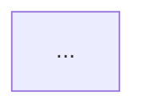

# Decay Diagnosis — Shared Framework

Code and test quality diagnostics based on principles from twelve classic software engineering books.
Use `source-coverage.md` to ground these sources in real evidence, exceptions, and trade-offs.

## Iron Law

```
NEVER suggest fixes before completing risk diagnosis.
EVERY finding must follow: Symptom → Source → Consequence → Remedy.
```

Reviews that violate this law only list rule violations without explaining why they matter. Findings without Consequence and Remedy are not findings — they are noise.

> **On-demand sections (skip unless the condition applies):**
> - "Remedy Mode" — only when the user passes `--fix` or asks to fix findings
> - "Post-Report Triage" — only in interactive sessions after report output
> - "History Tracking" — only after Health Score calculation is complete

## Project Configuration

Before running a review, attempt to read `.decay-review.yaml` from the project root.
If the file exists, parse and apply its settings before continuing.
If the file does not exist, proceed with defaults (all risks enabled, none ignored).

In multi-mode sessions, re-read only when the user says the config has changed.

### Supported Settings

**`disable`** — A list of risk codes to skip entirely. Findings for disabled risks are silently omitted from the report and do not affect the Health Score.
Valid codes: `R1` `R2` `R3` `R4` `R5` `R6` `T1` `T2` `T3` `T4` `T5` `T6`

**`severity`** — Override the severity of specific risks for this project.
Valid values: `critical` `warning` `suggestion`
Example: `R1: suggestion` means every R1 finding is downgraded to Suggestion regardless of what the guide says.

**`ignore`** — A list of glob patterns. Files matching any pattern are excluded from analysis. Findings caused solely by ignored files are omitted.
Common entries: `**/*.generated.*`, `**/vendor/**`, `**/migrations/**`

**`focus`** — A non-empty list of risk codes to evaluate; all others are skipped.
Omit this key (or leave empty) to evaluate all non-disabled risks.
Cannot be combined with a non-empty `disable` list.

**`strictness`** — Adjusts the severity scoring strictness for teams at different maturity stages. Takes one of the following values:
- `strict` — heavier deductions; for teams that maintain high standards.
- `balanced` — default, used when the key is absent.
- `legacy-friendly` — lighter deductions, and the Summary opens with the three highest-leverage fixes so a legacy codebase's first run isn't a wall of Criticals. Each finding is still reported — just with softened scoring and wording.

Per-preset deduction weights are in the **Health Score Calculation** below.

**Minimal example:**
```yaml
version: 1
strictness: legacy-friendly
disable:
  - T5
severity:
  R1: suggestion
ignore:
  - "**/*.generated.*"
```

If `.decay-review.yaml` contains a `custom_risks` mapping, read `custom-risks-guide.md` in the `_shared/` directory for loading and scanning instructions.

### Configuration Validation

Before applying, check for errors and mention each in the report:
- Invalid risk code (not R1–R6, T1–T6, or a defined `Cx` code): skip, log `"Config warning: X is not a valid risk code"`
- Invalid severity value (not `critical`/`warning`/`suggestion`): skip, log the error
- Both `disable` and `focus` are non-empty: treat as a config error, ignore both, log it
- Invalid `strictness` value (not `strict`/`balanced`/`legacy-friendly`): fall back to `balanced`, log the error

If YAML cannot be parsed at all, skip config loading and proceed with defaults.

### Configuration Report

If a config file was found and applied, add this line immediately after the **Scope** line in the report:
`Config: .decay-review.yaml applied (strictness: <preset>, N risks disabled, M paths ignored)`

Use `balanced` for `<preset>` when `strictness` is not set. Include even if N and M are zero. Omit this line if no config file was found.

---

## Auto Scope Detection

When no files or code are specified, auto-detect scope:

**PR Review:** `git diff --cached` → `git diff` → `git diff main...HEAD` → ask the user.

**Architecture Audit / Tech Debt:** default to the whole project. `--since=<ref>`: run `git diff <ref>...HEAD --name-only`, only analyze modules containing changed files; note "Incremental audit — modules touched since <ref>".

**Test Quality:** default to all test files. If a diff exists, prioritize test files co-located with changed production files (`src/foo.ts` → `src/foo.test.ts`).

**Health Dashboard:** default to the whole project. If the user provides a path, scope all dimension sub-scans to that path.

**Scope line:** always state what was detected — e.g., `Scope: staged changes (3 files)` or `Scope: branch changes vs main (12 files)`.

---

## Six Decay Risks

Navigation index only — authoritative definitions (symptoms, severity guides, sources, "What Not to Flag" guards) are in `decay-risks.md`. Do not copy or edit diagnostic questions here; update `decay-risks.md` directly. Book-level coverage, exceptions, and trade-offs are in `source-coverage.md`.

| Code | Risk | Diagnostic Question |
|------|------|---------------------|
| R1 | Cognitive Overload | How much mental effort does this take to understand? |
| R2 | Change Propagation | How many unrelated things break when one thing changes? |
| R3 | Knowledge Duplication | Is the same decision expressed in multiple places? |
| R4 | Accidental Complexity | Is the code more complex than the problem? |
| R5 | Dependency Disorder | Do dependencies flow in a consistent direction? |
| R6 | Domain Model Distortion | Does the code faithfully represent the domain? |

---

## Report Template

**Language rule:** Output the report in the same language the user used. Translate the content and one-sentence verdict of each finding to match the user's language. Keep the following in English: Iron Law field labels (Symptom / Source / Consequence / Remedy), book titles, principle and smell names (e.g. "Shotgun Surgery", "Divergent Change"), and the fixed structural headings in the template below (`Findings`, `Summary`, `Module Dependency Graph`, `Critical`, `Warning`, `Suggestion`).

````
# Decay Diagnosis Report

**Mode:** [PR Review / Architecture Audit / Tech Debt Assessment / Test Quality Review]
**Scope:** [file(s), directory, or description of what was reviewed]
**Health Score:** XX/100

[One sentence overall verdict]

---

## Module Dependency Graph

<!-- Mode 2 (Architecture Audit) ONLY — omit this section for other modes -->
<!-- classDef colors: see architecture-guide.md Step 1 Rule 6 -->



---

## Findings

<!-- Sort all findings by severity: Critical first, then Warning, then Suggestion -->
<!-- If no findings in a severity tier, omit that tier's heading -->

### 🔴 Critical

**[Risk Name] — [Short descriptive title]**
Symptom: [exactly what was observed in the code]
Source: [Book title — Principle or Smell name]
Consequence: [what breaks or gets worse if this is not fixed]
Remedy: [concrete, specific action]

### 🟡 Warning

**[Risk Name] — [Short descriptive title]**
Symptom: ...
Source: ...
Consequence: ...
Remedy: ...

### 🟢 Suggestion

**[Risk Name] — [Short descriptive title]**
Symptom: ...
Source: ...
Consequence: ...
Remedy: ...

---

## Summary

[2–3 sentences: what is the most important action, and what is the overall trend]
````

## Remedy Mode

When the user passes `--fix` or asks to "fix findings", read `remedy-guide.md` in the `_shared/` directory before writing the report.

## Health Score Calculation

Base score: 100. Per-finding deductions depend on the `strictness` preset
(defaults to `balanced` when no preset is set):

| Preset | 🔴 Critical | 🟡 Warning | 🟢 Suggestion |
|--------|------------|-----------|--------------|
| `strict` | −20 | −8 | −2 |
| `balanced` (default) | −15 | −5 | −1 |
| `legacy-friendly` | −8 | −3 | −1 |

Floor: 0 (score cannot go below 0). Presets only change scoring weights and wording — each finding is still fully reported. Under `legacy-friendly`, the **Summary** opens with the three highest-leverage fixes so the first run isn't a wall of Criticals.

## History Tracking

After generating the Health Score, attempt to append a record to `.decay-review-history.json` in the project root.

**Append logic:**
1. Read the file (start from an empty array if it doesn't exist)
2. Append: `{ date, mode, score, findings: { critical, warning, suggestion }, scope }`
3. Write back to the file

**Trend display:** If the history file exists and contains at least one prior record for the same mode, add a Trend line after the Health Score in the report:

  **Trend:** 85 → 82 (−3) over last 3 runs

Show the most recent prior score and the delta. If the delta is 0: "Stable at 82".
If this is the first run for this mode: "First run — no trend data".

## Post-Report Triage (Optional)

**Guard:** Interactive sessions only — skip in CI/headless mode.

After reporting Warning or Suggestion findings, offer:
> Would you like to triage these findings? (accept / dismiss / defer / skip)

Process each finding one at a time (lowest severity first): display the title, ask `[a]ccept / [d]ismiss / [f]defer / [s]kip`; wait for the reply before processing the next.

**Dismiss:** Ask for a one-line reason → append to `suppress:` in `.decay-review.yaml` → downgrade to informational in future runs.

**Defer:** Same as dismiss, add `expires: YYYY-MM-DD` (default 90 days) → re-emerges at original severity after expiry.

**Suppress matching at scan time:** For each `suppress:` entry, match the `risk` code and file `pattern` against findings.
- Both match → downgrade to informational (not counted in Health Score, shown under a collapsed "Suppressed" section).
- `expires` has passed → ignore the entry, finding re-emerges. Note in Summary: "N suppressed findings have expired and are now active again."

## Reference Files

Read as needed:

| File | When to read |
|------|-------------|
| `source-coverage.md` | At the start of every review, before writing findings |
| `decay-risks.md` | Before any production code review or architecture/debt assessment |
| `test-decay-risks.md` | Before any test review and before the PR Review "Quick Test Check" step |
