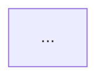

# 衰退诊断 — 共享框架

基于十二本经典软件工程书籍的原则进行代码和测试质量诊断。
使用 `source-coverage.md` 让这些来源基于真实证据、例外和权衡。

## 铁律

```
NEVER suggest fixes before completing risk diagnosis.
EVERY finding must follow: Symptom → Source → Consequence → Remedy.
```

违反此定律产出的审查只会列出规则违规而不解释为何重要。没有 Consequence 和 Remedy 的发现不是发现 — 而是噪音。

> **按需章节（除非条件适用否则跳过）：**
> - "Remedy Mode" — 仅当用户传入 `--fix` 或要求修复发现时
> - "Post-Report Triage" — 仅在报告输出后的交互式会话中
> - "History Tracking" — 仅在 Health Score 计算完成后

## 项目配置

在执行审查之前，尝试从项目根目录读取 `.decay-review.yaml`。
如果文件存在，解析并应用其设置后再继续。
如果文件不存在，使用默认值继续（所有风险启用，无忽略）。

在多模式会话中，仅在用户说配置已变更时重新读取。

### 支持的设置

**`disable`** — 要完全跳过的风险代码列表。被禁用风险的发现在报告中被静默省略，且不影响 Health Score。
有效代码：`R1` `R2` `R3` `R4` `R5` `R6` `T1` `T2` `T3` `T4` `T5` `T6`

**`severity`** — 覆盖此项目中特定风险的严重度。
有效值：`critical` `warning` `suggestion`
示例：`R1: suggestion` 表示每个 R1 发现都被降级为 Suggestion，无论指南如何说明。

**`ignore`** — glob 模式列表。匹配任何模式的文件被排除在分析之外。仅由被忽略文件引起的发现被省略。
常见条目：`**/*.generated.*`、`**/vendor/**`、`**/migrations/**`

**`focus`** — 非空的风险代码列表用于评估；其他全部跳过。
省略此键（或留空）以评估所有未禁用的风险。
不能与非空的 `disable` 列表组合使用。

**`strictness`** — 调整发现的评分严厉程度，适用于不同成熟度阶段的团队。取以下值之一：
- `strict` — 更重扣分；适用于保持高标准的团队。
- `balanced` — 默认值，键不存在时使用。
- `legacy-friendly` — 较轻扣分，且 Summary 以三个最高杠杆的修复开头，使遗留代码库的首次运行不是令人沮丧的 Critical 之墙。每个发现仍被报告 — 只是评分和措辞软化。

每个预设的扣分权重见下方的 **Health Score Calculation**。

**最小示例：**
```yaml
version: 1
strictness: legacy-friendly
disable:
  - T5
severity:
  R1: suggestion
ignore:
  - "**/*.generated.*"
```

如果 `.decay-review.yaml` 包含 `custom_risks` 映射，阅读 `_shared/` 目录中的 `custom-risks-guide.md` 获取加载和扫描说明。

### 配置验证

应用之前，检查错误并在报告中提及每项：
- 无效风险代码（非 R1–R6、T1–T6 或已定义的 `Cx` 代码）：跳过，记录 `"Config warning: X is not a valid risk code"`
- 无效严重度值（非 `critical`/`warning`/`suggestion`）：跳过，记录错误
- `disable` 和 `focus` 都非空：视为配置错误，忽略两者，记录之
- 无效 `strictness` 值（非 `strict`/`balanced`/`legacy-friendly`）：回退到 `balanced`，记录错误

如果 YAML 完全无法解析，跳过配置加载并使用默认值继续。

### 配置报告

如果找到并应用了配置文件，在报告的 **Scope** 行之后立即添加此行：
`Config: .decay-review.yaml applied (strictness: <preset>, N risks disabled, M paths ignored)`

`<preset>` 在 `strictness` 未设置时使用 `balanced`。即使 N 和 M 为零也包含。如果未找到配置文件则省略此行。

---

## 自动范围检测

当未指定文件或代码时，自动检测范围：

**PR Review：** `git diff --cached` → `git diff` → `git diff main...HEAD` → 询问用户。

**Architecture Audit / Tech Debt：** 默认整个项目。`--since=<ref>`：运行 `git diff <ref>...HEAD --name-only`，仅分析包含变更文件的模块；记录 "Incremental audit — modules touched since <ref>"。

**Test Quality：** 默认所有测试文件。如果存在 diff，优先处理与变更生产文件共置的测试文件（`src/foo.ts` → `src/foo.test.ts`）。

**Health Dashboard：** 默认整个项目。如果用户提供路径，将所有维度子扫描范围限定在该路径。

**Scope 行：** 始终陈述检测到的内容 — 例如，`Scope: staged changes (3 files)` 或 `Scope: branch changes vs main (12 files)`。

---

## 六大衰退风险

仅为导航索引 — 权威定义（症状、严重度指南、来源、"What Not to Flag" 守卫）位于 `decay-risks.md`。不要在此复制或编辑诊断问题；直接更新 `decay-risks.md`。书籍级别的覆盖、例外和权衡在 `source-coverage.md` 中。

| 代码 | 风险 | 诊断问题 |
|------|------|---------------------|
| R1 | Cognitive Overload | 理解这个需要多少心智努力？ |
| R2 | Change Propagation | 一次变更会破坏多少不相关的东西？ |
| R3 | Knowledge Duplication | 同一个决策是否在多处表达？ |
| R4 | Accidental Complexity | 代码是否比问题更复杂？ |
| R5 | Dependency Disorder | 依赖是否沿一致方向流动？ |
| R6 | Domain Model Distortion | 代码是否忠实地表示了领域？ |

---

## 报告模板

**语言规则：** 以用户使用的相同语言输出报告。翻译每条发现的内容和一句话结论以匹配用户语言。保持以下内容为英文：Iron Law 字段标签（Symptom / Source / Consequence / Remedy）、书名、原则和坏味名称（例如 "Shotgun Surgery"、"Divergent Change"），以及下述模板中的固定结构标题（`Findings`、`Summary`、`Module Dependency Graph`、`Critical`、`Warning`、`Suggestion`）。

````
# Decay Diagnosis Report

**Mode:** [PR Review / Architecture Audit / Tech Debt Assessment / Test Quality Review]
**Scope:** [file(s), directory, or description of what was reviewed]
**Health Score:** XX/100

[One sentence overall verdict]

---

## Module Dependency Graph

<!-- Mode 2 (Architecture Audit) ONLY — omit this section for other modes -->
<!-- classDef colors: see architecture-guide.md Step 1 Rule 6 -->



---

## Findings

<!-- Sort all findings by severity: Critical first, then Warning, then Suggestion -->
<!-- If no findings in a severity tier, omit that tier's heading -->

### 🔴 Critical

**[Risk Name] — [Short descriptive title]**
Symptom: [exactly what was observed in the code]
Source: [Book title — Principle or Smell name]
Consequence: [what breaks or gets worse if this is not fixed]
Remedy: [concrete, specific action]

### 🟡 Warning

**[Risk Name] — [Short descriptive title]**
Symptom: ...
Source: ...
Consequence: ...
Remedy: ...

### 🟢 Suggestion

**[Risk Name] — [Short descriptive title]**
Symptom: ...
Source: ...
Consequence: ...
Remedy: ...

---

## Summary

[2–3 sentences: what is the most important action, and what is the overall trend]
````

## Remedy Mode

当用户传入 `--fix` 或要求"修复发现"时，在写报告之前阅读 `_shared/` 目录中的 `remedy-guide.md`。

## Health Score Calculation

基础分：100。每个发现的扣分取决于 `strictness` 预设
（未设置预设时使用 `balanced`）：

| Preset | 🔴 Critical | 🟡 Warning | 🟢 Suggestion |
|--------|------------|-----------|--------------|
| `strict` | −20 | −8 | −2 |
| `balanced` (default) | −15 | −5 | −1 |
| `legacy-friendly` | −8 | −3 | −1 |

下限：0（分数不能低于 0）。预设仅改变评分权重和措辞 — 每个发现仍被完整报告。在 `legacy-friendly` 下，**Summary** 以三个最高杠杆的修复开头，使首次运行不是 Critical 之墙。

## History Tracking

生成 Health Score 后，尝试向项目根目录的 `.decay-review-history.json` 追加一条记录。

**追加逻辑：**
1. 读取文件（如果不存在则从空数组开始）
2. 追加：`{ date, mode, score, findings: { critical, warning, suggestion }, scope }`
3. 写回文件

**趋势显示：** 如果历史文件存在且包含同一模式的至少一条先前记录，在报告的 Health Score 之后添加 Trend 行：

  **Trend:** 85 → 82 (−3) over last 3 runs

显示最近的先前分数和增量。如果增量为 0："Stable at 82"。
如果是此模式的首次运行："First run — no trend data"。

## Post-Report Triage（可选）

**守卫：** 仅交互式会话 — 在 CI/无头模式下跳过。

报告 Warning 或 Suggestion 发现后，提供：
> Would you like to triage these findings? (accept / dismiss / defer / skip)

逐条处理每个发现（最低严重度优先）：显示标题，询问 `[a]ccept / [d]ismiss / [f]defer / [s]kip`；等待回复后再处理下一条。

**Dismiss：** 询问一行原因 → 追加到 `.decay-review.yaml` 的 `suppress:` 下 → 在未来运行中降级为信息。

**Defer：** 同 dismiss，添加 `expires: YYYY-MM-DD`（默认 90 天）→ 到期后以原始严重度重新浮现。

**扫描时抑制匹配：** 对每个 `suppress:` 条目，将 `risk` 代码和文件 `pattern` 与发现匹配。
- 两者都匹配 → 降级为信息（不计入 Health Score，显示在折叠的 "Suppressed" 部分下）。
- `expires` 已过 → 忽略条目，发现重新浮现。在 Summary 中记录："N suppressed findings have expired and are now active again."

## 参考文件

按需阅读：

| 文件 | 何时阅读 |
|------|-------------|
| `source-coverage.md` | 每次审查开始时，写发现之前 |
| `decay-risks.md` | 任何生产代码审查或架构/债务评估之前 |
| `test-decay-risks.md` | 任何测试审查之前以及 PR Review "Quick Test Check" 步骤之前 |
