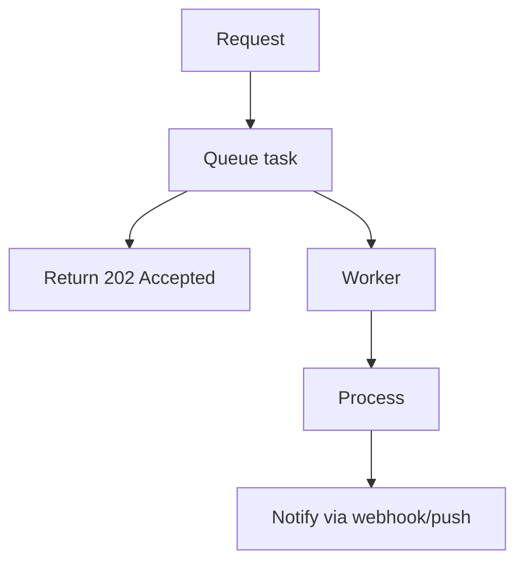

# Performance Deep Dive

> 性能工程深度分析：前端优化、后端优化、监控配置。主流程详见 [performance-engineer-guide.md](performance-engineer-guide.md)。

## 1. Frontend Optimization

### Core Web Vitals Optimization

#### LCP Optimization

```javascript
// Preload critical resources
<link rel="preload" href="/fonts/inter.woff2" as="font" crossorigin>
<link rel="preload" href="/hero-image.webp" as="image">

// Use responsive images


// Server-side rendering for critical content
// CDN caching for static assets
```

#### FID Optimization

```javascript
// Code splitting
const LazyComponent = React.lazy(() => import('./LazyComponent'));

// Defer non-critical work
requestIdleCallback(() => {
  // Non-critical initialization
});

// Break up long tasks
function processLargeArray(array) {
  const CHUNK_SIZE = 100;
  let index = 0;
  
  function processChunk() {
    const end = Math.min(index + CHUNK_SIZE, array.length);
    while (index < end) {
      process(array[index++]);
    }
    if (index < array.length) {
      requestIdleCallback(processChunk);
    }
  }
  
  requestIdleCallback(processChunk);
}
```

#### CLS Optimization

```css
/* Reserve space for images */
.image-container {
  aspect-ratio: 16 / 9;
  background: #f0f0f0;
}

/* Reserve space for ads */
.ad-slot {
  min-height: 250px;
}

/* Font loading */
@font-face {
  font-family: 'Inter';
  font-display: swap;
}
```

### Bundle Optimization

```javascript
// webpack.config.js
module.exports = {
  optimization: {
    splitChunks: {
      chunks: 'all',
      cacheGroups: {
        vendor: {
          test: /[\\/]node_modules[\\/]/,
          name: 'vendors',
          chunks: 'all',
        },
      },
    },
  },
};

// Tree shaking
export { usedFunction };  // Only export what's used

// Dynamic imports
const module = await import('./heavy-module');
```

## 2. Backend Optimization

### Algorithm Complexity

| Complexity | Operations for n=1000 | Optimization |
|------------|----------------------|--------------|
| O(1) | 1 | Ideal |
| O(log n) | 10 | Excellent |
| O(n) | 1,000 | Good |
| O(n log n) | 10,000 | Acceptable |
| O(n²) | 1,000,000 | Needs optimization |
| O(2^n) | 2^1000 | Avoid |

### Caching Strategies

#### Multi-level Caching
```python
class CacheStrategy:
    L1_CACHE = {}  # In-memory
    L2_CACHE = Redis()  # Distributed
    L3_CACHE = Database()  # Persistent
    
    async def get(self, key: str):
        if key in self.L1_CACHE:
            return self.L1_CACHE[key]
        value = await self.L2_CACHE.get(key)
        if value:
            self.L1_CACHE[key] = value
            return value
        value = await self.L3_CACHE.query(key)
        if value:
            await self.L2_CACHE.set(key, value, ttl=3600)
            self.L1_CACHE[key] = value
        return value
```

#### Cache Protection & Warm-up
```python
class CachePenetrationProtection:
    async def get_or_default(self, key: str, fallback_value: str = ""):
        value = await self.cache.get(key)
        if value is None:
            return fallback_value
        return value
    
    async def might_exist(self, key: str) -> bool:
        return self.bloom_filter.might_contain(key)

# Cache warm-up - pre-load hot data at system startup
async def warm_up_cache():
    hot_keys = ["config:system", "config:features", "user:popular_tags"]
    for key in hot_keys:
        value = await database.query(key)
        await cache.set(key, value, ttl=3600)
```

#### Cache Update Strategy
```python
class CacheUpdateStrategy:
    # Strong consistency - update cache immediately after DB update
    async def write_through(self, key: str, value: Any):
        await self.db.update(key, value)
        await self.cache.set(key, value)
    
    # Eventual consistency - allow slight delay
    async def write_back(self, key: str, value: Any):
        await self.cache.set(key, value)
        await self.queue.push(f"update:{key}:{value}")  # Async DB sync
    
    # Timed refresh
    async def timed_refresh(self, key: str):
        while True:
            value = await self.db.query(key)
            await self.cache.set(key, value)
            await asyncio.sleep(300)  # Refresh every 5 minutes
```

### Database Optimization

```sql
-- Index optimization
CREATE INDEX idx_orders_user_date 
ON orders(user_id, created_at DESC);

-- Query optimization
EXPLAIN ANALYZE
SELECT * FROM orders 
WHERE user_id = 123 
ORDER BY created_at DESC 
LIMIT 20;

-- Partitioning
CREATE TABLE orders (
    id BIGSERIAL,
    created_at TIMESTAMP,
    -- ...
) PARTITION BY RANGE (created_at);

-- Connection pooling
-- Pool size = (core_count * 2) + disk_spindles
```

### Async Processing

> Full implementation patterns (Redis pipeline, connection pool, Celery retry) are in [backend-optimization.md](backend-optimization.md).

Key principle: move slow operations (email, notifications, report generation) out of the request path into async workers.



## 3. Monitoring Setup

### Prometheus Metrics

```yaml
# prometheus.yml
global:
  scrape_interval: 15s

scrape_configs:
  - job_name: 'app'
    static_configs:
      - targets: ['localhost:8080']
```

### Grafana Dashboard

```json
{
  "panels": [
    {
      "title": "Request Rate",
      "targets": [{
        "expr": "rate(http_requests_total[5m])"
      }]
    },
    {
      "title": "P95 Latency",
      "targets": [{
        "expr": "histogram_quantile(0.95, rate(http_request_duration_seconds_bucket[5m]))"
      }]
    },
    {
      "title": "Error Rate",
      "targets": [{
        "expr": "rate(http_requests_total{status=~\"5..\"}[5m])"
      }]
    }
  ]
}
```
