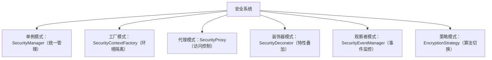

# 安全设计模式代码示例

> 安全设计模式代码案例主索引。完整案例已按安全域拆分为子文件。

## 子文件导航

| 子文件 | 内容 | 适用场景 |
|------|------|---------|
| [examples-injection.md](examples-injection.md) | 代理/装饰器/责任链模式 | 注入防御、输入校验、XSS/SQL注入 |
| [examples-auth-config.md](examples-auth-config.md) | 观察者/策略模式、配置管理 | 认证授权、加密策略、配置管理 |
| [examples-owasp.md](examples-owasp.md) | 纵深防御、审计系统、告警 | OWASP 防御、审计日志、入侵检测 |

## 1. 完整安全系统架构

```java
public class SecureSystem {
    private final SecurityContext securityContext;
    private final SecurityProxy resourceProxy;
    private final SecurityStrategyContext strategyContext;
    private final SecurityEventPublisher eventPublisher;

    public SecureSystem(String environment) {
        this.securityContext = SecurityContextFactory.getContext(environment);
        this.strategyContext = new SecurityStrategyContext();
        this.strategyContext.setStrategy(environment);
        this.eventPublisher = new SecurityEventPublisher();

        SensitiveResource realResource = new RealSensitiveResource();
        this.resourceProxy = new SecurityProxy(realResource, securityContext);
        setupObservers();
    }

    private void setupObservers() {
        SecurityEventManager manager = SecurityEventManager.getInstance();
        manager.registerObserver(new LoggingObserver());
        if (!"testing".equals(System.getProperty("env"))) {
            manager.registerObserver(new AlertObserver(new EmailService()));
            manager.registerObserver(new BruteForceDetector());
        }
    }

    public boolean authenticate(String username, String password) {
        boolean success = securityContext.authenticate(username, password);
        if (success) {
            eventPublisher.publishLoginSuccess(username, "SecureSystem");
        } else {
            eventPublisher.publishLoginFailure(username, "SecureSystem");
        }
        return success;
    }

    public String processData(String user, String data) {
        if (!securityContext.authorize("process", user)) {
            eventPublisher.publishUnauthorizedAccess(user, "data-processing", "process");
            throw new SecurityException("未授权");
        }
        DataProcessor processor = new AuditDecorator(
            new EncryptionDecorator(
                new InputValidationDecorator(new BasicDataProcessor())
            )
        );
        return processor.process(data);
    }

    public String accessResource(String user, String resource) {
        try {
            return resourceProxy.readData(user);
        } catch (SecurityException e) {
            eventPublisher.publishDataBreachAttempt(user, "resource-access", e.getMessage());
            throw e;
        }
    }
}

// 事件发布器
class SecurityEventPublisher {
    private final SecurityEventManager eventManager;

    public SecurityEventPublisher() {
        this.eventManager = SecurityEventManager.getInstance();
    }

    public void publishLoginSuccess(String user, String source) {
        eventManager.notifyObservers(
            new SecurityEvent(SecurityEventType.LOGIN_SUCCESS, user, source, "登录成功")
        );
    }

    public void publishLoginFailure(String user, String source) {
        eventManager.notifyObservers(
            new SecurityEvent(SecurityEventType.LOGIN_FAILURE, user, source, "登录失败")
        );
    }

    public void publishUnauthorizedAccess(String user, String resource, String action) {
        eventManager.notifyObservers(
            new SecurityEvent(SecurityEventType.UNAUTHORIZED_ACCESS, user, resource,
                "尝试执行 " + action)
        );
    }

    public void publishDataBreachAttempt(String user, String method, String details) {
        eventManager.notifyObservers(
            new SecurityEvent(SecurityEventType.DATA_BREACH_ATTEMPT, user, method, details)
        );
    }
}
```

## 2. 完整综合演示

```java
public class ComprehensiveSecurityDemo {
    public static void main(String[] args) {
        // 设置环境
        System.setProperty("env", "production");

        // 创建安全系统
        SecureSystem system = new SecureSystem("production");

        System.out.println("=== 安全系统演示 ===");

        // 1. 认证
        System.out.println("\n1. 用户认证:");
        boolean authResult = system.authenticate("alice", "password123");
        System.out.println("认证结果: " + authResult);

        // 2. 数据处理
        System.out.println("\n2. 数据处理:");
        try {
            String processed = system.processData("alice", "Sensitive Data");
            System.out.println("处理结果: " + processed);
        } catch (Exception e) {
            System.err.println("处理失败: " + e.getMessage());
        }

        // 3. 资源访问
        System.out.println("\n3. 资源访问:");
        try {
            String resource = system.accessResource("alice", "user-data");
            System.out.println("资源内容: " + resource);
        } catch (Exception e) {
            System.err.println("访问失败: " + e.getMessage());
        }

        // 4. 模拟攻击
        System.out.println("\n4. 模拟攻击场景:");
        try {
            system.processData("attacker", "<script>alert('xss')</script>");
        } catch (SecurityException e) {
            System.err.println("攻击被阻止: " + e.getMessage());
        }

        // 5. 未授权访问
        System.out.println("\n5. 未授权访问:");
        try {
            system.authenticate("bob", "wrongpass");
            system.accessResource("bob", "admin-data");
        } catch (SecurityException e) {
            System.err.println("未授权访问被阻止: " + e.getMessage());
        }

        System.out.println("\n=== 演示完成 ===");
    }
}
```

## 3. 模式应用指南

### 何时使用哪种模式

| 模式 | 适用场景 | 安全收益 |
|------|----------|----------|
| 单例模式 | 安全管理器、配置管理器、加密服务 | 统一管理共享资源，防止重复创建 |
| 工厂模式 | 安全上下文创建、加密算法选择 | 隔离不同环境的安全策略 |
| 代理模式 | 资源访问控制、远程服务调用 | 集中安全检查与审计 |
| 装饰器模式 | 安全特性叠加（验证、加密、审计） | 灵活组合安全特性 |
| 观察者模式 | 安全事件监控、告警系统 | 实时响应安全事件 |
| 策略模式 | 加密算法切换、访问策略 | 灵活调整安全级别 |

### 典型安全架构组合



## 4. 安全清单

### 实施阶段清单

**认证与授权**
- [ ] 使用安全认证机制（避免硬编码凭据）
- [ ] 实施最小权限原则
- [ ] 会话管理使用安全 Cookie（HttpOnly、Secure、SameSite）
- [ ] 实施密码哈希（bcrypt/Argon2）

**输入验证**
- [ ] 验证所有用户输入
- [ ] 检查输入长度限制
- [ ] 过滤危险字符（`< > " ' & ;`）
- [ ] 防止 SQL 注入（使用参数化查询）
- [ ] 防止 XSS（输出编码）
- [ ] 防止路径遍历

**加密处理**
- [ ] 使用强加密算法（AES-256、RSA-2048+）
- [ ] 安全密钥管理（不硬编码、密钥轮换）
- [ ] 静态敏感数据加密
- [ ] 强制 HTTPS 使用 TLS 1.2+

**错误处理**
- [ ] 错误消息中不暴露敏感信息
- [ ] 统一错误处理，避免信息泄露
- [ ] 记录安全相关错误

**多线程安全**
- [ ] 共享资源使用同步机制
- [ ] 使用线程安全数据结构
- [ ] 单例模式使用双重检查锁定

### 审查阶段清单

**架构审查**
- [ ] 安全边界清晰定义
- [ ] 敏感数据有保护措施
- [ ] 审计日志完整记录
- [ ] 安全组件可配置

**代码审查**
- [ ] 无硬编码密码/密钥
- [ ] 验证所有外部输入
- [ ] 敏感操作有授权检查
- [ ] 异常正确处理
- [ ] 使用安全设计模式

**测试验证**
- [ ] 单元测试覆盖安全逻辑
- [ ] 集成测试验证认证/授权
- [ ] 渗透测试漏洞已修复

## 5. 安全编码原则

1. **纵深防御**：多层安全措施，每层可独立提供保护
2. **最小权限**：仅授予必要权限
3. **默认安全**：默认配置应为安全配置
4. **失败安全**：操作失败时默认拒绝访问
5. **开闭原则**：对扩展开放，对修改关闭

## 6. 常见安全漏洞及对应模式

| 漏洞类型 | 设计模式解决方案 |
|----------|------------------|
| 权限提升 | 代理模式 + 最小权限检查 |
| SQL 注入 | 装饰器模式 + 参数化查询 |
| XSS 攻击 | 装饰器模式 + 输出编码 |
| 会话劫持 | 策略模式 + 安全 Cookie 策略 |
| 暴力破解 | 观察者模式 + 限流 |
| 敏感信息泄露 | 装饰器模式 + 加密 |
| 路径遍历 | 责任链模式 + 路径验证 |
