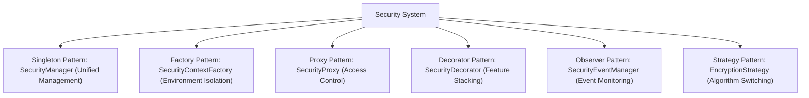

# Security Design Pattern Code Examples

> Main index for security design pattern code cases. Complete cases have been split into sub-files by security domain.

## Sub-file Navigation

| Sub-file | Content | Use Cases |
|------|------|---------|
| [examples-injection.md](examples-injection.md) | Proxy / Decorator / Chain of Responsibility patterns | Injection defense, input validation, XSS/SQL injection |
| [examples-auth-config.md](examples-auth-config.md) | Observer / Strategy patterns, configuration management | Authentication & authorization, encryption strategies, configuration management |
| [examples-owasp.md](examples-owasp.md) | Defense in depth, audit systems, alerts | OWASP defense, audit logging, intrusion detection |

## 1. Complete Secure System Architecture

```java
public class SecureSystem {
    private final SecurityContext securityContext;
    private final SecurityProxy resourceProxy;
    private final SecurityStrategyContext strategyContext;
    private final SecurityEventPublisher eventPublisher;

    public SecureSystem(String environment) {
        this.securityContext = SecurityContextFactory.getContext(environment);
        this.strategyContext = new SecurityStrategyContext();
        this.strategyContext.setStrategy(environment);
        this.eventPublisher = new SecurityEventPublisher();

        SensitiveResource realResource = new RealSensitiveResource();
        this.resourceProxy = new SecurityProxy(realResource, securityContext);
        setupObservers();
    }

    private void setupObservers() {
        SecurityEventManager manager = SecurityEventManager.getInstance();
        manager.registerObserver(new LoggingObserver());
        if (!"testing".equals(System.getProperty("env"))) {
            manager.registerObserver(new AlertObserver(new EmailService()));
            manager.registerObserver(new BruteForceDetector());
        }
    }

    public boolean authenticate(String username, String password) {
        boolean success = securityContext.authenticate(username, password);
        if (success) {
            eventPublisher.publishLoginSuccess(username, "SecureSystem");
        } else {
            eventPublisher.publishLoginFailure(username, "SecureSystem");
        }
        return success;
    }

    public String processData(String user, String data) {
        if (!securityContext.authorize("process", user)) {
            eventPublisher.publishUnauthorizedAccess(user, "data-processing", "process");
            throw new SecurityException("Unauthorized");
        }
        DataProcessor processor = new AuditDecorator(
            new EncryptionDecorator(
                new InputValidationDecorator(new BasicDataProcessor())
            )
        );
        return processor.process(data);
    }

    public String accessResource(String user, String resource) {
        try {
            return resourceProxy.readData(user);
        } catch (SecurityException e) {
            eventPublisher.publishDataBreachAttempt(user, "resource-access", e.getMessage());
            throw e;
        }
    }
}

// Event publisher
class SecurityEventPublisher {
    private final SecurityEventManager eventManager;

    public SecurityEventPublisher() {
        this.eventManager = SecurityEventManager.getInstance();
    }

    public void publishLoginSuccess(String user, String source) {
        eventManager.notifyObservers(
            new SecurityEvent(SecurityEventType.LOGIN_SUCCESS, user, source, "Login successful")
        );
    }

    public void publishLoginFailure(String user, String source) {
        eventManager.notifyObservers(
            new SecurityEvent(SecurityEventType.LOGIN_FAILURE, user, source, "Login failed")
        );
    }

    public void publishUnauthorizedAccess(String user, String resource, String action) {
        eventManager.notifyObservers(
            new SecurityEvent(SecurityEventType.UNAUTHORIZED_ACCESS, user, resource,
                "Attempted to execute " + action)
        );
    }

    public void publishDataBreachAttempt(String user, String method, String details) {
        eventManager.notifyObservers(
            new SecurityEvent(SecurityEventType.DATA_BREACH_ATTEMPT, user, method, details)
        );
    }
}
```

## 2. Complete Comprehensive Demo

```java
public class ComprehensiveSecurityDemo {
    public static void main(String[] args) {
        // Set environment
        System.setProperty("env", "production");

        // Create security system
        SecureSystem system = new SecureSystem("production");

        System.out.println("=== Security System Demo ===");

        // 1. Authentication
        System.out.println("\n1. User authentication:");
        boolean authResult = system.authenticate("alice", "password123");
        System.out.println("Authentication result: " + authResult);

        // 2. Data processing
        System.out.println("\n2. Data processing:");
        try {
            String processed = system.processData("alice", "Sensitive Data");
            System.out.println("Processing result: " + processed);
        } catch (Exception e) {
            System.err.println("Processing failed: " + e.getMessage());
        }

        // 3. Resource access
        System.out.println("\n3. Resource access:");
        try {
            String resource = system.accessResource("alice", "user-data");
            System.out.println("Resource content: " + resource);
        } catch (Exception e) {
            System.err.println("Access failed: " + e.getMessage());
        }

        // 4. Simulated attack
        System.out.println("\n4. Simulated attack scenario:");
        try {
            system.processData("attacker", "<script>alert('xss')</script>");
        } catch (SecurityException e) {
            System.err.println("Attack blocked: " + e.getMessage());
        }

        // 5. Unauthorized access
        System.out.println("\n5. Unauthorized access:");
        try {
            system.authenticate("bob", "wrongpass");
            system.accessResource("bob", "admin-data");
        } catch (SecurityException e) {
            System.err.println("Unauthorized access blocked: " + e.getMessage());
        }

        System.out.println("\n=== Demo complete ===");
    }
}
```

## 3. Pattern Application Guide

### When to Use Which Pattern

| Pattern | Use Cases | Security Benefit |
|------|----------|----------|
| Singleton Pattern | Security managers, configuration managers, encryption services | Unified shared resource management, prevents duplicate creation |
| Factory Pattern | Security context creation, encryption algorithm selection | Isolates security strategies across different environments |
| Proxy Pattern | Resource access control, remote service calls | Centralized security checks and auditing |
| Decorator Pattern | Security feature stacking (validation, encryption, auditing) | Flexible composition of security features |
| Observer Pattern | Security event monitoring, alert systems | Real-time response to security events |
| Strategy Pattern | Encryption algorithm switching, access strategies | Flexible adjustment of security levels |

### Typical Secure Architecture Combinations



## 4. Security Checklist

### Implementation Phase Checklist

**Authentication & Authorization**
- [ ] Use secure authentication mechanisms (avoid hardcoded credentials)
- [ ] Implement least privilege principle
- [ ] Session management uses secure cookies (HttpOnly, Secure, SameSite)
- [ ] Implement password hashing (bcrypt/Argon2)

**Input Validation**
- [ ] Validate all user inputs
- [ ] Check input length limits
- [ ] Filter dangerous characters (`< > " ' & ;`)
- [ ] Prevent SQL injection (use parameterized queries)
- [ ] Prevent XSS (output encoding)
- [ ] Prevent path traversal

**Encryption**
- [ ] Use strong encryption algorithms (AES-256, RSA-2048+)
- [ ] Secure key management (no hardcoding, key rotation)
- [ ] Encrypt sensitive data at rest
- [ ] Enforce HTTPS with TLS 1.2+

**Error Handling**
- [ ] Do not expose sensitive information in error messages
- [ ] Unified error handling to prevent information leakage
- [ ] Log security-related errors

**Concurrency Safety**
- [ ] Use synchronization mechanisms for shared resources
- [ ] Use thread-safe data structures
- [ ] Singleton pattern uses double-checked locking

### Review Phase Checklist

**Architecture Review**
- [ ] Security boundaries clearly defined
- [ ] Sensitive data has protection measures
- [ ] Audit logs are completely recorded
- [ ] Security components are configurable

**Code Review**
- [ ] No hardcoded passwords/keys
- [ ] All external inputs validated
- [ ] Sensitive operations have authorization checks
- [ ] Exceptions handled correctly
- [ ] Secure design patterns used

**Testing & Verification**
- [ ] Unit tests cover security logic
- [ ] Integration tests verify authentication/authorization
- [ ] Penetration test vulnerabilities are fixed

## 5. Secure Coding Principles

1. **Defense in Depth**: Multiple layers of security measures; each layer provides independent protection
2. **Least Privilege**: Only grant the minimum necessary permissions
3. **Secure by Default**: Default configurations should be secure
4. **Fail Secure**: Deny access by default when operations fail
5. **Open/Closed Principle**: Open for extension, closed for modification

## 6. Common Security Vulnerabilities & Corresponding Patterns

| Vulnerability Type | Design Pattern Solution |
|----------|------------------|
| Privilege Escalation | Proxy Pattern + Least Privilege Check |
| SQL Injection | Decorator Pattern + Parameterized Queries |
| XSS Attack | Decorator Pattern + Output Encoding |
| Session Hijacking | Strategy Pattern + Secure Cookie Strategy |
| Brute Force | Observer Pattern + Rate Limiting |
| Sensitive Information Leakage | Decorator Pattern + Encryption |
| Path Traversal | Chain of Responsibility Pattern + Path Validation |
