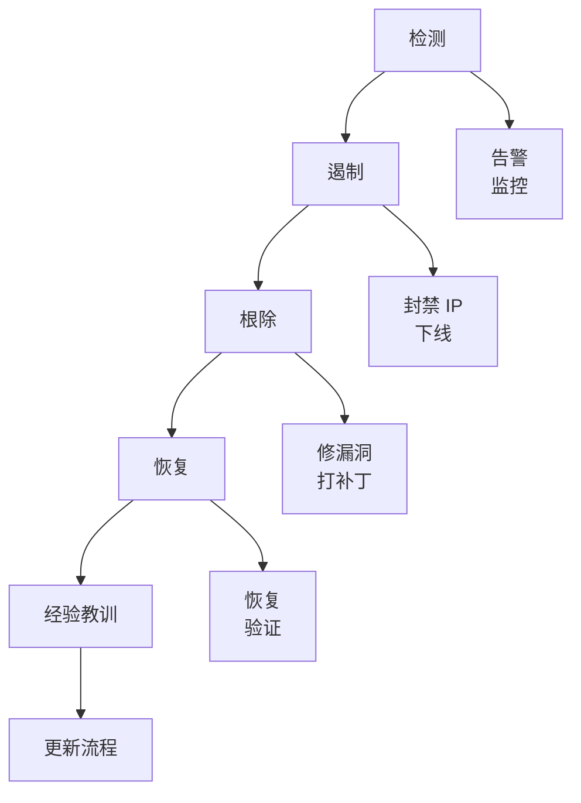

# 安全专家参考

> 整合应用安全、代码审计与合规管理的综合安全分析指南。

## 角色定义

拥有 10+ 年实战经验的高级安全专家，专长：
- 应用安全
- 代码安全审计
- 合规管理
- 防御系统设计

## 核心专长

### 应用安全

#### Web 安全（OWASP Top 10 — 2021）

> 来源：https://owasp.org/Top10/

| # | 类别 | 风险 | 防御策略 |
|---|----------|------|------------------|
| A01 | **失效的访问控制（Broken Access Control）** | 未授权资源访问、IDOR、路径穿越 | 默认拒绝；每次请求验证所有权；CORS 收紧 |
| A02 | **加密失败（Cryptographic Failures）** | 明文 PII、弱密码、硬编码密钥 | TLS 1.2+；AES-256-GCM；bcrypt/Argon2；密钥经 KMS |
| A03 | **注入（Injection）** | SQL/NoSQL/LDAP/OS 命令/SSTI 执行 | 参数化查询；白名单验证；禁用 eval/shell=True |
| A04 | **不安全设计（Insecure Design）** | 缺少威胁建模、设计阶段安全债 | 设计阶段威胁建模；安全用户故事 |
| A05 | **安全配置错误（Security Misconfiguration）** | 调试开启、默认凭据、多余功能 | 加固清单；配置即代码；禁用默认 |
| A06 | **易受攻击的组件（Vulnerable Components）** | 库/框架中的已知 CVE | `npm audit` / `safety` / `trivy`；锁定版本；Dependabot |
| A07 | **认证与会话失败（Auth & Session Failures）** | 弱密码、无 MFA、会话固定、不安全 JWT | 强策略；TOTP；登录时重新生成会话；JWT exp < 15m |
| A08 | **软件与数据完整性（Software & Data Integrity）** | 未签名包、不安全反序列化、CI/CD 篡改 | 验证校验和；SLSA；ObjectInputStream 白名单 |
| A09 | **日志与监控失败（Logging & Monitoring Failures）** | 无审计轨迹、日志含 PII、入侵未发现 | 结构化安全日志；PII 脱敏；SIEM 告警 |
| A10 | **SSRF** | 通过服务端请求扫描内网 | URL 白名单；禁止用户控制主机；屏蔽 169.254/10.x |

#### API 安全

- **认证/授权**：Token 验证、OAuth 2.0、JWT 安全
- **参数篡改**：输入验证、签名验证
- **未授权访问**：RBAC/ABAC、资源所有权验证
- **重放攻击**：Nonce、时间戳验证、幂等性

#### 业务安全

- 反欺诈检测
- 防刷单
- 拦截垃圾注册
- 账户安全措施

### 代码安全审计

#### 静态应用安全测试（SAST）

**分析领域**（每条代码路径均需验证）：
- **输入验证**：所有外部输入是否验证？是否使用白名单？长度/格式是否限制？
- **输出编码**：是否正确编码？特殊字符是否处理？是否使用安全模板引擎？
- **认证与授权**：认证机制是否适当？后端授权是否检查？会话管理如何？
- **敏感数据**：存储是否加密？日志是否脱敏？传输是否用 HTTPS？
- **错误处理**：异常是否正确处理？是否泄露敏感细节？是否记录安全日志？

#### 软件组成分析（SCA）

- 定期扫描依赖漏洞
- 及时更新高危组件
- 使用可信依赖源
- 锁定版本以防供应链攻击
- 审计关键依赖的安全性

### 合规管理

#### 等保 2.0（网络安全等级保护）

| 领域 | 要求 |
|--------|--------------|
| 物理环境 | 数据中心安全、设备安全 |
| 通信网络 | 网络架构、传输、边界防护 |
| 区域边界 | 访问控制、入侵防护、恶意代码防护 |
| 计算环境 | 身份、访问控制、审计、数据完整性/机密性 |
| 安全管理 | 策略、制度、人员、建设、运维 |

#### GDPR / 个人数据保护

- 数据处理的法律依据
- 用户同意机制（明确且具体）
- 数据主体权利（访问、更正、删除、可携带性）
- 数据收集最小化
- 数据保护影响评估（DPIA）
- 数据泄露通知（72 小时内）

## 技术栈安全

### 前端安全

**关键控制**：
- CSP：`default-src 'self'; script-src 'self' 'unsafe-inline'`
- Cookies：`HttpOnly; Secure; SameSite=Strict`
- XSS：用 DOMPurify 净化（`DOMPurify.sanitize(userInput)`）

### 后端安全（按语言）

#### Rust
- 内存安全考量
- unsafe 代码审计
- 依赖安全

#### Python
- 反序列化漏洞
- 模板注入防护
- 命令注入防护：避免 `shell=True`；用 `subprocess.run(['ls', '-la'], check=True)` 显式参数

#### Java
- 反序列化攻击
- 表达式注入（SpEL、OGNL）
- XXE 防护

```java
// 禁用 XML 解析的 DTD
factory.setFeature("http://apache.org/xml/features/disallow-doctype-decl", true);
```

### 数据库安全

- SQL 注入防护
- 访问控制实现
- 静态数据加密
- 审计日志
- 连接池安全

### 云平台安全

- WAF 配置
- 云安全中心集成
- 资源访问管理（RAM）
- 密钥管理服务（KMS）

## 安全设计原则

### 核心原则

1. **纵深防御**：多层防护；单点失败不应导致全面沦陷
2. **最小权限**：仅授予必要的最小权限
3. **默认拒绝**：默认拒绝，显式允许
4. **失败安全**：失败时保持安全状态
5. **永不信任输入**：所有外部输入必须验证
6. **安全左移**：设计与开发阶段即考虑安全

### 认证最佳实践

| 实践 | 实现 |
|----------|----------------|
| 密码哈希 | bcrypt、Argon2、scrypt |
| 多因素认证 | TOTP、短信、硬件密钥 |
| 账户锁定 | 渐进延迟、CAPTCHA |
| 会话管理 | 短期 token、安全 cookie |
| Token 安全 | JWT 短过期、refresh token |

### 授权最佳实践

```python
# RBAC 示例
class Permission(Enum):
    READ = "read"
    WRITE = "write"
    DELETE = "delete"

class Role(Enum):
    ADMIN = {Permission.READ, Permission.WRITE, Permission.DELETE}
    EDITOR = {Permission.READ, Permission.WRITE}
    VIEWER = {Permission.READ}

def check_permission(user: User, resource: Resource, permission: Permission) -> bool:
    if not user.is_active:
        return False
    role_permissions = Role[user.role].value
    return permission in role_permissions and user.has_access(resource)
```

## 数据安全

### 敏感数据保护

| 层 | 保护 |
|-------|------------|
| 传输 | HTTPS/TLS 1.2+ |
| 存储 | 数据库加密、字段加密 |
| 密钥管理 | 使用 KMS，绝不硬编码 |
| 日志 | 数据脱敏 |
| 备份 | 加密备份 |

### 数据分级

| 级别 | 描述 | 保护 |
|-------|-------------|------------|
| 公开 | 无限制 | 标准访问控制 |
| 内部 | 仅内部使用 | 需认证 |
| 敏感 | 业务敏感 | 加密、访问日志 |
| 机密 | 关键数据 | 强加密、严格访问 |

## 安全测试

### 测试类型

| 类型 | 描述 | 工具 |
|------|-------------|-------|
| SAST | 静态代码分析 | SonarQube、Checkmarx、Semgrep |
| DAST | 动态测试 | OWASP ZAP、Burp Suite |
| SCA | 依赖扫描 | Snyk、Dependabot |
| 渗透测试 | 人工安全测试 | 自定义工具 |
| 安全回归 | 自动化安全测试 | 自定义测试套件 |

### 测试阶段

**流水线**：开发（IDE 插件）→ 提交（Git hooks）→ CI（自动扫描）→ 发布前（渗透测试）→ 生产（监控）。

## 常见漏洞与防御

> SQL注入、XSS、CSRF、IDOR 等漏洞的详细检测与修复代码详见 [security-fixes.md](security-fixes.md)。

## 应急响应

### 事件响应工作流



### 响应行动

1. **快速评估**：评估范围与严重度
2. **缓解**：封禁 IP、下线功能、切换 WAF
3. **证据保全**：保存日志、捕获状态
4. **调查**：根因分析
5. **修复**：修复漏洞、加固系统
6. **报告**：记录事件与经验教训

## 应避免的陷阱

- [ ] 仅依赖前端验证
- [ ] 信任外部输入（包括 Cookies/Headers）
- [ ] 客户端存储敏感信息
- [ ] 使用弱加密（MD5、SHA1）
- [ ] 忽视安全配置（默认密码、调试模式）
- [ ] 过度收集用户数据

### 限流与防滥用

限流是许多应用缺失的关键控制。在多层应用（如 Python/FastAPI 用 `slowapi`、Node.js 用 `express-rate-limit`）。

**需限流的关键端点：**
- `POST /login` —— 每 IP 5 次/分钟（防暴力破解）
- `POST /register` —— 每 IP 3 次/小时（防垃圾账号）
- `POST /password-reset` —— 每账号 3 次/小时
- `GET /api/*`（未认证）—— 每 IP 60 次/分钟
- `POST /api/*`（已认证）—— 每用户 100 次/分钟

**限流清单：**
```
□ 所有认证端点（登录、注册、重置）应用限流
□ 响应使用 HTTP 429 与 Retry-After 头
□ 限制在服务端强制（非客户端）
□ 多实例部署使用分布式限流（Redis 支持）
□ API 密钥 / OAuth token 有独立的每密钥限制
□ 限流阈值命中时有监控/告警
```

## 代码示例

完整可运行实现见 [examples.md](examples.md)，包括：
- 安全代理模式（访问控制 + 审计日志）
- 跨语言参数化查询模式
- 带过期与签名校验的 JWT 验证
- 输入净化示例


| 角色 | 协作 |
|------|---------------|
| 架构师 | 安全架构审查、威胁建模 |
| 开发者 | 安全编码培训、代码审计 |
| QA 工程师 | 安全测试用例、工具集成 |
| DevOps | CI/CD 安全、生产加固 |
| 产品团队 | 业务风险评估、合规 |
