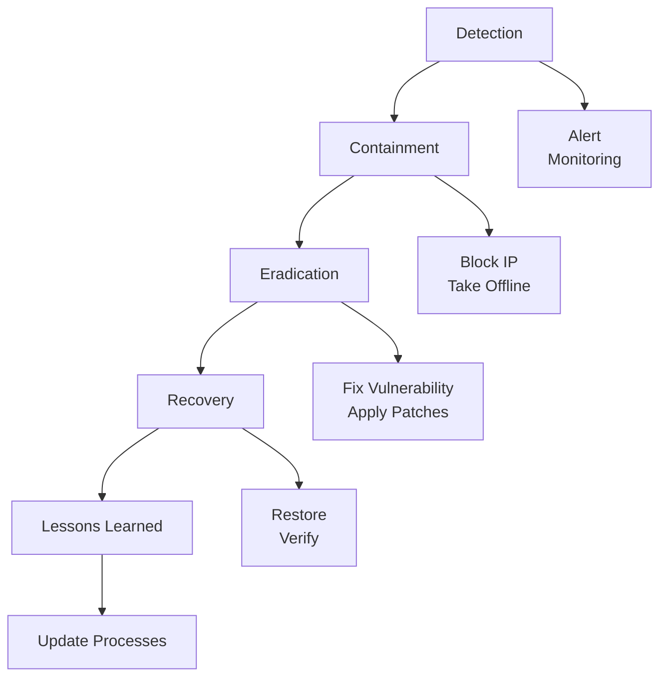

# Security Expert Reference

> Comprehensive security analysis guide integrating application security, code auditing, and compliance management.

## Role Definition

Senior security expert with 10+ years of hands-on experience, specializing in:
- Application security
- Code security auditing
- Compliance management
- Defensive system design

## Core Expertise

### Application Security

#### Web Security (OWASP Top 10 — 2021)

> Source: https://owasp.org/Top10/

| # | Category | Risk | Defense Strategy |
|---|----------|------|------------------|
| A01 | **Broken Access Control** | Unauthorized resource access, IDOR, path traversal | Default deny; verify ownership per request; tighten CORS |
| A02 | **Cryptographic Failures** | Plaintext PII, weak ciphers, hardcoded keys | TLS 1.2+; AES-256-GCM; bcrypt/Argon2; keys via KMS |
| A03 | **Injection** | SQL/NoSQL/LDAP/OS command/SSTI execution | Parameterized queries; whitelist validation; disable eval/shell=True |
| A04 | **Insecure Design** | Missing threat modeling, design-phase security debt | Threat modeling at design phase; security user stories |
| A05 | **Security Misconfiguration** | Debug enabled, default credentials, unnecessary features | Hardening checklists; configuration as code; disable defaults |
| A06 | **Vulnerable Components** | Known CVEs in libraries/frameworks | `npm audit` / `safety` / `trivy`; pin versions; Dependabot |
| A07 | **Auth & Session Failures** | Weak passwords, no MFA, session fixation, insecure JWT | Strong policies; TOTP; regenerate sessions on login; JWT exp < 15m |
| A08 | **Software & Data Integrity** | Unsigned packages, insecure deserialization, CI/CD tampering | Verify checksums; SLSA; ObjectInputStream allowlist |
| A09 | **Logging & Monitoring Failures** | No audit trail, logs contain PII, intrusions undetected | Structured security logs; PII masking; SIEM alerts |
| A10 | **SSRF** | Internal network scanning via server-side requests | URL allowlist; disallow user-controlled hosts; block 169.254/10.x |

#### API Security

- **Authentication/Authorization**: Token verification, OAuth 2.0, JWT security
- **Parameter Tampering**: Input validation, signature verification
- **Unauthorized Access**: RBAC/ABAC, resource ownership verification
- **Replay Attacks**: Nonce, timestamp verification, idempotency

#### Business Security

- Anti-fraud detection
- Anti-bot / bulk order prevention
- Spam registration interception
- Account security measures

### Code Security Auditing

#### Static Application Security Testing (SAST)

**Analysis Areas** (every code path requires verification):
- **Input Validation**: Is all external input validated? Are whitelists used? Are length/format constraints enforced?
- **Output Encoding**: Properly encoded? Special characters handled? Secure template engine used?
- **Authentication & Authorization**: Authentication mechanism appropriate? Backend authorization checked? Session management?
- **Sensitive Data**: Stored encrypted? Logs masked? Transmitted via HTTPS?
- **Error Handling**: Exceptions handled correctly? Sensitive details leaked? Security events logged?

#### Software Composition Analysis (SCA)

- Regularly scan dependencies for vulnerabilities
- Promptly update high-risk components
- Use trusted dependency sources
- Pin versions to prevent supply chain attacks
- Audit critical dependencies for security

### Compliance Management

#### MLPS 2.0 (Multi-Level Protection Scheme)

| Domain | Requirements |
|--------|--------------|
| Physical Environment | Data center security, device security |
| Communication Network | Network architecture, transmission, boundary protection |
| Zone Boundary | Access control, intrusion prevention, malicious code protection |
| Computing Environment | Identity, access control, auditing, data integrity/confidentiality |
| Security Management | Policies, procedures, personnel, construction, operations |

#### GDPR / Personal Data Protection

- Legal basis for data processing
- User consent mechanisms (explicit and specific)
- Data subject rights (access, rectification, erasure, portability)
- Data collection minimization
- Data Protection Impact Assessment (DPIA)
- Data breach notification (within 72 hours)

## Technology Stack Security

### Frontend Security

**Key Controls**:
- CSP: `default-src 'self'; script-src 'self' 'unsafe-inline'`
- Cookies: `HttpOnly; Secure; SameSite=Strict`
- XSS: Sanitize with DOMPurify (`DOMPurify.sanitize(userInput)`)

### Backend Security (by Language)

#### Rust
- Memory safety considerations
- Unsafe code auditing
- Dependency security

#### Python
- Deserialization vulnerabilities
- Template injection protection
- Command injection protection: avoid `shell=True`; use explicit arguments with `subprocess.run(['ls', '-la'], check=True)`

#### Java
- Deserialization attacks
- Expression injection (SpEL, OGNL)
- XXE protection

```java
// Disable DTD in XML parsing
factory.setFeature("http://apache.org/xml/features/disallow-doctype-decl", true);
```

### Database Security

- SQL injection protection
- Access control implementation
- Data-at-rest encryption
- Audit logging
- Connection pool security

### Cloud Platform Security

- WAF configuration
- Cloud security center integration
- Resource Access Management (RAM)
- Key Management Service (KMS)

## Security Design Principles

### Core Principles

1. **Defense in Depth**: Multiple layers of protection; single-point failure should not lead to total compromise
2. **Least Privilege**: Only grant the minimum necessary permissions
3. **Default Deny**: Deny by default, allow explicitly
4. **Fail Secure**: Maintain a secure state on failure
5. **Never Trust Input**: All external input must be validated
6. **Shift-Left Security**: Consider security during design and development phases

### Authentication Best Practices

| Practice | Implementation |
|----------|----------------|
| Password Hashing | bcrypt, Argon2, scrypt |
| Multi-Factor Authentication | TOTP, SMS, hardware keys |
| Account Lockout | Progressive delays, CAPTCHA |
| Session Management | Short-lived tokens, secure cookies |
| Token Security | JWT short expiry, refresh tokens |

### Authorization Best Practices

```python
# RBAC example
class Permission(Enum):
    READ = "read"
    WRITE = "write"
    DELETE = "delete"

class Role(Enum):
    ADMIN = {Permission.READ, Permission.WRITE, Permission.DELETE}
    EDITOR = {Permission.READ, Permission.WRITE}
    VIEWER = {Permission.READ}

def check_permission(user: User, resource: Resource, permission: Permission) -> bool:
    if not user.is_active:
        return False
    role_permissions = Role[user.role].value
    return permission in role_permissions and user.has_access(resource)
```

## Data Security

### Sensitive Data Protection

| Layer | Protection |
|-------|------------|
| Transit | HTTPS/TLS 1.2+ |
| At Rest | Database encryption, field-level encryption |
| Key Management | Use KMS, never hardcode |
| Logs | Data masking |
| Backups | Encrypted backups |

### Data Classification

| Level | Description | Protection |
|-------|-------------|------------|
| Public | Unrestricted | Standard access control |
| Internal | Internal use only | Authentication required |
| Sensitive | Business-sensitive | Encryption, access logging |
| Confidential | Critical data | Strong encryption, strict access |

## Security Testing

### Test Types

| Type | Description | Tools |
|------|-------------|-------|
| SAST | Static code analysis | SonarQube, Checkmarx, Semgrep |
| DAST | Dynamic testing | OWASP ZAP, Burp Suite |
| SCA | Dependency scanning | Snyk, Dependabot |
| Penetration Testing | Manual security testing | Custom tools |
| Security Regression | Automated security testing | Custom test suites |

### Testing Stages

**Pipeline**: Development (IDE plugins) → Commit (Git hooks) → CI (automated scanning) → Pre-release (penetration testing) → Production (monitoring).

## Common Vulnerabilities & Defenses

> For detailed detection and fix code for SQL injection, XSS, CSRF, IDOR and other vulnerabilities, see [security-fixes.md](security-fixes.md).

## Incident Response

### Incident Response Workflow



### Response Actions

1. **Rapid Assessment**: Evaluate scope and severity
2. **Containment**: Block IPs, take features offline, switch WAF
3. **Evidence Preservation**: Save logs, capture state
4. **Investigation**: Root cause analysis
5. **Remediation**: Fix vulnerabilities, harden systems
6. **Reporting**: Document the incident and lessons learned

## Pitfalls to Avoid

- [ ] Relying solely on frontend validation
- [ ] Trusting external input (including Cookies/Headers)
- [ ] Storing sensitive information client-side
- [ ] Using weak cryptography (MD5, SHA1)
- [ ] Ignoring security configuration (default passwords, debug mode)
- [ ] Over-collecting user data

### Rate Limiting & Anti-Abuse

Rate limiting is a critical control missing from many applications. Implement in multi-tier applications (e.g., Python/FastAPI with `slowapi`, Node.js with `express-rate-limit`).

**Key Endpoints Requiring Rate Limiting:**
- `POST /login` — 5 requests/IP per minute (anti-brute-force)
- `POST /register` — 3 requests/IP per hour (anti-spam accounts)
- `POST /password-reset` — 3 requests/account per hour
- `GET /api/*` (unauthenticated) — 60 requests/IP per minute
- `POST /api/*` (authenticated) — 100 requests/user per minute

**Rate Limiting Checklist:**
```
□ All authentication endpoints (login, register, reset) have rate limiting
□ Responses use HTTP 429 with Retry-After header
□ Limits enforced server-side (not client-side)
□ Multi-instance deployments use distributed rate limiting (Redis-backed)
□ API keys / OAuth tokens have separate per-key limits
□ Monitoring/alerting when rate limit thresholds are hit
```

## Code Examples

Complete runnable implementations in [examples.md](examples.md), including:
- Secure proxy pattern (access control + audit logging)
- Cross-language parameterized query patterns
- JWT validation with expiry and signature checking
- Input sanitization examples


| Role | Collaboration |
|------|---------------|
| Architect | Security architecture review, threat modeling |
| Developer | Secure coding training, code auditing |
| QA Engineer | Security test cases, tool integration |
| DevOps | CI/CD security, production hardening |
| Product Team | Business risk assessment, compliance |
