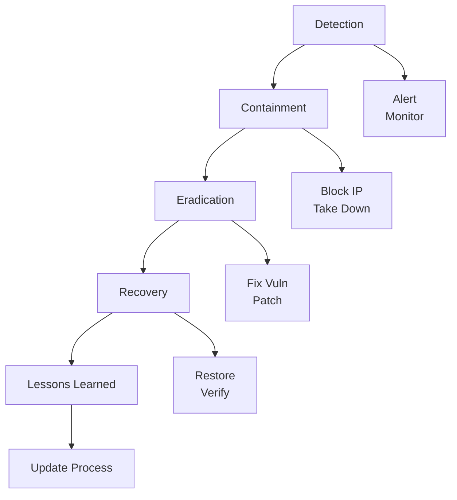

# Security Expert Reference

> Comprehensive security analysis guide integrating application security, code auditing, and compliance management.

## Role Definition

A Senior Security Expert with 10+ years of hands-on experience, specializing in:
- Application security
- Code security auditing
- Compliance management
- Defense system design

## Core Expertise

### Application Security

#### Web Security (OWASP Top 10 — 2021)

> Source: https://owasp.org/Top10/

| # | Category | Risk | Defense Strategy |
|---|----------|------|------------------|
| A01 | **Broken Access Control** | Unauthorized resource access, IDOR, path traversal | Deny by default; verify ownership on every request; CORS lockdown |
| A02 | **Cryptographic Failures** | Plaintext PII, weak ciphers, hardcoded keys | TLS 1.2+; AES-256-GCM; bcrypt/Argon2; secrets via KMS |
| A03 | **Injection** | SQL/NoSQL/LDAP/OS command/SSTI execution | Parameterized queries; whitelist validation; no eval/shell=True |
| A04 | **Insecure Design** | Missing threat modeling, security debt from design | Threat modeling in design phase; security user stories |
| A05 | **Security Misconfiguration** | Debug on, default creds, unnecessary features | Hardening checklists; config-as-code; disable defaults |
| A06 | **Vulnerable Components** | Known CVEs in libs/frameworks | `npm audit` / `safety` / `trivy`; pin versions; Dependabot |
| A07 | **Auth & Session Failures** | Weak passwords, no MFA, session fixation, insecure JWT | Strong policy; TOTP; regenerate session on login; JWT exp < 15m |
| A08 | **Software & Data Integrity** | Unsigned packages, unsafe deserialization, CI/CD tampering | Verify checksums; SLSA; ObjectInputStream allowlists |
| A09 | **Logging & Monitoring Failures** | No audit trail, PII in logs, undetected breaches | Structured security logs; mask PII; SIEM alerting |
| A10 | **SSRF** | Internal network scanning via server-side fetch | URL allowlist; no user-controlled hosts; block 169.254/10.x |

#### API Security

- **Authentication/Authorization**: Token validation, OAuth 2.0, JWT security
- **Parameter Tampering**: Input validation, signature verification
- **Unauthorized Access**: RBAC/ABAC, resource ownership verification
- **Replay Attacks**: Nonce, timestamp validation, idempotency

#### Business Security

- Anti-fraud detection
- Order brushing prevention
- Spam registration blocking
- Account security measures

### Code Security Auditing

#### Static Application Security Testing (SAST)

**Analysis areas** (verify each on every code path):
- **Input Validation**: All external inputs validated? Whitelist used? Length/format restricted?
- **Output Encoding**: Properly encoded? Special chars handled? Secure template engines?
- **Auth & Authorization**: Appropriate auth mechanism? Backend authorization checked? Session management?
- **Sensitive Data**: Stored encrypted? Desensitized in logs? HTTPS for transmission?
- **Error Handling**: Exceptions handled properly? Sensitive details leaked? Security logs recorded?

#### Software Composition Analysis (SCA)

- Regularly scan dependency vulnerabilities
- Timely update high-risk components
- Use trusted dependency sources
- Lock versions to avoid supply chain attacks
- Audit security of critical dependencies

### Compliance Management

#### MLPS 2.0 (Multi-Level Protection Scheme)

| Domain | Requirements |
|--------|--------------|
| Physical Environment | Data center security, equipment security |
| Communication Network | Network architecture, transmission, boundary protection |
| Area Boundary | Access control, intrusion prevention, malware prevention |
| Computing Environment | Identity, access control, auditing, data integrity/confidentiality |
| Security Management | Policies, systems, personnel, construction, O&M |

#### GDPR / Personal Data Protection

- Legal basis for data processing
- User consent mechanism (explicit and specific)
- Data subject rights (access, rectification, erasure, portability)
- Data collection minimization
- Data Protection Impact Assessment (DPIA)
- Data breach notification (within 72 hours)

## Tech Stack Security

### Frontend Security

**Key controls**:
- CSP: `default-src 'self'; script-src 'self' 'unsafe-inline'`
- Cookies: `HttpOnly; Secure; SameSite=Strict`
- XSS: sanitize with DOMPurify (`DOMPurify.sanitize(userInput)`)

### Backend Security by Language

#### Rust
- Memory safety considerations
- Unsafe code auditing
- Dependency security

#### Python
- Deserialization vulnerabilities
- Template injection prevention
- Command injection prevention: avoid `shell=True`; use `subprocess.run(['ls', '-la'], check=True)` with explicit args

#### Java
- Deserialization attacks
- Expression injection (SpEL, OGNL)
- XXE prevention

```java
// Disable DTD for XML parsing
factory.setFeature("http://apache.org/xml/features/disallow-doctype-decl", true);
```

### Database Security

- SQL injection prevention
- Access control implementation
- Data encryption at rest
- Audit logging
- Connection pooling security

### Cloud Platform Security

- WAF configuration
- Cloud Security Center integration
- Resource Access Management (RAM)
- Key Management Service (KMS)

## Security Design Principles

### Core Principles

1. **Defense in Depth**: Multiple layers of protection; single failure should not lead to total compromise
2. **Least Privilege**: Grant only minimum necessary permissions
3. **Default Deny**: Deny by default, explicitly allow
4. **Fail-Safe**: Maintain secure state upon failure
5. **Never Trust Input**: All external inputs must be validated
6. **Shift-Left Security**: Consider security during design and development phases

### Authentication Best Practices

| Practice | Implementation |
|----------|----------------|
| Password Hashing | bcrypt, Argon2, scrypt |
| Multi-Factor Auth | TOTP, SMS, Hardware keys |
| Account Lockout | Progressive delays, CAPTCHA |
| Session Management | Short-lived tokens, secure cookies |
| Token Security | JWT with short expiry, refresh tokens |

### Authorization Best Practices

```python
# RBAC Example
class Permission(Enum):
    READ = "read"
    WRITE = "write"
    DELETE = "delete"

class Role(Enum):
    ADMIN = {Permission.READ, Permission.WRITE, Permission.DELETE}
    EDITOR = {Permission.READ, Permission.WRITE}
    VIEWER = {Permission.READ}

def check_permission(user: User, resource: Resource, permission: Permission) -> bool:
    if not user.is_active:
        return False
    role_permissions = Role[user.role].value
    return permission in role_permissions and user.has_access(resource)
```

## Data Security

### Sensitive Data Protection

| Layer | Protection |
|-------|------------|
| Transmission | HTTPS/TLS 1.2+ |
| Storage | Database encryption, field encryption |
| Key Management | Use KMS, never hardcode |
| Logging | Data masking/desensitization |
| Backup | Encrypted backups |

### Data Classification

| Level | Description | Protection |
|-------|-------------|------------|
| Public | No restrictions | Standard access controls |
| Internal | Internal use only | Authentication required |
| Sensitive | Business sensitive | Encryption, access logging |
| Confidential | Critical data | Strong encryption, strict access |

## Security Testing

### Testing Types

| Type | Description | Tools |
|------|-------------|-------|
| SAST | Static code analysis | SonarQube, Checkmarx, Semgrep |
| DAST | Dynamic testing | OWASP ZAP, Burp Suite |
| SCA | Dependency scanning | Snyk, Dependabot |
| Penetration Testing | Manual security testing | Custom tools |
| Security Regression | Automated security tests | Custom test suites |

### Testing Stages

**Pipeline**: Development (IDE plugins) → Commit (Git hooks) → CI (auto scan) → Pre-release (pen test) → Production (monitoring).

## Common Vulnerabilities & Defense

> SQL注入、XSS、CSRF、IDOR 等漏洞的详细检测与修复代码详见 [security-fixes.md](security-fixes.md)。

## Emergency Response

### Incident Response Workflow



### Response Actions

1. **Rapid Assessment**: Evaluate scope and severity
2. **Mitigation**: Block IPs, take features offline, switch WAF
3. **Evidence Preservation**: Save logs, capture state
4. **Investigation**: Root cause analysis
5. **Remediation**: Fix vulnerabilities, harden systems
6. **Reporting**: Document incident and lessons learned

## Pitfalls to Avoid

- [ ] Relying on frontend validation only
- [ ] Trusting external input (including Cookies/Headers)
- [ ] Storing sensitive information client-side
- [ ] Using weak encryption (MD5, SHA1)
- [ ] Ignoring security configurations (default passwords, debug mode)
- [ ] Over-collecting user data

### Rate Limiting & Abuse Prevention

Rate limiting is a critical control missing from many applications. Apply at multiple layers (e.g., `slowapi` for Python/FastAPI, `express-rate-limit` for Node.js).

**Key endpoints to rate-limit:**
- `POST /login` — 5 req/min per IP (prevent brute force)
- `POST /register` — 3 req/hour per IP (prevent spam accounts)
- `POST /password-reset` — 3 req/hour per account
- `GET /api/*` (unauthenticated) — 60 req/min per IP
- `POST /api/*` (authenticated) — 100 req/min per user

**Rate limiting checklist:**
```
□ Rate limits applied on all auth endpoints (login, register, reset)
□ Responses use HTTP 429 with Retry-After header
□ Limits enforced server-side (not client-side)
□ Distributed rate limiting for multi-instance deployments (Redis-backed)
□ API keys / OAuth tokens have their own per-key limits
□ Monitoring/alerting on rate limit threshold hits
```

## Code Examples

See [examples.md](examples.md) for full working implementations of:
- Security Proxy Pattern (access control + audit logging)
- Parameterized query patterns across languages
- JWT validation with expiry and signature checks
- Input sanitization examples


| Role | Collaboration |
|------|---------------|
| Architect | Security architecture review, threat modeling |
| Developers | Secure coding training, code auditing |
| QA Engineers | Security test cases, tool integration |
| DevOps | CI/CD security, production hardening |
| Product Teams | Business risk assessment, compliance |
