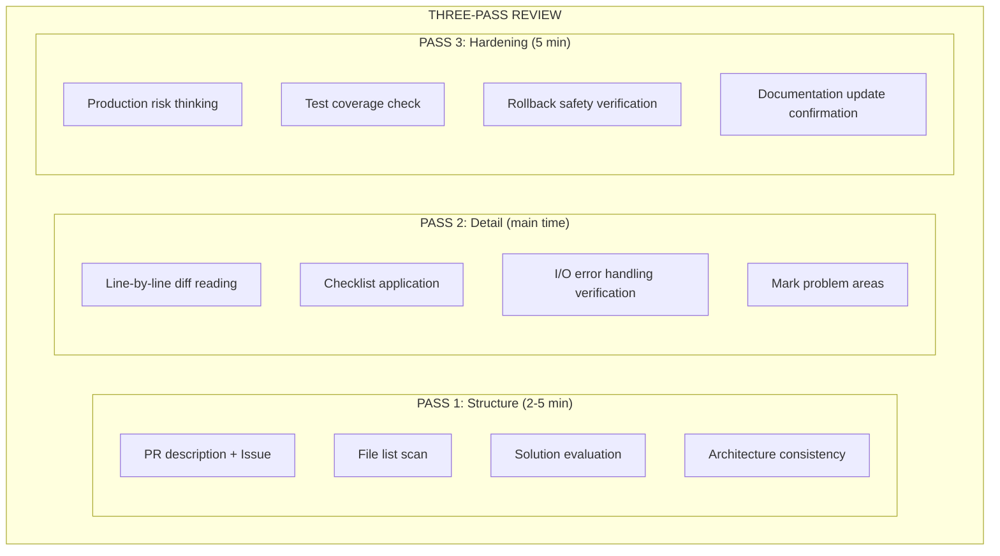

# Three-Pass Review Workflow

An optional manual review workflow — systematic scanning to avoid missing issues

## Overview

This workflow is designed for human reviewers. AI agents can use parallel analysis mode.
Three-pass scanning ensures comprehensive coverage, not random browsing.

---

## Pass 1: High-Level Structure (2-5 minutes)

**Goal**: Understand the overall architecture and scope of the change

### Steps

1. **Read the PR description and linked Issue**
   - What is the purpose of the change?
   - What problem does it solve?
   - Are there constraints or limitations?

2. **Scan the file list**
   - Is the scope of change reasonable?
   - Are there unexpected files modified?
   - Is the file organization reasonable?

3. **Evaluate the overall approach**
   - Is this the right approach?
   - Is there a simpler alternative?
   - Does it align with the project architecture?

4. **Verify architectural consistency**
   - Does it introduce architectural drift?
   - Are dependency directions correct?
   - Does it violate existing patterns?

### Output Checklist

```
□ Change purpose is clear
□ Scope is reasonable
□ Approach is correct
□ Architecture is consistent
```

---

## Pass 2: Line-by-Line Detail (main time)

**Goal**: Find logic errors, security issues, performance issues

### Steps

1. **Read every line of every file's diff**
   - Don't skip any lines
   - Understand the reason for each change

2. **Apply dimension-specific checklists**
   | Dimension | Key Checks |
   |-----------|------------|
   | Security | OWASP Top 10, injection, authentication/authorization |
   | Performance | N+1 queries, algorithm complexity, caching |
   | Correctness | Edge cases, null values, race conditions |
   | Quality | Code smells, naming, error handling |

3. **Verify error handling at every I/O boundary**
   - Database operations
   - Network requests
   - File system
   - External APIs

4. **Mark anything that gives you pause**
   - Trust your instincts
   - Uncertainty itself is an issue

### Output Checklist

```
□ All changes have been read
□ Issues have been marked
□ Error handling has been verified
```

---

## Pass 3: Edge Cases and Hardening (5 minutes)

**Goal**: Find hidden issues and missing tests

### Steps

1. **Think about what could go wrong in production**
   - Under high load?
   - With unstable networking?
   - With abnormal data?

2. **Check tests for marked code paths**
   - Does the new feature have tests?
   - Are edge cases covered?
   - Are error paths tested?

3. **Verify rollback safety**
   - Can the change be safely rolled back?
   - Are there data migrations?
   - Are there breaking changes?

4. **Confirm documentation updates**
   - Does the README need updating?
   - Does the API documentation need updating?
   - Does the CHANGELOG need an entry?

### Output Checklist

```
□ Production risks have been assessed
□ Test coverage has been confirmed
□ Rollback safety has been verified
□ Documentation has been updated
```

---

## Time Budget

| PR Size | Pass 1 | Pass 2 | Pass 3 | Total |
|---------|--------|--------|--------|-------|
| Small (<100 lines) | 2 min | 5 min | 3 min | ~10 min |
| Medium (100-400 lines) | 3 min | 15 min | 5 min | ~25 min |
| Large (400-1000 lines) | 5 min | 30 min | 10 min | ~45 min |
| Very Large (>1000 lines) | Consider splitting the PR |

**Note**: Comprehension drops sharply when reviewing more than 400 lines at once.
Consider splitting into multiple sessions.

---

## Relationship to Parallel Analysis

| Mode | When to Use | Advantage |
|------|-------------|-----------|
| Three-Pass Review | Human reviewers, learning process | Comprehensive, systematic |
| Parallel Analysis | AI agents, automated pipelines | Fast, consistent |

### Combined Usage

```
1. AI parallel analysis generates initial report
2. Human three-pass review confirms and supplements
3. Merge into final review report
```

---

## Quick Reference Card



---

## References

- [../review-workflow.md](../review-workflow.md) — Full review workflow
- [../templates/feedback-examples.md](../templates/feedback-examples.md) — Feedback examples
- [../anti-patterns.md](../anti-patterns.md) — Review anti-patterns
