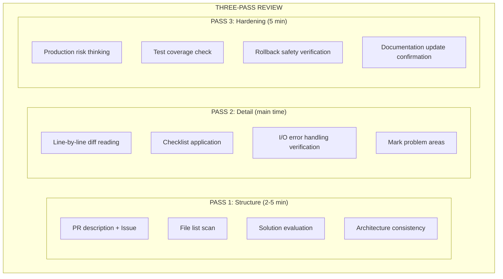

# Three-Pass Review Workflow

Optional human review workflow — systematic scanning to avoid missing issues

## Overview

This workflow is designed for human reviewers. AI Agents can use the parallel analysis mode.
Three-pass scanning ensures comprehensive coverage, rather than random browsing.

---

## Pass 1: High-Level Structure (2-5 minutes)

**Goal**: Understand overall architecture and scope of changes

### Steps

1. **Read PR description and linked Issues**
   - What is the purpose of the changes?
   - What problem does it solve?
   - Are there any constraints or limitations?

2. **Scan file list**
   - Is the scope of changes reasonable?
   - Are there unexpected files modified?
   - Is the file organization reasonable?

3. **Check overall solution**
   - Is this the right solution?
   - Are there simpler alternatives?
   - Does it align with project architecture?

4. **Verify architecture consistency**
   - Does it introduce architectural deviations?
   - Is the dependency direction correct?
   - Does it violate existing patterns?

### Output Checklist

```
□ Change purpose is clear
□ Scope is reasonable
□ Solution is correct
□ Architecture is consistent
```

---

## Pass 2: Line-by-Line Detail (main time)

**Goal**: Find logic errors, security issues, performance problems

### Steps

1. **Read every line of each file's diff**
   - Don't skip any lines
   - Understand the reason for each change

2. **Apply dimension-specific checklists**
   | Dimension | Key Checks |
   |------|----------|
   | Security | OWASP Top 10, injection, auth/authorization |
   | Performance | N+1 queries, algorithm complexity, caching |
   | Correctness | Edge cases, null values, race conditions |
   | Quality | Code smells, naming, error handling |

3. **Verify error handling at every I/O boundary**
   - Database operations
   - Network requests
   - File system
   - External APIs

4. **Mark anything that makes you pause**
   - Trust your intuition
   - Uncertainty is an issue

### Output Checklist

```
□ All changes read
□ Issues marked
□ Error handling verified
```

---

## Pass 3: Edge Cases & Hardening (5 minutes)

**Goal**: Find hidden issues and missing tests

### Steps

1. **Think about what could go wrong in production**
   - Under high load?
   - With unstable network?
   - With abnormal data?

2. **Check tests for marked code paths**
   - Are there tests for new features?
   - Are edge cases covered?
   - Are error paths tested?

3. **Verify rollback safety**
   - Can changes be safely rolled back?
   - Are there data migrations?
   - Are there breaking changes?

4. **Confirm documentation updates**
   - Does README need updating?
   - Does API documentation need updating?
   - Does CHANGELOG need an entry?

### Output Checklist

```
□ Production risks assessed
□ Test coverage confirmed
□ Rollback safety verified
□ Documentation updated
```

---

## Time Budget

| PR Size | Pass 1 | Pass 2 | Pass 3 | Total |
|---------|--------|--------|--------|------|
| Small (<100 lines) | 2 min | 5 min | 3 min | ~10 min |
| Medium (100-400 lines) | 3 min | 15 min | 5 min | ~25 min |
| Large (400-1000 lines) | 5 min | 30 min | 10 min | ~45 min |
| Extra Large (>1000 lines) | Consider splitting PR |

**Note**: Comprehension drops sharply when reviewing more than 400 lines at once.
Consider splitting into multiple sessions.

---

## Relationship with Parallel Analysis

| Mode | Use Case | Advantages |
|------|----------|------|
| Three-Pass Review | Human reviewers, learning process | Comprehensive, systematic |
| Parallel Analysis | AI Agent, automated processes | Fast, consistent |

### Combined Usage

```
1. AI parallel analysis generates initial report
2. Human three-pass review confirms and supplements
3. Merge to output final review report
```

---

## Quick Reference Card



---

## References

- [../review-workflow.md](../review-workflow.md) — Complete review workflow
- [../templates/feedback-examples.md](../templates/feedback-examples.md) — Feedback examples
- [../anti-patterns.md](../anti-patterns.md) — Review anti-patterns
