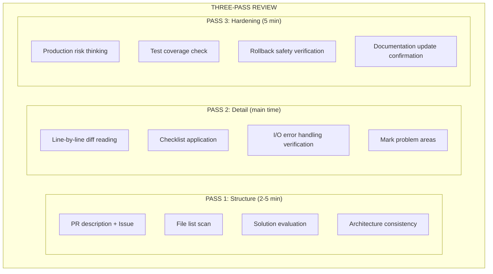

# 三遍审查工作流

可选的人工审查工作流 —— 系统化扫描以避免遗漏问题

## 概述

此工作流为人工审查者设计。AI Agent 可使用并行分析模式。
三遍扫描确保全面覆盖，而非随机浏览。

---

## 第一遍：高层结构（2-5 分钟）

**目标**：理解整体架构与变更范围

### 步骤

1. **阅读 PR 描述与关联 Issue**
   - 变更的目的是什么？
   - 解决了什么问题？
   - 是否有约束或限制？

2. **扫描文件列表**
   - 变更范围是否合理？
   - 是否有意外的文件被修改？
   - 文件组织是否合理？

3. **检查整体方案**
   - 这是正确的方案吗？
   - 是否有更简单的替代方案？
   - 是否与项目架构对齐？

4. **验证架构一致性**
   - 是否引入架构偏差？
   - 依赖方向是否正确？
   - 是否违反既有模式？

### 输出清单

```
□ 变更目的清晰
□ 范围合理
□ 方案正确
□ 架构一致
```

---

## 第二遍：逐行细节（主要时间）

**目标**：找出逻辑错误、安全问题、性能问题

### 步骤

1. **阅读每个文件 diff 的每一行**
   - 不要跳过任何行
   - 理解每次变更的原因

2. **应用维度专属清单**
   | 维度 | 关键检查 |
   |------|----------|
   | 安全 | OWASP Top 10、注入、认证/授权 |
   | 性能 | N+1 查询、算法复杂度、缓存 |
   | 正确性 | 边界情况、null 值、竞态条件 |
   | 质量 | 代码坏味、命名、错误处理 |

3. **在每个 I/O 边界验证错误处理**
   - 数据库操作
   - 网络请求
   - 文件系统
   - 外部 API

4. **标记任何让你停顿的地方**
   - 相信直觉
   - 不确定性本身就是问题

### 输出清单

```
□ 所有变更已阅读
□ 问题已标记
□ 错误处理已验证
```

---

## 第三遍：边界情况与加固（5 分钟）

**目标**：找出隐藏问题与缺失测试

### 步骤

1. **思考生产环境可能出什么问题**
   - 高负载下？
   - 网络不稳定时？
   - 异常数据下？

2. **检查标记代码路径的测试**
   - 新功能是否有测试？
   - 边界情况是否覆盖？
   - 错误路径是否测试？

3. **验证回滚安全性**
   - 变更能否安全回滚？
   - 是否有数据迁移？
   - 是否有破坏性变更？

4. **确认文档更新**
   - README 是否需要更新？
   - API 文档是否需要更新？
   - CHANGELOG 是否需要条目？

### 输出清单

```
□ 生产风险已评估
□ 测试覆盖已确认
□ 回滚安全已验证
□ 文档已更新
```

---

## 时间预算

| PR 大小 | 第一遍 | 第二遍 | 第三遍 | 合计 |
|---------|--------|--------|--------|------|
| 小（<100 行） | 2 分钟 | 5 分钟 | 3 分钟 | ~10 分钟 |
| 中（100-400 行） | 3 分钟 | 15 分钟 | 5 分钟 | ~25 分钟 |
| 大（400-1000 行） | 5 分钟 | 30 分钟 | 10 分钟 | ~45 分钟 |
| 超大（>1000 行） | 考虑拆分 PR |

**注意**：一次审查超过 400 行时理解力急剧下降。
考虑拆分为多个会话。

---

## 与并行分析的关系

| 模式 | 适用场景 | 优势 |
|------|----------|------|
| 三遍审查 | 人工审查者、学习过程 | 全面、系统 |
| 并行分析 | AI Agent、自动化流程 | 快速、一致 |

### 组合使用

```
1. AI 并行分析生成初始报告
2. 人工三遍审查确认并补充
3. 合并输出最终审查报告
```

---

## 快速参考卡



---

## 参考

- [../review-workflow.md](../review-workflow.md) —— 完整审查工作流
- [../templates/feedback-examples.md](../templates/feedback-examples.md) —— 反馈示例
- [../anti-patterns.md](../anti-patterns.md) —— 审查反模式
